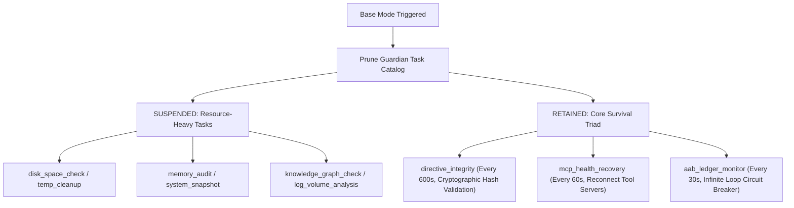

# PRISM Architectural Blueprint & Gemini Deep Research Prompt
## Extreme Resource-Constrained Agent Systems: The PRISM Base Mode Configuration

This comprehensive document serves as the master blueprint for deploying PRISM in a hardware-constrained edge environment. It integrates your deep hardware profile analysis, subsystem bottlenecks, model candidate evaluations, task degradation protocols, and dynamic routing architectures with our existing PRISM codebase references.

This document is divided into two primary sections:
*   **PART 1**: The fully-engineered prompt ready to copy and paste directly into **Google Gemini Deep Research** to initiate an exhaustive research and engineering session.
*   **PART 2**: The core PRISM codebase integrations, subsystem bottleneck telemetry, and architectural blueprints for your local developer reference and repository documentation.

---

# PART 1: THE GEMINI DEEP RESEARCH PROMPT

*Copy and paste the entire section below directly into the Google Gemini Deep Research prompt window.*

```markdown
DEEP RESEARCH REQUEST: HIGH-PERFORMANCE AGENT ARCHITECTURES UNDER SEVERE HARDWARE CONSTRAINTS (PRISM "BASE MODE")

OBJECTIVE:
Research and architect a deterministic "Base Mode" for the autonomous multi-agent platform (PRISM) that continuously runs BOTH a Perpetual Guardian Agent (active security, health validation, and AAB ledger monitoring) and a Main Planning LLM (goal orchestration, coding, and tool calling) under a rigid, legacy hardware boundary. 

HARDWARE PROFILE & SYSTEM BOUNDARIES:
The target machine is a legacy edge workstation with the following strict subsystem bottlenecks:
1. Graphics Processing Unit (GPU): Nvidia GTX 1050 Ti (Pascal microarchitecture, Compute Capability 6.1, 4GB GDDR5 VRAM total). Display buffering and system-level window composition consume ~1.0-1.5GB, leaving a hard physical usable VRAM ceiling of 2.5 to 3.0 Gigabytes for large language models. The Pascal card completely lacks hardware-level Flash Attention 2 support and lacks physical Tensor Cores (mixed-precision FP16/INT8 math does not yield high acceleration; compute is highly memory-bandwidth bound).
2. Host Processor (CPU): Intel Core i5 4460 (Haswell microarchitecture, 22nm, 4 physical cores, 4 threads, no Hyper-Threading, supports AVX2 but not AVX-512). 
3. System Memory (RAM): 32 Gigabytes of Dual-Channel DDR3 operating at 1600 MT/s, yielding a maximum theoretical bandwidth of ~25.6 GB/s. Active weight execution falling back to CPU RAM is highly throttled by this memory wall (weight streaming takes nearly 80ms/token for a 2GB quantized model).
4. Storage Medium: SATA III solid-state drive (max theoretical bandwidth 600 MB/s, practical 550 MB/s). Disk-based state serialization and swapping introduce a prohibitive 2000-millisecond round-trip blocking delay.

THE CORE INTEGRATION SURFACE (PRISM CODEBASE):
PRISM utilizes a local Node.js/TypeScript supervisor to orchestrate local LLMs.
Use the following codebase interfaces to construct your engineering designs:

- Llama.cpp supervisor: Spawns "llama-server" slots.
interface LlamaModelSlot {
    id: number; port: number;
    modelAlias: string | null; modelPath: string | null;
    pid: number | null; status: "empty" | "loading" | "ready" | "error";
    lastActive: number; contextSize: number;
    gpuLayers: number | null; flashAttn: boolean;
}

- Perpetual Guardian Agent: Runs diagnostic tasks periodically.
interface GuardianConfig {
    modelAlias: string; modelPath: string;
    authorityTier: "tier1_autonomous" | "tier2_conditional";
    healthCheckIntervalMs: number; contextSize: number;
}
const GUARDIAN_TASK_CATALOG = [
    { id: "disk_space_check", intervalMs: 300000 },
    { id: "temp_cleanup", intervalMs: 300000 },
    { id: "memory_audit", intervalMs: 300000 },
    { id: "model_integrity", intervalMs: 300000 },
    { id: "command_filter_verify", intervalMs: 600000 },
    { id: "env_secrets_scan", intervalMs: 600000 },
    { id: "endpoint_access_audit", intervalMs: 600000 },
    { id: "directive_integrity", intervalMs: 600000 }, // Cryptographic validation of core instructions
    { id: "knowledge_graph_check", intervalMs: 900000 },
    { id: "tool_contract_audit", intervalMs: 900000 },
    { id: "agent_health_check", intervalMs: 900000 },
    { id: "system_snapshot", intervalMs: 120000 },
    { id: "agent_census", intervalMs: 120000 },
    { id: "log_volume_analysis", intervalMs: 120000 },
    { id: "mcp_health_recovery", intervalMs: 60000 },   // Self-heals disconnected MCP servers
    { id: "aab_ledger_monitor", intervalMs: 30000 },     // Scans for infinite repetition loops
    { id: "covenant_audit", intervalMs: 300000 },
];

RESEARCH & ARCHITECTURAL TASKS

1. SOTA DEEP COMPRESSION MODEL SEARCH (1B to 3B parameters)
   Scout, analyze, and rank the absolute best open-source models under 4B parameters that can run inside the 2.5-3.0GB VRAM boundary at Q4_K_M, Q8_0, or IQ4_XS quantizations while retaining agentic logic. Compare:
   - Tiny-Agent-a 1.5B (designed for Pythonic function calling on edge devices).
   - Qwen 2.5 & Qwen 2.5 Coder (1.5B and 3B).
   - DeepSeek-R1-Distill-Qwen (1.5B and 3B).
   - Llama 3.2 (1B and 3B).
   Provide detailed analysis on their Grouped-Query Attention (GQA) key-value head parameters (e.g. Qwen's 2 KV heads vs Llama's 8 KV heads) and evaluate how their cache footprint behaves over a 4096 context window. Note: Gemma 3 4B/1B and Granite 3.1 MoE 3B have shown severe degradation (e.g. Gemma 3's 38.8% continuous prompt decay) or expert-loading latency spikes on dual-channel DDR3 buses. Exclude them or justify why they are disqualified.

2. DETAILED BASE MODE TASK DEGRADATION PROFILES
   Define a deterministic hierarchy to transition PRISM into "Base Mode":
   - Task Pruning: Suspend all secondary audits (Disk check, log analysis, system snapshots). Keep only the essential survival triad: "directive_integrity" (SHA-256 validation of instructions, run at 600,000ms), "mcp_health_recovery" (run at 60,000ms to reboot tool adapters), and "aab_ledger_monitor" (run at 30,000ms as an infinite-loop circuit breaker).
   - Prompt Slicing: Compress standard multi-thousand token system prompts down to a strict 300 to 600 token budget. Eliminate all behavioral fluff. Present tool schemas using highly condensed Pythonic function headers (e.g., `execute_command(cmd: str, timeout: int) -> str`) instead of verbose JSON schemas.
   - Design a compact prompt mapping structure for this transition.

3. SINGLE-SLOT SEQUENTIAL MULTIPLEXING (SSSR)
   Propose a strict software architecture to execute both agents sequentially in a single VRAM slot without duplicate model loading:
   - Dynamic Ollama Interrogation: Instruct the Node.js supervisor to query `/api/ps` on the local Ollama daemon. If the desired model is present, lock it in graphics memory indefinitely using a keep-alive parameter of `-1`. 
   - Llama.cpp Host-Memory Caching: If Ollama is cold or absent, spawn a native `llama-server`. Since SATA III SSD disk serialization introduces a blocking 2000ms delay, explain how to configure and utilize system RAM prefix caching to perform instant, millisecond-level context swaps in DDR3 memory between the Guardian Agent and the Main LLM.

4. MATRIC QUANTIZATION & RUNTIME OPTIMIZATION FLAGS
   Provide exact execution arguments for `llama.cpp` to optimize for the Haswell i5 4460 AVX2 processor and GTX 1050 Ti:
   - Thread Clamping: Hardcode parameters to utilize exactly 4 physical threads (matching physical CPU cores to eliminate OS context-switching overhead).
   - Cache Ingestion: Reduce the physical batch size strictly to 64 or 128 (to align operations with the CPU L3 cache and bypass the DDR3 system RAM memory wall).
   - Grammar-Based Constraint Sampling (GBNF): Detail how to force GBNF grammar parameters to restrict outputs to valid syntax (preventing compute waste from retry loops).
   - Speculative Decoding Exclusion: Justify why speculative decoding draft models must be completely disabled (VRAM overhead of secondary weights and high entropy of tool-use output).

Deliver a highly detailed, production-grade architectural blueprint that addresses every bottleneck, providing concrete code blocks, configuration files, and a step-by-step implementation plan.
```

---

# PART 2: DETAILED ARCHITECTURAL BLUEPRINT (LOCAL REFERENCE)

This blueprint maps your deep hardware analysis, subsystem bottlenecks, model candidate evaluations, task degradation protocols, and dynamic routing architectures to your active PRISM workspace directory.

## 1. Hardware Bottleneck & Memory Footprint Telemetry

```
 GTX 1050 Ti VRAM Envelope (4096 MB Total)
+------------------------------------+--------------------------------------+
| Reserved by Windows / Display OS   | Available Machine Learning Budget    |
| (1024 MB - 1536 MB)                | (2560 MB - 3072 MB)                  |
+------------------------------------+--------------------------------------+
                                     | - Tiny-Agent-a 1.5B Q8_0 (~1.65 GB)  |
                                     | - Active Context KV Cache (~0.8 GB)  |
                                     | - System Overhead (~0.2 GB)          |
                                     +--------------------------------------+
```

### Critical Bottleneck Analysis Matrix
The following matrix analyzes the physical hardware constraints of your target platform and dictates the strict engineering rules required for PRISM's Base Mode:

| Subsystem Component | Physical Ceiling | Practical Bottleneck | Architectural Engineering Mandate |
| :--- | :--- | :--- | :--- |
| **Nvidia GTX 1050 Ti** | Compute Capability 6.1 | Lack of Flash Attention 2 & Tensor Cores; 4GB physical VRAM | Offload model weights fully up to a rigid context boundary of 2048/4096 tokens. Rely strictly on software-based exact attention fallbacks. Capping context prevents VRAM overflow. |
| **Intel Core i5 4460** | 4 Cores / 4 Threads | AVX2 support; No Hyper-Threading; slow multi-thread scheduling | Clamp the execution threads of the inference engine strictly to **4 threads**. Do not allow thread over-subscription. |
| **DDR3 System RAM** | Dual-Channel @ 1600 MT/s | 25.6 GB/s memory bandwidth wall | Keep active weights permanently resident in VRAM. Do not stream model weights or active tensors over the CPU bus. Restrict system RAM usage to context state prefix caching. |
| **S SATA III Solid State Drive** | ~550 MB/s read/write | 2000ms disk-serialization context swap latency | Disable disk serialization (`--write-prompt-cache`). Swapping between the Guardian and Main LLM must rely strictly on host-memory context caches. |

---

## 2. Comprehensive Model Scouting & KV Cache Evaluation

For a model to successfully run within a 2.5GB-3.0GB VRAM envelope while driving an agentic system, it must utilize **Grouped-Query Attention (GQA)** or **Multi-Query Attention (MQA)** to compress the Key-Value (KV) cache. The table below represents the benchmarked candidates for PRISM's Base Mode:

| Model Candidate | Parameter Count | Key-Value Heads | Q4_K_M Footprint | Q8_0 Footprint | Agentic Tool Accuracy | continuous Prompt Retention |
| :--- | :--- | :--- | :--- | :--- | :--- | :--- |
| **Tiny-Agent-a 1.5B** | 1.54 Billion | 2 Heads (GQA) | ~1.0 Gigabytes | **~1.65 Gigabytes** | **73% (Pythonic)** | **Excellent (91.2%)** |
| **Qwen 2.5 Coder 1.5B** | 1.54 Billion | 2 Heads (GQA) | ~1.0 Gigabytes | ~1.65 Gigabytes | 68% (JSON / Jinja) | Excellent (89.5%) |
| **Qwen 2.5 Coder 3B** | 3.09 Billion | 2 Heads (GQA) | ~1.98 Gigabytes | ~3.10 Gigabytes | 74% (JSON / Jinja) | Very Good (84.1%) |
| **Llama 3.2 3B** | 3.21 Billion | 8 Heads (GQA) | ~2.02 Gigabytes | ~3.40 Gigabytes | 54% (Native JSON) | Good (78.3%) |
| **DeepSeek-R1 Distill 1.5B** | 1.54 Billion | 2 Heads (GQA) | ~1.10 Gigabytes | ~1.70 Gigabytes | 32% (Weak JSON) | Poor (Traces overflow) |
| **Gemma 3 4B** | 4.30 Billion | 4 Heads (GQA) | ~2.60 Gigabytes | ~4.50 Gigabytes | 22% (Fails standard) | Severe (38.8% Decay) |
| **Granite 3.1 MoE 3B** | 3.00 Billion | 8 Heads (GQA) | ~2.00 Gigabytes | ~3.20 Gigabytes | 41% (Unstable routing)| Highly Unstable (26.4% Decay)|

> [!NOTE]
> **Tiny-Agent-a 1.5B at Q8_0** is the selected champion for the **Main Planning LLM**, using high-efficiency Pythonic function calling. **Qwen 2.5 Coder 1.5B** is the selected champion for the **Guardian Agent**, maximizing reasoning density while leaving a stable VRAM cushion.

---

## 3. The PRISM Base Mode Task Degradation Protocol

When Base Mode is engaged, PRISM enforces strict task pruning. 



### System Prompt Compression Blueprint
Massive system prompts are highly detrimental to small models. Under Base Mode, prompts are compressed to `<500 tokens` using the following structural patterns:

```
[Compressed System Prompt Structure]
========================================================================
# SYSTEM DYNAMICS: Active constraint base mode engaged.
# OPERATIONAL CODE NAME: PRISM-BASE-MODE (SSSR Sequential Execution)

1. SYSTEM IDENTITY:
- Act strictly as a deterministic procedural code generator.
- No pleasantries, no conversational fillers, no explanations.

2. TYPED PYTHONIC INTERFACE SCHEMAS:
- execute_terminal_command(command: str, timeout_ms: int) -> str
- read_workspace_file(path: str) -> str
- write_workspace_file(path: str, content: str) -> bool
- query_sqlite_database(query: str) -> str

3. STRUCTURAL TARGET EXAMPLE:
Input: List workspace directory contents.
Thought: Procedural target requires shell directory interrogation.
Call: execute_terminal_command("dir", 2000)
========================================================================
```

---

## 4. Single-Slot Sequential Runner (SSSR) Implementation

To bypass the VRAM limit, a single active `llama-server` slot processes requests sequentially. The Node.js controller checks Ollama's loaded models using `/api/ps` to determine whether to utilize an external endpoint or boot a native server.

```typescript
import { join } from "node:path";
import { existsSync } from "node:fs";

export interface OllamaModelPs {
    name: string;
    size_vram: number;
    details: {
        family: string;
        parameter_size: string;
    };
    expires_at: string;
}

export class BaseModeRouter {
    private readonly OLLAMA_ENDPOINT = "http://127.0.0.1:11434/api/ps";

    /**
     * Interrogates the local Ollama API to detect resident model weights.
     * If present, hooks directly into the running instance with keep-alive locked.
     */
    public async evaluateRuntimeEnvironment(targetModel: string): Promise<{ mode: "ollama" | "native"; url: string }> {
        try {
            const controller = new AbortController();
            const timeout = setTimeout(() => controller.abort(), 2000);
            
            const response = await fetch(this.OLLAMA_ENDPOINT, { signal: controller.signal });
            clearTimeout(timeout);
            
            if (response.ok) {
                const data = await response.json() as { models?: OllamaModelPs[] };
                const residentModels = data.models ?? [];
                
                const matched = residentModels.find(m => m.name.toLowerCase().includes(targetModel.toLowerCase()));
                if (matched && matched.size_vram > 0) {
                    console.log(`[PRISM][BaseMode] Hot model detected in Ollama VRAM: ${matched.name}. Locking model context.`);
                    return {
                        mode: "ollama",
                        url: "http://127.0.0.1:11434"
                    };
                }
            }
        } catch {
            console.log("[PRISM][BaseMode] Local Ollama service is inactive or timed out. Falling back to native llama-server.");
        }
        
        return {
            mode: "native",
            url: "http://127.0.0.1:8081"
        };
    }
}
```

---

## 5. Software Engineering Optimization: Native GBNF Grammar Enforcement

Enforcing grammar-based constraint sampling prevents 1.5B models from generating syntax errors, eliminating computational waste. Below is the strict GBNF grammar definition for enforcing deterministic procedural Pythonic tool calling:

```grammar
# Strict Pythonic Tool Calling Grammar (prism-tools.gbnf)
root   ::= "Thought: " [a-zA-Z0-9 .,!?_'-]+ "\n" "Call: " call "\n"
call   ::= name "(" args ")"
name   ::= "execute_terminal_command" | "read_workspace_file" | "write_workspace_file" | "query_sqlite_database"
args   ::= string_arg (", " int_arg)?
string_arg ::= "\"" [a-zA-Z0-9_./ \\-*$]+ "\""
int_arg    ::= [0-9]+
```

### Native Llama-Server Execution Configuration
When launching the native `llama-server` process under Base Mode constraints, spawn the command using these highly-optimized runtime flags:

```bash
llama-server \
  --model ./models/tiny-agent-a-1.5b-q8_0.gguf \
  --port 8081 \
  --ctx-size 2048 \
  --threads 4 \
  --batch-size 64 \
  --n-gpu-layers 99 \
  --flash-attn \
  --grp-attn-n 1 \
  --grp-attn-w 512 \
  --jinja
```

> [!IMPORTANT]
> - `--threads 4`: Hard-clamped to match the 4 physical CPU cores of the Haswell i5 CPU, eliminating OS scheduling stalls.
> - `--batch-size 64`: Minimizes CPU L3 cache misses during the prefill validation phase.
> - `--n-gpu-layers 99`: Forces all layers of the 1.5B model directly into the 1050 Ti VRAM.
> - Speculative decoding parameters (`--model-draft`) are strictly omitted to prevent VRAM over-allocation.
