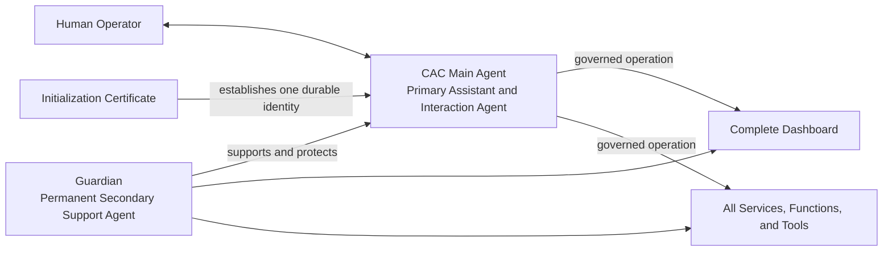

# CAC Main Agent and Guardian Architecture

## Canonical agent roles

PRISM has two permanent agent roles with different responsibilities.

### CAC Main Agent

The Character Accountability Control (CAC) agent is the operator's **main agent**. It is the assistant, agent, companion, and primary interaction identity presented to the operator throughout PRISM.

- Each operator has exactly one CAC Main Agent for each Initialization Certificate.
- The Initialization Certificate establishes the CAC Main Agent's durable character and identity binding.
- New chats and sessions reuse that same CAC Main Agent; they do not create additional CAC agents.
- The CAC Main Agent retains its `characterId`, assistant identity, operator binding, accountability history, and governed access across sessions.
- All operator requests, responses, planning, tool use, and service interactions execute through or on behalf of the CAC Main Agent.
- A CAC database assignment is the persisted identity and accountability record for the main agent. It is not a separate agent and is not merely an authentication card or audit certificate.

### Required security identity binding

The Initialization Certificate security binding consists of the complete identity tuple collected during setup:

- **Operator email:** required, normalized operator identity and account binding.
- **Operator name:** required, human-readable identity of the responsible operator.
- **CAC email:** required, durable email identity of the CAC Main Agent.
- **CAC name:** required, human-readable name of the CAC Main Agent.
- **Location name:** optional, operator-defined context such as `Desktop` or `Engineering Dept.`.

The certificate must sign and persist these attributes with the CAC assignment. Every later session and action must resolve the same binding from the certificate and CAC record rather than accept caller-supplied replacements. Changes to a required identity attribute require an auditable, authorized identity-transition record; they must not silently rewrite the original certificate. The optional location name provides context and does not replace authentication or authorization.

### Guardian

Guardian is the permanent **secondary agent**. Guardian supports the CAC Main Agent and protects the complete PRISM runtime.

- Guardian monitors and assists the CAC Main Agent.
- Guardian supports the dashboard and all services, functions, tools, integrations, and runtime components.
- Guardian performs continuous health monitoring, policy and directive verification, diagnostics, recovery, self-healing, and support routing.
- Guardian may advise, warn, pause, or escalate according to policy, but it does not replace the CAC Main Agent as the operator's assistant.
- Guardian is platform-scoped; the CAC Main Agent is operator-scoped.

## Required relationship

The hierarchy is therefore:

1. **Operator-facing primary agent:** CAC Main Agent.
2. **Permanent secondary support agent:** Guardian.
3. **Session agents and workers:** subordinate, temporary capabilities acting under the CAC identity and Guardian oversight.

Any implementation or documentation that creates a CAC per chat session, calls Guardian the primary assistant, or describes CAC as only a certificate conflicts with this architecture.
