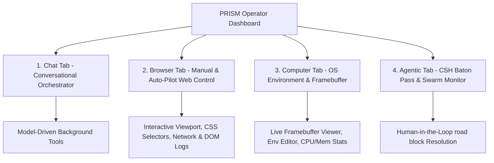

# PRISM Computer and Browser Control: Operator Guide

This guide answers critical architectural and operational questions regarding PRISM's **Computer Control** and **Browser Control** capabilities, detailing how operators can interact with, configure, and monitor these functions via the dynamic Web Dashboard.

---

## 1. Executive Summary & Core Q&A

### Q1: Does PRISM have a user/operator friendly "Computer Control"?
> [!NOTE]
> **Yes.** PRISM features a dedicated, native **Computer Tab** inside the Web Dashboard specifically designed for operator-friendly interaction. It provides live system monitoring, CPU/Memory usage sparklines, screen framebuffer stream viewers, manual screenshots/video capture, a secure system environment variable editor, and direct CLI command dispatches.

### Q2: Does PRISM have a user/operator friendly "Browser Control"?
> [!NOTE]
> **Yes.** PRISM has a state-of-the-art **Browser Tab** inside the Web Dashboard. It provides a visual URL navigation bar, headed/headless browser session launcher profiles, CSS selector target clickers, typing controls, dynamic JavaScript evaluators, network log inspect tables, in-depth console output logs, a live DOM inspector, and a comprehensive **Browser Auto-Pilot** controller to submit autonomous visual objectives.

### Q3: Does the user/operator access these functions from the Chat Tab?
> [!IMPORTANT]
> **Indirectly (via conversation).** The **Chat Tab** does not render manual address bars, click/type buttons, or live framebuffers. Instead, it serves as the **Conversational Orchestrator**. 
> When an operator types a prompt like *"Search for the latest PRISM release on GitHub,"* PRISM's internal ReAct planner automatically invokes `browser_control` or `computer_use` tools in the background. The Chat Tab then streams real-time thinking traces, step logs, and visual screenshots directly in the message feed, while leaving the direct manual buttons to the dedicated tabs.

### Q4: Does PRISM have access to these functions from the actual Computer Control tab and Browser Control tab?
> [!IMPORTANT]
> **Yes, directly.** The **Computer Tab** and **Browser Tab** are specifically designed for manual and direct operator control. Rather than relying on AI text prompts, the operator has instant access to visual inputs, dropdown lists, buttons, and settings panels to control the active sandbox or host machine themselves.

---

## 2. Dynamic Interface Tour & Layout

The PRISM Web Dashboard divides these features into cohesive, color-coded tabs to keep the interface simple, powerful, and clean:

### 2.1 The Chat Tab (The Conversational Brain)
* **Purpose**: Conversational instruction, multi-modal asset attachment, onboarding guides, and autonomous loop dispatch.
* **Layout**: Standard chat timeline feed on the left, model profile drawer on the right.
* **How to trigger Computer/Browser Use**: Just ask!
  * *Example prompt*: `"Attach a Chrome browser session, go to wikipedia.org, and extract the summary of Advanced Agentic Coding."`
  * *Result*: PRISM launches a sandboxed browser, performs the actions, and renders visual thumbnails of the steps directly in the chat timeline.

### 2.2 The Browser Tab (The Sandbox Navigator)
* **Purpose**: Direct manual web navigation, selector debugging, network analysis, and Browser Auto-Pilot execution.
* **Top Bar**: Live headed/headless Session Launchers (`🚀 Launch Headed` / `🤖 Launch Headless`), DevTools toggle, and Diagnostic Suite button.
* **Viewport Pane**: Address bar (`https://...`), interactive selector clicker (`browserClickElement`), selector typewriter (`browserTypeText`), and JavaScript console (`browserEvaluate`).
* **Telemetry Panels**: Network traffic tables (Method, URL, Status), dynamic Console outputs, live DOM string tree, and storage key/value grids (Cookies, localStorage).
* **Auto-Pilot Panel**: Input an objective, set a maximum action limit (e.g. `20` actions), choose a perception mode (Accessibility tree vs Screenshot), and click `🚀 Go` to watch the browser work in real-time.

### 2.3 The Computer Tab (The OS Command Center)
* **Purpose**: Direct manual host/sandbox screen interaction, CLI scripting, hardware metrics, and environment configurations.
* **Top Bar**: Live system CPU/Memory usage gauges and real-time interactive terminal command dispatchers.
* **Framebuffer Viewer**: Click `📸 Capture Screengrab` to pull a live desktop screenshot. Use `Burst Capture` to record high-fidelity visual streams.
* **Environment variables**: Read and update live OS environment variables in a protected dashboard grid.
* **Hardware tree**: View all registered system devices and hardware drivers in a collapsed folder taxonomy.

---

## 3. The Security & Collaboration Safeguards

To allow operators to delegate tasks to PRISM safely without risk of credential theft, data leakage, or runaway execution loops, PRISM embeds two cutting-edge systems:

### 3.1 Sovereign Sentinel Hyper-Proxy (SSHP)
* **Visual PII Masking**: Automatically detects password fields, credit card entries, and SSN shapes. Composites solid black blocking boxes onto in-memory images before the LLM sees them.
* **DOM Sanitizer**: Auto-scrubs sensitive regex matches from all page DOM trees.
* **Sacred Covenant Audit**: Pre-audits every command against the 10 Laws (Directive Manifest). Blocks harmful commands like `file:///etc/passwd` or `localStorage.clear()` instantly.
* **Operator Toggle**: Operators can toggle SSHP dynamically in the **Settings Tab** under the *Sovereign Sentinel Shielding* card.
  * **Dynamic Badge**: A live dynamic badge (`🛡️ SSHP ACTIVE` / `🛡️ SSHP OFF`) is always visible in the Browser Control header to give operators real-time confirmation.

### 3.2 Cognitive Session Handoff (CSH) "Baton Pass"
* When the agent encounters a CAPTCHA, MFA challenge, or authorization wall, it pauses its execution loop, serializes all cookies and planning states, and triggers a **Baton Pass**.
* **Agentic Tab Queue**: The handoff is listed in the CSH queue panel. The operator clicks `🎮 Take Browser Control` to jump directly to the browser view.
* **Viewport Banner**: The Browser viewport displays a highlighted roadblock warning banner:
  > **Cognitive Session Handoff (CSH) Roadblock Active:** *Solve the CAPTCHA or blocker, then click Resume to hand control back.*
* The operator completes the manual action (e.g., typing the MFA code or solving the puzzle) and clicks **Resume Agent**, handing control back to the autonomous planner seamlessly.

---

## 4. Operational Playbook: Bridging the Gap

To combine these interfaces for a state-of-the-art workflow, follow this recommended operator playbook:

1. **Initiate the Goal**: In the **Chat Tab**, describe your objective (e.g. *"Log in to the company portal and download the monthly CSV invoice"*).
2. **Monitor from the Browser**: Switch to the **Browser Tab**. Select the active session dropdown to watch the live Viewport screenshot update as the agent navigates.
3. **Resolve Roadblocks (CSH Handoff)**: If the portal prompts for a Google Authenticator MFA code:
   - PRISM will automatically pause and trigger a Baton Pass.
   - The roadblock banner will appear in your Viewport.
   - Click the input field, type the MFA code using the manual typewriter control, and click `Go`.
   - Click `Resume Agent`. PRISM will take control of the authenticated page and complete the goal.
4. **Download & Verify**: Once completed, download the CSV from the **Browser Storage** panel, or read the action receipts inside the **AAB Ledger** in the **Agentic Tab**.
