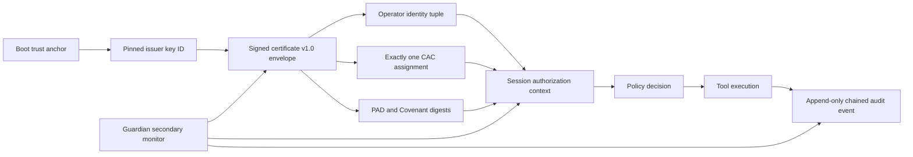

# Initialization Certificate v1.0 Critical Security Audit

**Audit date:** 2026-07-31  
**System:** Prism Refraction  
**Scope:** Initialization Certificate, CAC Main Agent, Guardian, Permanent Active Directives (PAD), Sacred Covenant, IAM binding, action enforcement, persistence, cryptography, auditability, testing, and operations  
**Assessment type:** Source-assisted critical security audit with read-only live-state inspection  
**Overall verdict:** **CRITICAL — NOT APPROVED FOR PRODUCTION TRUST CLAIMS**

## 1. Executive Verdict

The current implementation does not yet establish the Initialization Certificate as the cryptographic and authorization root of every session and action.

Ed25519 is used correctly for detecting changes to the signed Markdown content. That property is materially undermined by the surrounding trust model:

1. The signing private key is stored as plaintext PEM and the inspected Windows ACL grants inherited read access to `CodexSandboxUsers`.
2. Verification trusts the public key embedded in the same certificate being verified. An attacker who can replace a certificate can generate a new key pair, sign altered content, embed the new public key, and pass verification.
3. Production SQLite triggers permit deletion of a certificate whenever more than one certificate exists globally. This contradicts the stated per-operator immutability guarantee.
4. The required operator/CAC identity tuple is not signed into live certificates, and certificate format version `1.0` is not signed machine-readable metadata.
5. Live audit data contains 1,070 `tool_execution` events; all 1,070 lack operator email, CAC email, character ID, and assignment ID.
6. The Guardian, IAM claim flow, runtime Covenant, and orchestrator do not collectively enforce a fail-closed certificate/CAC root for every action.

Accordingly, a valid current signature proves only that content matches the signature under the public key supplied by that content. It does **not** prove that PRISM issued the certificate, that the key remained under authorized control, that the certificate still exists immutably, or that subsequent actions were authorized by its bound identity.

## 2. Required Security Invariant

The target invariant is:

> Every operator has exactly one durable CAC Main Agent bound to exactly one immutable Initialization Certificate. Every session and action resolves its authority from that signed persisted binding. Guardian is a permanent secondary monitor and cannot replace CAC. PAD and Sacred Covenant integrity are verified before execution. Missing, ambiguous, revoked, unverifiable, or inconsistent bindings fail closed.

The signed identity tuple must contain:

- operator email;
- operator name;
- CAC email;
- CAC name;
- optional Location Name;
- immutable certificate ID;
- machine-readable certificate format version;
- issuer/key identifier;
- issuance time and lifecycle state.

Caller-supplied identity values may be comparison inputs, but never the source of authority.

## 3. Scope and Method

The audit used four evidence classes:

| Evidence class | Method |
|---|---|
| Source | Reviewed certificate signing/verification, session-store migrations, IAM claim behavior, Guardian checks, policy/orchestrator wiring, Covenant runtime, PAD boot gates, and activity persistence. |
| Live persistence | Opened the active chat/activity and IAM SQLite databases in read-only mode. No provider call or data mutation was used. |
| Host controls | Inspected the Windows ACL protecting `initialization_keys.json`; no secret value was read or disclosed. |
| Executable check | Added an isolated `ChatSessionStore` test that instantiates production migrations and exercises certificate deletion behavior. |

The active provider context was confirmed as OpenRouter with model `google/gemma-4-31b-it`. Provider credentials were not inspected. Earlier unexpected OpenAI traffic during certificate tests is treated as test-isolation evidence, not as the configured production provider.

## 4. Live-State Evidence

Read-only inspection of the active workspace produced the following snapshot:

| Measure | Result | Security meaning |
|---|---:|---|
| Certificate-tagged messages | 27 | Certificate history is not one record per operator. |
| Embedded-key signatures that verify | 25 | Content integrity succeeds for most records under their self-supplied keys. |
| Records without the signature marker | 2 | Legacy certificate-tagged records fail current verification. |
| Certificates containing operator name | 0 of 27 | Required human identity is not signed. |
| Certificates containing CAC name | 0 of 27 | Required CAC identity is not signed. |
| Certificates containing Location Name | 0 of 27 | Optional field is not represented in the inspected format. |
| Certificates declaring machine-readable v1.0 | 0 of 27 | Version cannot be reliably enforced or migrated. |
| Current character assignments | 4 | Current assignment rows are consolidated to one per active operator. |
| `tool_execution` events | 1,070 | Large enough to test actual action provenance behavior. |
| Tool events missing operator email | 1,070 of 1,070 | Operator authority is absent from persisted action evidence. |
| Tool events missing CAC email | 1,070 of 1,070 | CAC authority is absent from persisted action evidence. |
| Tool events missing character ID | 1,070 of 1,070 | Main Agent identity is absent from persisted action evidence. |
| Tool events missing assignment ID | 1,070 of 1,070 | Actions cannot be joined to their durable CAC assignment. |

Certificate distribution was one each for four named active operator emails and 23 under the placeholder `operator@prism.local`. Of those 23 placeholder records, 21 include the current signature marker and two do not. IAM contains active display names for the four named users, but those names are not present in their signed certificates.

No live database content was changed by this audit.

## 5. Trust Model Analysis

### 5.1 What the Current Signature Proves

For certificate body $M$, signature $S$, and embedded public key $K_{embedded}$, the verifier establishes:

$$
\operatorname{Ed25519Verify}(K_{embedded}, M, S) = \text{true}
$$

This establishes mathematical consistency among the three values.

### 5.2 What It Does Not Prove

Issuer authentication requires an independently trusted key or trust chain:

$$
K_{embedded} \in \operatorname{TrustedIssuerKeys}
$$

That condition is not enforced. The certificate supplies its own verifier key. Consequently, replacement content signed by an attacker-controlled key can satisfy the current equation.

### 5.3 Required Root Chain

Every arrow above must be machine-enforced. Documentation or UI presentation is not a substitute for an authorization dependency.

## 6. Findings

### IC-01 — Plaintext Signing Key Readable by a Broad Local Principal

**Severity:** Critical  
**Evidence:** `initialization-signature.ts` persists private PEM in `initialization_keys.json`. The inspected file ACL grants inherited `ReadAndExecute` to `CodexSandboxUsers`.  
**Impact:** A local sandbox principal can obtain the issuer private key, forge certificates, and make altered content indistinguishable from legitimately issued content under that key.  
**Required action:** Treat the key as compromised. Revoke it, rotate to a new issuer key, inventory and reissue trusted certificates, move private-key operations to OS-protected or hardware-backed custody, and deny inherited broad reads.

### IC-02 — Certificate Verification Has No Independent Issuer Trust Anchor

**Severity:** Critical  
**Evidence:** `verifyMarkdownCertificate()` verifies against the public key embedded in the certificate Markdown. No pinned issuer fingerprint, key ID allowlist, certificate chain, or separately signed key manifest is required.  
**Impact:** An attacker who can replace a certificate can create a fresh key pair and a fully self-consistent forged certificate that passes verification.  
**Required action:** Put an immutable `issuerKeyId` in the signed envelope and resolve it only through a pinned, independently protected trust store. Reject unknown, revoked, expired, or self-declared issuer keys.

### IC-03 — Production Immutability Is Global-Count Based and Bypassable

**Severity:** Critical  
**Evidence:** Production delete triggers raise only when the global count of certificate messages or sessions is less than or equal to one. The isolated production-store test confirms that the first of two certificate sessions can be deleted and only the last global certificate is blocked.  
**Impact:** Any operator's certificate can be deleted while another certificate exists. This destroys provenance and violates immutable-per-operator claims.  
**Required action:** Block update and delete unconditionally for certificate records. Implement lifecycle changes as signed append-only supersession/revocation records, never mutation or deletion.

### IC-04 — Required Human/CAC Identity Tuple Is Not Signed

**Severity:** High  
**Evidence:** None of 27 live certificates contains operator name or CAC name. Location Name and a complete signed tuple are absent. IAM has operator display names, but the certificate issuer does not bind them.  
**Impact:** A certificate cannot authoritatively answer which human and which CAC it binds. Email-only or session-column associations can drift independently from signed content.  
**Required action:** Define a canonical structured envelope containing normalized operator email/name and CAC email/name, with optional location, then sign its canonical serialization.

### IC-05 — Certificate/CAC Identity Is Not a Universal Execution Gate

**Severity:** Critical  
**Evidence:** The runtime orchestrator does not universally resolve certificate and CAC context before policy evaluation. All 1,070 live `tool_execution` events lack operator email, CAC email, character ID, and assignment ID.  
**Impact:** Actions can be evaluated and executed without durable proof of the operator/CAC authority chain. Post-event attribution cannot reconstruct the promised root.  
**Required action:** Introduce one mandatory `ExecutionAuthorityContext` resolved server-side from certificate ID and assignment ID. Policy and tool dispatch must reject absent or invalid context before side effects.

### IC-06 — Guardian Verification Is Incomplete and Globally Scoped

**Severity:** High  
**Evidence:** Guardian verifies only the newest global certificate and primarily checks workspace-root drift. It does not continuously validate every active operator's certificate, issuer trust, identity tuple, CAC cardinality, lifecycle status, PAD/Covenant binding, or action context.  
**Impact:** Corruption or substitution of a non-latest operator certificate can remain undetected. Guardian cannot enforce the stated permanent-secondary role across tenants/operators.  
**Required action:** Monitor each active binding independently, emit fail-closed health state, and prevent dispatch when any binding required by the action is unverifiable.

### IC-07 — Authentication Can Succeed When Certificate Claim Fails

**Severity:** High  
**Evidence:** IAM certificate claim uses a 24-hour orphan heuristic, and claim failure does not necessarily block successful login.  
**Impact:** An authenticated session may exist without a valid, uniquely claimed Initialization Certificate. Authentication and certificate authorization can diverge.  
**Required action:** Make valid certificate/CAC resolution a post-authentication precondition for privileged session activation. Replace time-based orphan inference with an explicit signed enrollment nonce and one-time transaction.

### IC-08 — Canonical Covenant and Runtime Covenant Are Separate Trust Objects

**Severity:** High  
**Evidence:** Runtime `prism-covenant.ts` uses a separate hardcoded article set rather than verifying and executing against the canonical Sacred Covenant Markdown or a shared generated artifact.  
**Impact:** Documentation can say one thing while runtime enforces another. Neither object authoritatively proves the active Covenant version bound to a certificate/action.  
**Required action:** Create one canonical machine-readable Covenant artifact, sign it, generate human-readable Markdown from it, and bind its digest/version into certificates and action authority contexts.

### IC-09 — Certificate v1.0 Is Not a Signed Machine-Readable Protocol Version

**Severity:** High  
**Evidence:** None of 27 live certificates declares a machine-readable v1.0 format in signed content. Version exists as a product/document concept, not an enforceable protocol discriminator.  
**Impact:** Parsers cannot safely reject unknown formats, migrations cannot prove source version, and downgrade/confusion attacks are harder to prevent.  
**Required action:** Require exact `format: prism-initialization-certificate` and `version: 1.0` fields inside a canonical signed envelope.

### IC-10 — Security Tests Do Not Match Production and Are Not Fully Isolated

**Severity:** High  
**Evidence:** `initialization-certificate.test.ts` hand-creates stricter triggers than production, so it reports deletion protection that production does not provide. Prior focused execution reached an unexpected OpenAI path and changed the live `.prism-preferences.json` workspace root to a deleted temporary directory.  
**Impact:** Security regressions can pass CI, tests can invoke unintended external providers, and tests can corrupt operator configuration.  
**Required action:** Test production migrations directly. Set `PRISM_PREFERENCES_PATH`, workspace root, provider stores, network denial, and key paths to per-test temporary locations before importing stateful modules.

### IC-11 — Activity Digests Are Not a Tamper-Evident Audit Chain

**Severity:** High  
**Evidence:** `ActivityBus` hashes individual event fields with SHA-256 but does not include a previous-event hash. `SqliteActivityStore` persists with `INSERT OR REPLACE` and has no append-only update/delete controls.  
**Impact:** An actor with database write access can replace or remove events and recompute independent hashes. Ordering, omission, and history integrity are not cryptographically protected.  
**Required action:** Use append-only event IDs, sequence numbers, previous-event hashes, periodic signed checkpoints, and restrictive database controls. Export checkpoints to an independently controlled sink.

### IC-12 — Malformed Key Material Is Silently Replaced

**Severity:** High  
**Evidence:** Key loading regenerates keys when persisted key material is malformed instead of entering a recovery state requiring authorized rotation.  
**Impact:** Existing certificates may become unverifiable without a clear incident signal. An attacker can trigger silent trust-root replacement or conceal key-store corruption.  
**Required action:** Fail closed, preserve forensic evidence, require an explicit audited rotation ceremony, and maintain a signed issuer-key history/revocation registry.

### IC-13 — Legacy and Placeholder Certificates Create Ambiguous Cardinality

**Severity:** High  
**Evidence:** Live state contains 23 certificate-tagged records under `operator@prism.local`, including two unsigned legacy records, while four current named assignments are one-per-operator.  
**Impact:** “Exactly one per operator” cannot be established for historical/placeholder records. Global newest/global count logic can select or protect the wrong record.  
**Required action:** Quarantine legacy records without deleting them, classify ownership through a signed migration manifest, and enforce unique active `(tenantId, operatorId)` and `(certificateId, assignmentId)` bindings.

### IC-14 — PAD Integrity Is Stronger Than Prior Audit Claims but Not Certificate-Bound

**Severity:** Medium  
**Evidence:** Current boot code includes SHA-256 and Ed25519 fail-closed PAD gates. This corrects older audit snapshots. The active PAD digest/key identity is not, however, part of the Initialization Certificate's signed machine-readable envelope and universal action context.  
**Impact:** Boot-time PAD integrity can succeed without proving which PAD version authorized a later action.  
**Required action:** Preserve the current fail-closed boot gates and add signed PAD artifact ID, version, digest, and issuer key ID to certificate and action provenance.

## 7. Claims Versus Enforcement

| Claim | Current enforcement | Verdict |
|---|---|---|
| Certificate is immutable | Updates blocked; deletes allowed until one global record remains. | False as implemented |
| Exactly one certificate per operator | No durable active-certificate uniqueness constraint; 23 placeholder records exist. | Not established |
| Exactly one CAC Main Agent per operator/certificate | Four current assignment rows are consolidated, but certificate-to-assignment uniqueness is not a signed universal gate. | Partially established |
| Guardian permanently protects each binding | Newest global certificate/workspace drift checks only. | Not established |
| Every action roots in certificate/CAC | 1,070 of 1,070 tool events omit the binding fields. | Disproved by live evidence |
| Signature proves authentic PRISM issuance | Public key is self-embedded and key custody is exposed. | False |
| Certificate v1.0 is enforceable | No signed machine-readable version. | Not established |
| PAD is fail-closed at boot | SHA-256 and Ed25519 gates are present. | Established at inspected boot path |
| Sacred Covenant is canonical at runtime | Markdown and runtime article set are separate. | Not established |

## 8. Critical Attack Scenarios

### 8.1 Forged Replacement Certificate

1. Attacker obtains database write capability or another certificate replacement path.
2. Attacker generates an Ed25519 key pair.
3. Attacker creates altered certificate Markdown and signs it.
4. Attacker embeds their own public key in the Markdown.
5. Current verification succeeds because no independent issuer pin is required.

### 8.2 Legitimate-Issuer Forgery Through Key Disclosure

1. A principal covered by the broad inherited ACL reads the plaintext PEM.
2. The principal signs arbitrary certificate content with the actual issuer key.
3. Even a future pinned-key verifier accepts the forged certificate unless the exposed key is revoked.

### 8.3 Certificate Erasure

1. More than one certificate exists globally, as in the live database.
2. Attacker or faulty application deletes a target certificate session.
3. Production trigger permits deletion because the global count is greater than one.
4. The target operator loses the provenance root while another operator's record remains.

### 8.4 Identity Substitution at Execution

1. A caller reaches an execution path without a server-resolved certificate/CAC context.
2. Policy evaluates generic session/profile data.
3. Tool dispatch proceeds and persists an event with no operator/CAC assignment identity.
4. The action cannot later be proven to derive from the promised certificate authority chain.

### 8.5 Silent Trust-Root Reset

1. Persisted key material is corrupted or deliberately malformed.
2. Runtime silently generates a replacement key pair.
3. Historical certificates cease to verify under the newly active issuer identity.
4. The event resembles routine recovery rather than a security incident unless separately detected.

## 9. Standards Mapping

| Control objective | Relevant guidance | Current gap |
|---|---|---|
| Cryptographic key lifecycle and protection | NIST SP 800-57 Part 1 Rev. 5; OWASP Key Management Cheat Sheet | Plaintext key, broad ACL, silent regeneration, no formal revocation history |
| Digital signature assurance | NIST FIPS 186-5 | Ed25519 primitive is appropriate; issuer authentication and key custody are insufficient |
| Identification and authentication | NIST SP 800-53 Rev. 5 IA-2, IA-4, IA-5 | Human/CAC tuple is not signed and claim can fail open |
| Access enforcement and least privilege | NIST SP 800-53 Rev. 5 AC-3, AC-6 | Execution is not universally gated by certificate/CAC context; key ACL is too broad |
| Audit protection and non-repudiation | NIST SP 800-53 Rev. 5 AU-9, AU-10 | Independent hashes and replaceable rows do not provide append-only history |
| Secure development and test isolation | NIST SP 800-218 SSDF; OWASP ASVS configuration controls | Security tests diverge from production and can touch live state/network |
| Software supply-chain provenance | SLSA provenance principles | Runtime governance artifacts and issuer keys lack one independently verifiable provenance chain |

Standards alignment does not confer certification. It identifies the control objectives necessary to support PRISM's stated trust claims.

## 10. Remediation Roadmap

### Phase 0 — Immediate Containment (0–24 hours)

1. Classify the inspected initialization signing key as compromised.
2. Stop new certificate issuance with that key.
3. Restrict ACL inheritance and remove broad local read principals.
4. Preserve hashes and read-only copies of current certificates, databases, key metadata, and relevant logs for incident analysis.
5. Disable destructive certificate/session endpoints until unconditional protections ship.
6. Make privileged action dispatch fail closed when certificate/CAC authority context is absent.

### Phase 1 — Trust Root Repair (1–7 days)

1. Introduce a pinned issuer-key registry with immutable key IDs, status, activation time, revocation time, and rotation lineage.
2. Move signing to DPAPI/CNG, TPM/HSM, cloud KMS, or another non-exportable OS/service-backed key mechanism appropriate to deployment.
3. Define canonical certificate envelope v1.0 and deterministic serialization.
4. Bind operator/CAC tuple, PAD digest, Covenant digest, workspace identity, profile, issuer key ID, and lifecycle fields.
5. Replace silent key regeneration with an explicit audited recovery ceremony.

### Phase 2 — Persistence and Cardinality (1–2 weeks)

1. Make certificate rows append-only and prohibit update/delete unconditionally.
2. Represent revoke, supersede, migrate, and archive as signed events.
3. Add database constraints for one active certificate per tenant/operator and one active CAC assignment per certificate/operator.
4. Quarantine and classify the 23 placeholder and two unsigned legacy records through a signed migration manifest.
5. Perform issuance, assignment, and lifecycle transition in one transaction.

### Phase 3 — Universal Enforcement (2–4 weeks)

1. Add mandatory `ExecutionAuthorityContext` to orchestrator, policy engine, approvals, tools, computer/browser control, scheduled work, MCP/A2A paths, and retries.
2. Resolve context server-side; compare and reject caller identity conflicts.
3. Bind every audit event to certificate ID, assignment ID, operator identity, CAC identity, PAD/Covenant versions, policy decision, and approval.
4. Require Guardian health for the specific operator binding used by an action.
5. Block login-to-operational-session transition when certificate/CAC claim fails.

### Phase 4 — Tamper-Evident Operations and Assurance (3–6 weeks)

1. Implement hash-chained append-only events and signed checkpoints exported to an independent sink.
2. Generate runtime Covenant and human documentation from one signed canonical artifact.
3. Add negative tests for forged self-key certificates, revoked issuer keys, duplicate assignments, missing identity, deletion, downgrade, stale Guardian state, and login claim failure.
4. Enforce no-network unit tests and per-test preference/workspace/key/database paths.
5. Conduct an independent penetration test and key-management review before restoring production trust claims.

## 11. Release Acceptance Gates

Production approval requires all gates below. A waiver cannot convert a failed cryptographic or authorization invariant into a pass.

- [ ] No exportable plaintext certificate issuer private key exists in application-managed files.
- [ ] Issuer key is independently pinned; self-declared public keys are rejected.
- [ ] Exposed legacy key is revoked and all trusted active certificates are reissued or explicitly migrated.
- [ ] Canonical signed v1.0 envelope contains the complete required identity tuple and governance artifact digests.
- [ ] Certificate update/delete is impossible through application APIs and direct normal-runtime database access.
- [ ] Exactly one active certificate and one active CAC assignment are enforced per tenant/operator.
- [ ] Every execution path requires a valid server-resolved authority context before policy evaluation and side effects.
- [ ] Every action event persists certificate, operator, CAC, assignment, PAD, Covenant, policy, approval, and result provenance.
- [ ] Guardian validates the specific binding used by each action and fails closed on ambiguity or drift.
- [ ] Login cannot become operational when certificate claim/verification fails.
- [ ] Runtime Covenant and published Covenant derive from one signed canonical artifact.
- [ ] Audit history is append-only, hash-chained, checkpoint-signed, and externally anchored.
- [ ] Production-migration tests prove unconditional immutability and cardinality constraints.
- [ ] Tests cannot access live preferences, live keys, operator databases, or external providers.
- [ ] Independent red-team tests cannot forge, replace, delete, downgrade, duplicate, or bypass a certificate binding.

## 12. Positive Controls Observed

The following controls should be preserved while repairing the trust model:

- Ed25519 is a suitable modern signature primitive for this use when keys and issuer trust are correctly managed.
- Signed-content tampering is detected for 25 current-format live records.
- Certificate message/session updates are blocked by database triggers.
- Four current named operators have consolidated one-per-operator assignment rows.
- PAD SHA-256 and Ed25519 integrity gates are wired fail closed at the inspected boot path.
- IAM stores normalized operator emails and display names needed for the complete signed tuple.
- Canonical architecture now explicitly states CAC Main Agent, Guardian secondary, one-per-operator binding, and the required identity tuple.

These positives reduce implementation effort but do not offset the critical findings.

## 13. Audit Limitations

This was not a formal compliance certification, hardware forensics exercise, exhaustive dependency audit, or external penetration test. Database inspection was read-only and sampled the active configured workspace. The audit did not read provider credentials or private-key contents. Network/provider execution was intentionally excluded after test-isolation concerns were observed.

The conclusions are nevertheless sufficient for the release verdict because the critical failures are directly demonstrated by source, host ACL, live persistence, and an executable production-migration test.

## 14. Final Decision

**Initialization Certificate v1.0 is rejected as a production root of trust in its current implementation.**

Release claims of immutable provenance, authentic PRISM issuance, exactly-one certificate/CAC binding, or certificate-rooted universal action accountability must remain disabled until all critical findings and release acceptance gates are closed with independently reproducible evidence.
