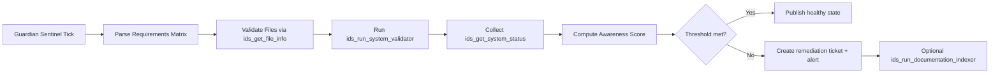

# PRISM MCP IDS Runtime Awareness Framework

Status: Active
Updated: 2026-07-20
Audience: Operators, SRE, Governance Engineering, Product Strategy

## Purpose

Define IDS as the runtime awareness backbone for PRISM. This framework turns IDS usage into measurable operational awareness instead of narrative-only confidence.

## Core Principle

When IDS is integrated into runtime governance loops, PRISM must show increased awareness through measurable indicators:

- faster drift detection
- higher requirement-to-evidence integrity
- reduced unresolved mismatch backlog
- better runtime health visibility

## Runtime Awareness Model

Awareness score is a weighted index calculated at each Sentinel cycle.

$$
AwarenessScore = 0.30 * IndexFreshness + 0.25 * CoverageIntegrity + 0.20 * DriftResolution + 0.15 * ValidatorHealth + 0.10 * QueryReliability
$$

Each component is normalized to $[0, 100]$.

## IDS Signals

1. ids_get_system_status

- source of index freshness, document counts, service health

1. ids_get_documentation_stats

- source of coverage and repository documentation density indicators

1. ids_get_file_info

- source of requirement-file existence integrity and tag quality

1. ids_search

- source of retrieval relevance and awareness discovery workflows

1. ids_run_system_validator

- source of structural policy compliance checks

1. ids_run_documentation_indexer

- source of controlled freshness restoration when stale thresholds are exceeded

1. ids_run_header_updater

- source of remediation automation for style and alignment consistency (approval-gated)

## Runtime Pipeline

## Thresholds

- AwarenessScore >= 85: Healthy
- AwarenessScore 70-84: Warning
- AwarenessScore < 70: Critical

- Index staleness threshold: 24h
- Validator failure threshold: any critical validator error
- Requirement mismatch threshold: > 0 for regulated release gates

## Governance Rules

1. ids_run_header_updater and ids_run_documentation_indexer must run under explicit operator approval in business execution profile.
2. Sentinel failures must emit a structured runtime alert and create a queue item.
3. Release readiness cannot be approved when AwarenessScore remains < 85 for two consecutive reporting windows.

## Guardian Efficiency Profile

IDS MCP is optimized for Guardian-driven periodic diagnostics and should run as
an efficient control loop rather than a high-frequency noisy poller.

Recommended profile:

1. Sentinel interval: 15 minutes baseline.
2. Lightweight checks each cycle: `ids_get_system_status`, targeted
  `ids_get_file_info`, and `ids_run_system_validator`.
3. Heavy remediation actions only on threshold breaches:
  `ids_run_documentation_indexer` and `ids_run_header_updater`.
4. De-duplicate repeated alerts by requirement ID and validator signature.
5. Preserve last-good awareness snapshot to avoid transient false regressions.

## Operator Commands

- baseline health check:
  - call ids_get_system_status
- alignment verification:
  - call ids_run_system_validator with scope full
- targeted file integrity check:
  - call ids_get_file_info for requirement-linked files
- remediation refresh:
  - call ids_run_documentation_indexer when staleness exceeds threshold

## Acceptance Criteria

1. Sentinel produces awareness metrics every configured interval.
2. Awareness score history is retained for trend inspection.
3. Critical drift is visible in operator surfaces and release gates.
4. IDS remediation tools are approval-gated and auditable.

## Related Documents

- STATUS.md
- REQUIREMENTS_TRACEABILITY_MATRIX.md
- slm_documentation_alignment_sentinel.md
- PRISM_AUDIT_MASTER_MATRIX_2026-07-20.md
- reference/mcp_server/MCP_IDS_API_REFERENCE.md
- reference/mcp_server/MCP_IDS_OPERATIONAL_RUNBOOK.md
