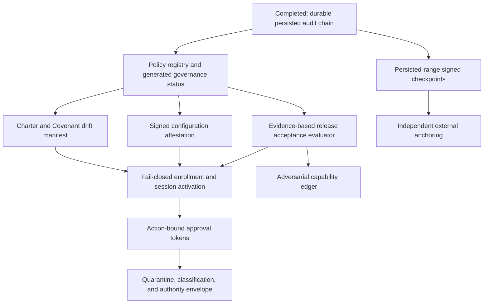

# Orrery to PrismRefraction Governance Transfer

## Detailed Research, Implemented Work, and Forward Engineering Plan

**Research date:** 2026-08-07 through 2026-08-08
**Prepared for:** Kirk LaSalle
**Source project:** Orrery (`D:\Projects\orrery`, <https://github.com/kirklasalle/orrery>)
**Target project:** PrismRefraction (`D:\Projects\PrismRefraction`)
**Related audit:** [Initialization Certificate v1.0 Critical Security Audit](INITIALIZATION_CERTIFICATE_V1_CRITICAL_SECURITY_AUDIT_2026-07-31.md)
**Nexus exchange:** `D:\Projects\.nexus\bridge\hotline.md`
**Document status:** Source-verified research complete; M1-M7 transfer implementation complete and locally tested
**Implementation status:** Durable audit persistence, machine-readable controls, generated governance artifacts, all sixteen required evidence producers, fail-closed enrollment, signed action-bound approval, quarantine/interdiction, delegation budgets, persisted-range anchoring, and adversarial ledgers are implemented. Production certification remains blocked until deployment-bound evidence is supplied and independently controlled infrastructure is verified.

---

## 1. Executive conclusion

Orrery should not be copied into PrismRefraction as another orchestration framework. Prism already has a richer runtime, provider layer, operator service, Guardian, policy engine, activity bus, secure computer/browser controls, and production deployment surface. Importing Orrery's dispatcher, adapters, or four-tier cycle hierarchy wholesale would duplicate ownership and create two competing execution models.

The valuable transfer is narrower and more important: **Orrery makes governance claims executable, inspectable, and falsifiable.** Its strongest ideas are not the Meta/Macro/Meso/Micro names. They are these engineering properties:

1. A persisted record is forward-only and hash-linked.
2. Verification identifies the first broken event, not merely `true` or `false`.
3. Pre-control history is reported as unprovable, never retroactively labelled secure.
4. Runtime policy coverage is represented as structured data.
5. Human-readable governance documentation is checked against that structured data in CI.
6. Configuration that changes system authority can be signed and attested.
7. Unknown actions are classified conservatively.
8. Classification and authorization are different objects.
9. Approval is narrow, expiring, single-use, and bound to one action.
10. Adversarial tests record both attacks that fail and attacks that still succeed.

Prism already independently implemented several of these ideas after the July certificate audit. The correct strategy is therefore:

- preserve Prism's existing runtime and security modules;
- fill only the remaining enforcement and evidence gaps;
- use Orrery as a behavioral reference, not a package dependency;
- require executable evidence for every future claim that a finding is closed.

The first transfer is complete: Prism's in-memory hash chain is now persisted to SQLite with sequence and predecessor metadata, resumes across process restarts, serializes multiple writers, blocks ordinary mutation/deletion, supports governed retention, and can be verified from the database alone.

---

## 2. Research method and evidence standard

This assessment was based on direct source inspection of both local repositories. The GitHub URL identifies the public source, but the local checkout was treated as the authoritative implementation available to this workspace.

### 2.1 Orrery evidence inspected

The following Orrery modules were inspected directly:

| Module                       | Relevant public surface                                                                      | Transfer value                                              |
| ---------------------------- | -------------------------------------------------------------------------------------------- | ----------------------------------------------------------- |
| `orrery/core/ledger.py`      | `LedgerEvent.digest()`, `EventLedger.append()`, `EventLedger.verify()`, `LedgerVerification` | Forward-only hash-linked record and actionable verification |
| `orrery/core/attestation.py` | `governed_configuration()`, `configuration_digest()`, `attest()`, `evaluate()`, `enforce()`  | Signed authority-bearing configuration                      |
| `orrery/core/governance.py`  | `Policy`, `EnforcementStatus`, `enforced()`, `unenforced()`, `coverage_by_law()`             | Machine-readable governance coverage                        |
| `orrery/core/charter.py`     | `extract_laws()`, `document_digest()`, `build_manifest()`, `verify_charter()`                | Charter drift detection                                     |
| `orrery/core/signing.py`     | `OperatorSigner`, `OperatorKeyring`, `SignatureEnvelope`                                     | Operator-held asymmetric signing model                      |
| `orrery/core/approval.py`    | Action-bound approval model                                                                  | Narrow, single-purpose consent                              |
| `orrery/core/quarantine.py`  | Classification and release flow                                                              | Unknown actions are held rather than guessed                |
| `orrery/core/envelope.py`    | Adapter and deployment boundary intersection                                                 | Location-based authority envelope                           |
| `orrery/core/invariants.py`  | State invariant checks                                                                       | Post-action truth checks                                    |
| `orrery/core/hindsight.py`   | Recorded learning from completed cycles                                                      | Evidence-backed adaptation                                  |

Orrery's `GOVERNANCE.md`, `README.md`, audit, benchmark, hardened profile, and adversarial-test descriptions were also reviewed to understand the intended operational contract around those modules.

### 2.2 Prism evidence inspected

The following Prism areas were inspected directly:

- certificate envelope, signing, DPAPI key custody, issuer registry, lifecycle store, and migration manifest;
- Permanent Active Directive integrity and signature gates;
- canonical Covenant artifact and Covenant runtime;
- `ExecutionAuthorityContext` validation and universal-enforcement tests;
- Guardian certificate verification;
- IAM post-login certificate claim flow;
- activity bus, hash-chain implementation, signed checkpoint sink, SQLite persistence, and retention policy;
- release acceptance evaluator;
- security-negative, certificate, migration, enforcement, and retention tests;
- operator documentation that describes audit-chain verification.

### 2.3 Evidence labels used in this document

This plan distinguishes four states:

| Label                                         | Meaning                                                                                                       |
| --------------------------------------------- | ------------------------------------------------------------------------------------------------------------- |
| **Implemented and tested**                    | Code exists and a focused executable test was run successfully during this work                               |
| **Implemented, residual verification needed** | Code exists, but a broader claim such as “all execution paths” needs route/path inventory or runtime evidence |
| **Partial**                                   | A meaningful control exists, but the original invariant is not fully established                              |
| **Open**                                      | The required control or evidence does not exist                                                               |

A source comment, a document statement, or a hard-coded `passed: true` is not evidence that a security invariant is satisfied.

---

## 3. Corrected Prism baseline

The original July audit was accurate for the code and live state inspected then. Significant remediation landed afterward. Earlier versions of this transfer plan understated that progress and then over-corrected by treating some partially implemented findings as closed. The table below is the current source-verified position.

| Finding                          | Current status                                          | Current evidence                                                                                                                | Residual work                                                                                                  |
| -------------------------------- | ------------------------------------------------------- | ------------------------------------------------------------------------------------------------------------------------------- | -------------------------------------------------------------------------------------------------------------- |
| IC-01 private-key custody        | **Implemented**                                         | `dpapi-key-store.ts`; encrypted key file and ACL controls                                                                       | Independent host/ACL deployment verification                                                                   |
| IC-02 issuer trust anchor        | **Implemented**                                         | `key-registry.ts`; pinning, revocation, compromise state, rotation lineage                                                      | Protect registry integrity independently from application write access                                         |
| IC-03 certificate immutability   | **Implemented and tested**                              | unconditional chat-store triggers; production migration test                                                                    | Operational backup/restore procedure must preserve triggers                                                    |
| IC-04 signed identity tuple      | **Implemented**                                         | `certificate-envelope.ts` canonical v1 envelope                                                                                 | Validate all issuance call sites supply real names rather than defaults                                        |
| IC-05 universal authority gate   | **Implemented, residual verification needed**           | `execution-authority-context.ts`, server-only context checks, `universal-enforcement.test.ts`, signed action-bound approvals    | Prove every privileged route and background path invokes the gate                                              |
| IC-06 per-binding Guardian       | **Partial to substantial**                              | Guardian iterates all certificate rows and verifies signature/key trust                                                         | Drift comparison still uses only newest certificate; validate exact binding used by each action                |
| IC-07 login/claim fail-closed    | **Implemented locally; deployment integration remains** | authenticated and operational session states; transactional one-time enrollment; replay probe                                   | Federated enrollment and cross-database claim atomicity still require unified deployment evidence              |
| IC-08 one Covenant trust object  | **Implemented and drift-gated**                         | canonical artifact manifest and generated Covenant publication                                                                  | Migrate remaining governance publications to the same generated-source model                                   |
| IC-09 machine-readable version   | **Implemented**                                         | exact format/version discriminators in signed envelope                                                                          | Reject unsupported future versions explicitly at all ingestion points                                          |
| IC-10 production-parity tests    | **Partial to substantial**                              | production chat-store tests and temp config isolation exist                                                                     | Enforce network denial and live-path denial across every security suite                                        |
| IC-11 tamper-evident audit chain | **Implemented and tested in this transfer**             | durable predecessor/sequence fields, append-only guards, persisted-range signed anchors, restart/multi-writer verification, CLI | Deploy the anchor to a separately controlled sink; retention creates declared but unavoidable proof boundaries |
| IC-12 malformed-key fail closed  | **Implemented**                                         | `KeyMaterialError`, forensic preservation                                                                                       | Operator recovery runbook and tested ceremony                                                                  |
| IC-13 legacy ambiguity           | **Implemented**                                         | signed quarantine migration and active uniqueness constraints                                                                   | Live-state reinspection after migration                                                                        |
| IC-14 PAD provenance             | **Implemented**                                         | PAD digest in certificate provenance plus signature/integrity gate                                                              | Extend same manifest model to Covenant and Prime Directive                                                     |

### 3.1 Important over-claim discovered

The original `release-acceptance-verification.ts` marked many gates `passed: true` without executing the control it claimed to verify. Examples included universal execution coverage, per-action Guardian validation, login fail-closed behavior, audit-chain external anchoring, test isolation, and red-team resistance.

This is not a cosmetic concern. It is the exact category Orrery's governance registry and documentation gate are designed to prevent. A release certificate that certifies assertions rather than evaluating evidence can turn incomplete implementation into an apparently cryptographic claim.

**Resolution:** hard-coded pass assertions have been removed. The evaluator now consumes current commit/build evidence and production certification remains blocked until every required probe passes.

### 3.2 Independent implementation review and repairs

An independent code-review pass was run after the first audit-chain implementation. It
identified seven defects, including four High-severity issues. Those findings were treated
as blockers before any additional Orrery feature work.

| Review finding                                                             | Resolution                                                                                                                                          |
| -------------------------------------------------------------------------- | --------------------------------------------------------------------------------------------------------------------------------------------------- |
| Retention guard could remain enabled after a crash                         | Guard, prune-state update, deletion, reset, and commit now occur in one `BEGIN IMMEDIATE` transaction; rollback restores all state                  |
| Arbitrary prefix deletion could be trusted as a new root                   | Verification now requires the first retained sequence and predecessor to match `audit_chain_state`                                                  |
| Full pruning reset the next event to sequence 1/genesis                    | Durable prune tombstone preserves the last sequence/hash; subsequent events continue from it                                                        |
| Hash omitted policy, authority, side-effect, identity, and rollback fields | Hash version 2 covers every persisted evidentiary field through recursively canonical JSON                                                          |
| Concurrent writers had no wait policy                                      | SQLite connections use a bounded 5-second busy timeout and transactional head selection                                                             |
| Process-local and durable metadata shared one generic event contract       | Durable `previous_hash`/`sequence_number` no longer appear on generic `ActivityEvent` query results; the bus chain remains explicitly process-local |
| Timestamp retention could delete a middle sequence                         | Retention deletes only the maximal contiguous old prefix and records its terminal hash                                                              |
| Dirty duplicate sequences failed with an opaque index error                | Migration preflights duplicates and refuses startup with a forensic-preservation diagnostic                                                         |
| Legacy-only/empty databases exited successfully                            | Verification now returns `valid`, `invalid`, or `indeterminate`; CLI exit code 2 represents indeterminate evidence                                  |

The review also confirmed a broader P0 defect: the release-acceptance evaluator could sign
and write a certificate even though 12 of 15 gates were unconditional assertions. That path
now fails closed when no manifest is supplied: all gates are reported not evaluated, no signing
key is generated or loaded, no signature is attached, and no certificate is written. Supplied
evidence can pass only its exactly matching gate; incomplete coverage still blocks certification.

---

## 4. Implemented now: durable SQLite audit chain

### 4.1 The gap before this transfer

Prism already had a good in-memory implementation:

- `ActivityBus` assigned `previousHash` and `sequenceNumber`;
- `computeChainedEventHash()` bound the predecessor and selected event fields;
- `verifyEventChain()` identified sequence gaps, broken links, and content mismatches;
- `AuditSink` could create signed checkpoints.

However, `SqliteActivityStore` persisted only the final `hash`. It discarded `previousHash` and `sequenceNumber`. After restart, the database could not reconstruct ordering or prove continuity. The operator guide nevertheless told administrators to query a `prev_hash` column that did not exist.

The practical result was that IC-11 cryptography existed in memory but the durable audit evidence did not carry the chain.

### 4.2 Changes implemented

| File                                                   | Change                                                                                                                                                             |
| ------------------------------------------------------ | ------------------------------------------------------------------------------------------------------------------------------------------------------------------ |
| `src/core/activity/types.ts`                           | Preserved the process-local chain contract without exposing durable chain metadata on generic activity queries                                                     |
| `src/core/activity/hash-chained-audit.ts`              | Added versioned canonical hashing; version 2 covers every persisted evidentiary field while version 1 remains verifiable                                           |
| `src/core/activity/sqlite-store.ts`                    | Added `previous_hash`, `sequence_number`, `hash_version`, durable prune state, migration preflight, transactional append, strict verification, and mutation guards |
| `src/core/activity/retention-policy.ts`                | Added atomic contiguous-prefix pruning with a durable sequence/hash tombstone                                                                                      |
| `scripts/verify-audit-chain.cjs`                       | Added an offline operator CLI that verifies the persisted chain and writes a JSON evidence artifact                                                                |
| `package.json`                                         | Added audit verification, governance status, and governance probe commands                                                                                         |
| `tests/activity-chain-persistence.test.ts`             | Added focused persistence, restart, multiple-writer, mutation, full-evidence hashing, retention, tamper, legacy, and pruning tests                                 |
| `src/core/security/release-acceptance-verification.ts` | Disabled assertion-based certification and signing until executable evidence exists                                                                                |
| `tests/release-acceptance-verification.test.ts`        | Proves blocked evaluation creates no key, signature, or certificate                                                                                                |
| `docs/ADMIN_SRE_GUIDE.md`                              | Updated separately to use the real CLI rather than nonexistent columns                                                                                             |

### 4.3 Durable append algorithm

Each event append now follows this sequence:

1. Begin a SQLite `BEGIN IMMEDIATE` transaction.
2. Read the highest persisted non-null `sequence_number` and its `hash`.
3. Use sequence 1 and the all-zero genesis hash when no chained row exists.
4. Otherwise increment the durable sequence and use the durable head as `previous_hash`.
5. Recompute the event hash from the durable predecessor and event payload.
6. Insert the row with `hash`, `previous_hash`, and `sequence_number` together.
7. Commit the transaction.
8. Roll back on any failure.

The write lock prevents two active Prism processes from selecting the same sequence. A partial unique index additionally rejects duplicate non-null sequence numbers.

### 4.4 Append-only enforcement

Two SQLite triggers protect `activity_events`:

- all updates are refused;
- deletes are refused unless `audit_chain_guard.retention_active = 1`.

The retention policy raises that guard only around its configured deletion statement and resets it in a `finally` block. This preserves the existing explicit retention feature while preventing ordinary application or ad-hoc SQL paths from quietly deleting events.

This is a control against normal runtime mutation and accidental operator SQL. It is not a security boundary against the database owner. An actor able to modify the database schema can drop the triggers. The chain still detects altered retained rows, but an independently anchored signed checkpoint is required to prove deletion of an entire suffix or replacement of the whole database.

### 4.5 Verification semantics

`verifyPersistedChain()` reports:

- whether the retained chained region is internally valid;
- number of events cryptographically checked;
- number of pre-migration rows without chain metadata;
- first retained sequence;
- whether history begins after a retention prune;
- exact sequence where verification first failed;
- a human-readable incident reason.

Two distinctions are intentional:

1. **Pre-migration rows are `unprovable`, not `valid`.** Prism does not manufacture predecessor values for historical events and then imply those values existed when the event was written.
2. **A pruned chain is `rootedAfterPrune`.** The retained segment may be internally valid, but the verifier states that earlier events cannot be proven from the database. It does not silently relabel the first retained event as genesis.

### 4.6 Test evidence

The focused chain suite passes 13 tests:

1. predecessor and sequence metadata persist;
2. intact chain verifies from SQLite alone;
3. sequence and predecessor continue after process restart;
4. alternating active store instances serialize against the database head;
5. updates are refused;
6. ordinary deletes are refused;
7. governed retention can delete;
8. trigger bypass followed by row alteration is detected and localized;
9. pre-migration rows are reported as unprovable;
10. retention-pruned history is authenticated against the recorded prune boundary;
11. full pruning preserves sequence/hash continuity for the next event;
12. out-of-order timestamps cannot cause a middle-sequence hole;
13. policy and authority fields formerly omitted from the hash are tamper-detected.

Adjacent regression evidence also passed:

- TypeScript `tsc --noEmit`;
- full project build;
- activity retention suite;
- universal enforcement suite;
- security negative suite;
- database migration framework suite.

---

## 5. What Prism should implement next from Orrery

### Priority 1: Machine-readable governance policy registry

**Orrery reference:** `governance.py`
**Prism status:** Implemented; all control requirements resolve to registered producers
**Risk:** Low
**Value:** Very high because it governs every later trust claim

Implemented as `src/core/governance/control-registry.ts`, with structured records containing:

- stable policy ID;
- Law/article number;
- exact predicate the runtime can evaluate;
- status: `enforced`, `partial`, or `not_enforced`;
- implementation module and symbol;
- executable test or probe that supplies evidence;
- known limitation;
- last evidence timestamp and result, generated by CI rather than hand-authored.

`src/core/governance/governance-status.ts` now generates `docs/GOVERNANCE_CONTROL_STATUS.md`. `npm run governance:status:check` fails when the checked-in document differs, and `ci:gate:check` invokes that drift check. Documentation may explain a policy, but it may not independently promote its enforcement status.

The registry currently reports 14 controls as `partial`, one as `not_enforced`, and zero as `enforced`. This is deliberate: named `security.*` evidence requirements are contracts, not executable probes, until their producers are implemented and registered. `probe-registry.ts` now provides the executable-probe boundary. Four producers are registered: `security.certificate-envelope@1`, `security.certificate-immutability@1`, `security.production-migration-parity@1`, and `security.audit-chain@2`. Database-backed probes require explicit paths and report missing, empty, or legacy-only evidence as `not_evaluated` rather than creating evidence or guessing a pass.

**Acceptance tests:**

- every `enforced` entry names an existing executable probe;
- a missing probe prevents `enforced` status;
- changing generated documentation by hand fails CI;
- Laws with no mechanical control remain visibly `not_enforced`.

### Priority 2: Evidence-based release acceptance evaluator

**Orrery reference:** governance coverage plus attestation discipline
**Prism status:** Implemented; release remains fail-closed when deployment evidence is absent
**Risk:** Medium
**Value:** Critical before production certification

Hard-coded `passed: true` entries have been removed from `release-acceptance-verification.ts`. The pure evaluator now consumes a canonical evidence manifest and reports:

- probe ID and version;
- evaluated inputs;
- evidence artifact path or digest;
- evaluation timestamp;
- failure reason;
- `passed`, `failed`, or `not_evaluated` status.

A gate without a probe must be `not_evaluated`, which prevents certification. “The module exists” is insufficient evidence for claims such as universal route coverage or external anchoring.

The release assessment embeds the canonical evidence-manifest SHA-256 digest. Certificate issuance is a separate operation, refuses any non-passing gate, and signs the assessment only with an explicitly supplied release signing key. No file or key side effect occurs during evaluation.

`probe-runner.ts` emits a canonical manifest using one shared commit/build identity. Strict release validation validates that identity, merges the probe records with generic `release-validation.*` records, evaluates all 15 controls, and blocks unless every control passes. Existing generic release-validation checks intentionally do not satisfy security controls with unrelated probe IDs.

Remaining work is to implement and register the other named `security.*` probes. The current four-probe manifest can provide evidence for gates 4, 5, and 13 plus the durable-chain half of gate 12; it cannot satisfy external anchoring or any unrelated control.

### Priority 3: Signed configuration attestation

**Orrery reference:** `attestation.py`
**Prism status:** Implemented with canonical governed-field selection and drift evidence
**Risk:** Medium
**Value:** High

Implement `configuration-attestation.ts` with:

- `governedConfiguration()` selecting settings that change system authority;
- canonical deterministic serialization;
- `configurationDigest()`;
- signed attestation issuance using Prism's existing issuer/key-registry infrastructure;
- verification against pinned keys;
- drift output naming each changed governed field;
- an operator CLI such as `npm run security:attest-config`;
- optional startup enforcement, disabled by default until hardened-profile evidence exists.

Candidate governed settings include autonomy mode, tool risk overrides, approval thresholds, external-control permissions, operator profile, network/provider allowances, retention policy, and bypass flags. UI preferences, visual settings, and other non-authority configuration should not be included.

### Priority 4: Charter and Covenant drift manifest

**Orrery reference:** `charter.py`
**Prism status:** Implemented for governed artifacts and generated Covenant publication
**Risk:** Low to medium
**Value:** High for IC-08 and IC-14 consistency

Create a manifest covering:

- `Permanent_Active_Directives.txt`;
- `AGENTIC_PRIME_DIRECTIVE.md`;
- `AGENTIC_SACRED_COVENANT.md`;
- the canonical machine Covenant artifact;
- Governance Council Charter if it is part of runtime authority.

The manifest should identify each artifact by stable ID, version, digest, and relationship. CI should verify that the human Covenant and machine Covenant express the same article set. Until Markdown generation from the machine artifact is adopted, an equality/drift test is the conservative first step.

### Priority 5: Fail-closed enrollment and login activation

**Orrery reference:** unknown/invalid authority fails closed
**Prism status:** Implemented for local IAM activation; federated/cross-database deployment integration remains
**Risk:** High
**Value:** Critical

The current IAM handler:

- searches for a recent orphan certificate;
- uses a 24-hour age heuristic;
- claims the newest candidate;
- catches claim errors;
- explicitly allows login to continue.

Replace this with a signed, one-time enrollment transaction:

1. Wizard issues a random enrollment nonce bound to certificate ID and expected operator identity.
2. The signed certificate envelope or signed enrollment record contains the nonce digest.
3. Login redeems the nonce once in a database transaction.
4. Exact certificate, assignment, and operator identities are bound.
5. Replay or ambiguity fails.
6. Authentication may establish identity, but the resulting session remains non-operational until authority binding succeeds.
7. Read-only recovery UI may remain available; privileged dispatch may not.

### Priority 6: Action-bound approval tokens

**Orrery reference:** `approval.py`
**Prism status:** Implemented in `ApprovalQueue` with immutable action snapshots and signed one-time decisions
**Risk:** Medium to high
**Value:** High for irreversible actions

`ExecutionAuthorityContext` proves _who and what binding authorizes evaluation_. It does not itself prove that the operator approved one specific irreversible action.

Add an approval token containing:

- token ID;
- exact action ID;
- canonical action digest;
- operator identity and authority-context digest;
- issued/expiry timestamps;
- single-use nonce;
- risk class;
- issuer/signature metadata.

Approval for one action must not authorize another action, a modified parameter set, or a replay. Classification remains separate from approval.

Prism already has a useful partial implementation in `ApprovalQueue`: requests expire and
are consumed once. Extend that queue rather than replacing it. The missing properties are
approver identity, signed decision evidence, canonical action binding, persistence, and
cryptographic attribution. Do not activate the currently unwired `ApprovalService` as-is;
it binds broadly and lacks an authentication boundary.

### Priority 7: Quarantine, classification, and authority envelope

**Orrery references:** `quarantine.py`, `envelope.py`, `interdiction.py`
**Prism status:** Implemented in the existing tool registry, governance normalizer, and orchestrator path
**Risk:** Medium to high
**Value:** High for plugins and future tools

Adopt these semantic rules:

- undeclared action defaults to highest relevant risk;
- unknown action is quarantined, not approved by guesswork;
- classification states what an action is and never grants permission;
- approval grants narrow permission and never changes classification;
- adapter-declared reach and deployment-allowed reach intersect;
- a new action is judged by what resources it reaches even before its name is known.

Do not create a second policy engine. Implement these as inputs and invariants inside Prism's existing tool registry, policy engine, plugin validation, and execution authority path.

This priority is upgraded to **P0** by source review. `normalizeRequestByGovernance()` can
currently preserve caller assertions for undeclared actions instead of holding them for
classification. The target is the existing `GovernanceSchema` and `Orchestrator.run()` path,
not a parallel Orrery dispatcher.

### Priority 7A: Non-overridable interdiction and protected paths

Prism has subsystem deny patterns, PAD boot verification, Guardian checks, and global pause,
but no single gate proving that approval cannot override a prohibition. Add a central
interdiction result before approval evaluation. Protect governance roots, key registries,
audit-chain state, halt state, and approval evidence from actions executed under the same
authority they constrain.

### Priority 7B: Delegation budgets

Prism has local limits but no shared delegation tree budget. Extend `SubAgentRequest`,
`AgentPool.dispatch()`, and `SwarmCoordinator` with ancestry, depth, fan-out, total population,
and authority-tier descent constraints. Do not import Orrery's four-cycle runtime; add the
budget to Prism's existing agent hierarchy.

### Priority 8: Persisted-chain checkpoints and external anchoring

**Orrery reference:** forward-only ledger and signed integrity records
**Prism status:** Persisted-range checkpoints and anchor verification implemented; independent sink deployment remains
**Risk:** Medium
**Value:** Required for complete IC-11 closure

Connect `AuditSink` to persisted sequence ranges rather than only process-local event buffers. Each checkpoint should include:

- database identity;
- first and last sequence;
- event count;
- first predecessor hash;
- last event hash;
- Merkle or range root if retained;
- pre-migration and prune status;
- timestamp;
- issuer key ID and signature.

Export checkpoints to a sink outside the writable database boundary. A local JSON file on the same volume is useful operational evidence but not independent anchoring.

### Priority 9: Adversarial capability ledger

**Orrery reference:** `tests/test_adversarial.py`
**Prism status:** Digest-bound machine ledger implemented for initial attack families; broader attack inventory remains
**Risk:** Low
**Value:** High for honest governance

For every control, record:

- threat position;
- attack attempted;
- expected result;
- actual result;
- whether the attack still succeeds;
- why it succeeds;
- compensating control;
- remediation owner.

The audit-chain test added in this transfer demonstrates the style: it explicitly drops the mutation trigger, changes a row, and proves the cryptographic verifier detects the alteration. The test documents that a database owner can remove schema controls rather than pretending a trigger is an unbreakable boundary.

---

## 6. What should not be ported

### 6.1 Orrery dispatcher and four-tier cycle framework

Prism already has orchestration, autonomous loops, cognition-cycle plugins, scheduling, agents, and runtime policy. A second dispatcher would fragment lifecycle, cancellation, telemetry, authority, and error semantics.

The tier vocabulary may inform planning, but it should map onto existing Prism abstractions rather than become another root runtime.

### 6.2 Orrery filesystem and process adapters

Prism has richer tool and computer-control layers with established governance and UI integration. Porting Orrery adapters would create bypass paths unless every adapter were wrapped by Prism's authority and policy pipeline.

### 6.3 Orrery signing implementation

Prism's DPAPI custody, issuer registry, revocation state, rotation lineage, and signed lifecycle records are ahead of Orrery's environment-key model. Prism should not regress to keys supplied directly through environment variables.

The useful Orrery signing idea is operator-held private keys for human approvals. That should be added as a distinct approval authority, not used to replace Prism's system issuer registry.

### 6.4 Safety controls disabled by default without explicit attestation

Orrery is honest that many controls are off by default. Prism can adopt that honesty, but production-facing controls should not silently remain disabled. Default-off experimental controls need:

- visible capability reporting;
- hardened-profile tests;
- release-gate status;
- operator-facing attestation;
- no production claim until enabled and evidenced.

---

## 7. Recommended delivery sequence



### Proposed milestones

| Milestone | Scope                                             | Completion evidence                                                                                                                   |
| --------- | ------------------------------------------------- | ------------------------------------------------------------------------------------------------------------------------------------- |
| M1        | Durable chain                                     | Completed: 13 focused tests plus build/security regressions                                                                           |
| M2        | Policy registry and generated governance document | Complete: generated-document drift fails CI and unsupported `enforced` promotion is rejected                                          |
| M3        | Executable release gates                          | Complete architecture: sixteen producers cover every registered requirement; unavailable deployment evidence remains `not_evaluated`  |
| M4        | Configuration and charter attestation             | Complete: drift identifies changed authority settings and governed artifacts                                                          |
| M5        | Fail-closed enrollment                            | Complete locally: authenticated-but-unbound sessions cannot execute privileged actions                                                |
| M6        | Narrow approvals and quarantine                   | Complete: replay, parameter substitution, unknown-action, and delegation-budget attacks fail                                          |
| M7        | External audit anchoring                          | Complete mechanism: database replacement or suffix deletion is detectable; production still requires an independently controlled sink |

### M3-M7 implementation update

- **M3:** The evidence registry now executes fail-closed login, adversarial capability, and external persisted-anchor probes in addition to certificate, migration, Covenant, and durable-chain probes. Deployment-dependent evidence remains `not_evaluated` unless explicit database and anchor paths are supplied.
- **M4:** Governed configuration attestation and generated governance/Covenant artifact drift checks are enforced in CI.
- **M5:** IAM sessions persist separate `authenticated` and `operational` states. Local login requires timing-safe, one-time certificate enrollment before privileged cookie resolution succeeds; token replay is rejected transactionally.
- **M6:** Unknown tools/actions are interdicted before policy or approval. Approval decisions are immutable action snapshots bound to session, operation, arguments, risk, expiry, nonce, and an Ed25519 signature; settled request IDs cannot be replayed. Agent delegation enforces shared depth, fan-out, population, cycle, and authority-ceiling budgets.
- **M7:** Checkpoints are generated from verified SQLite rows, carry durable range and issuer identity metadata, and can be published outside the database boundary. Verification detects suffix deletion and changed range roots. Adversarial probe runs publish a digest-bound capability ledger.

Release certification remains fail-closed: local implementation does not substitute for deployment evidence, independently controlled anchor storage, host key-custody proof, or probes that remain unregistered.

---

## 8. Operational commands added by this transfer

After the application has migrated the database schema, verify the default activity database with:

```powershell
npm run security:verify-audit-chain
```

Generate or verify machine-readable governance status documentation with:

```powershell
npm run governance:status:generate
npm run governance:status:check
```

Run all registered governance probes and write the canonical evidence manifest:

```powershell
npm run governance:probes
```

Supply deployed database evidence where available:

```powershell
node dist/src/core/governance/probe-runner.js --audit-db "C:\path\to\prism-activity.db" --chat-db "C:\path\to\chat.db"
```

The runner exits 1 for failed probes and 2 for `not_evaluated` probes. CI collection uses
`--allow-not-evaluated` so it can preserve incomplete evidence; strict release evaluation
still blocks certification for every missing or unevaluated gate.

Verify a specific database:

```powershell
node scripts/verify-audit-chain.cjs --db "C:\path\to\prism-activity.db"
```

Request machine-readable output:

```powershell
node scripts/verify-audit-chain.cjs --db "C:\path\to\prism-activity.db" --json
```

The command also writes:

```text
prism-output/security/audit-chain-verification.json
```

Exit status is 0 only when all available evidence verifies without legacy ambiguity. A
missing database, missing schema, unreadable row, sequence gap, broken predecessor, or
content mismatch exits 1. Exit status 2 means evidence is **indeterminate**, such as a
legacy-only database or retained chain accompanied by unprovable pre-migration rows.

---

## 9. Security limitations and non-claims

This implementation does **not** claim:

- that rows written before chain metadata existed are proven;
- that retained rows prove pruned history;
- that SQLite triggers stop the database owner;
- that a local signed checkpoint is independent external anchoring;
- that a hash chain proves event truthfulness at creation time;
- that every execution path supplies complete authority solely because an interface exists;
- that local fail-closed enrollment proves federated enrollment or cross-database atomicity;
- that the human and machine Covenants are one source merely because both exist;
- that naming a `security.*` evidence requirement means its executable producer exists;
- that generic release-validation evidence can satisfy a security control with a different probe ID.

The chain proves retained-record continuity and content integrity relative to its available root. It cannot prove that the event's original claim about the world was true. That requires authority validation, policy evidence, result receipts, and independent observation.

---

## 10. Remaining Orrery closure work

The software transfer is complete through M7. What remains is production operationalization and evidence, not another Orrery runtime port:

1. publish audit anchors to a separately administered, append-only sink rather than a local file under the same host authority;
2. collect signed current-commit deployment attestations for host key custody, ACLs, issuer-registry integrity, legacy remediation, identity cardinality, action provenance, Guardian binding, and suite-wide isolation;
3. inventory and exercise every privileged route, scheduler callback, MCP/A2A entrypoint, autonomous loop, and background job before promoting universal authority coverage;
4. unify federated enrollment and certificate claim state where cross-database atomicity is required;
5. expand the adversarial capability ledger beyond enrollment replay, approval replay/substitution, and unknown-action quarantine;
6. provide operator ceremonies and CLI workflows for deployment attestation signing, release signing, key rotation/revocation, and external-anchor publication;
7. enforce the hardened production profile at startup only after those operator and recovery workflows are tested.

Controls must remain `partial` or evidence must remain `not_evaluated` until these production facts are supplied. This is deliberate fail-closed behavior, not unfinished local implementation.

---

## 11. Reciprocal transfer back to Orrery

The exchange should not be one-way. Orrery should adopt from Prism:

1. OS-protected private-key custody rather than environment-only secrets;
2. independently persisted public-key registry;
3. explicit `active`, `revoked`, and `compromised` key states;
4. rotation lineage;
5. signed append-only lifecycle events;
6. encrypted-at-rest operator signing where available;
7. release evidence that distinguishes implemented controls from configured controls.

A leaked Orrery approval/checkpoint key currently has no first-class revocation lifecycle comparable to Prism's registry. Prism's key-management pattern is the stronger design and should be upstreamed conceptually.

---

_This document records source state and executable evidence observed on 2026-08-08. It supersedes the earlier transfer-plan draft. Future status changes must update the structured governance registry, regenerate documentation, and supply current executable evidence rather than editing enforcement claims by hand._
