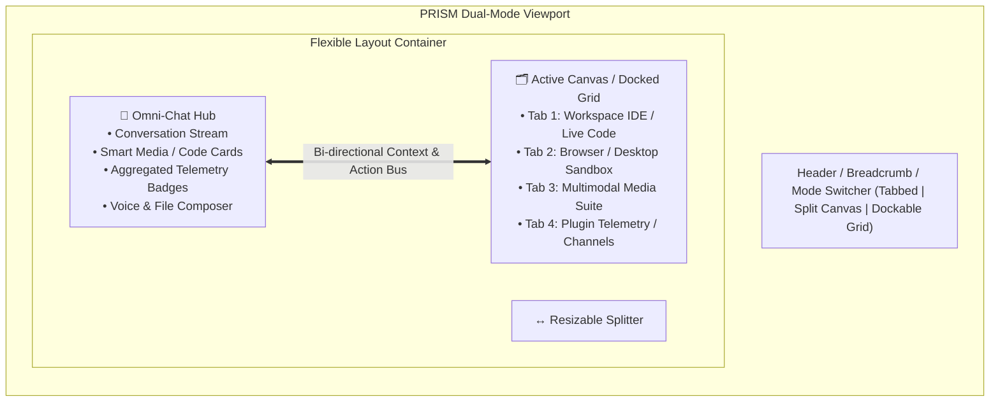

# PRISM Chat Intelligent Aggregator & Split/Dockable Canvas Architecture

## Executive Summary & Due Diligence Audit

This document outlines the architectural plan for upgrading the **PRISM Operator Chat Interface** into an **Intelligent Aggregation Hub** with **Split Canvas** and **Dockable Multi-Panel** capabilities. 

Rather than treating Chat and the 15 specialized tabs as mutually exclusive views, the chat stream serves as the central command orchestrator while all existing subsystems (IDE Workspace, Computer/Browser Control, Sandbox Desktop, Robotics, Multimodal Media, Channels, Tools, and Telemetry) project interactive widgets directly into the chat flow and dock into adjacent canvases.

---

## 1. Due Diligence & Codebase Audit Findings

A comprehensive audit of the `PrismRefraction` codebase reveals that all required subsystems, tools, and tab infrastructures already exist in full:

### A. Registered Dashboard Tabs (`src/core/operator/public/dashboard-core.js`)
PRISM currently has **15 core tabs** managed via dynamic fragment loading (`tab-loader.js` fetching `/public/tab-<id>.html`):
1. **`chat`** (`tab-chat.js`, `tab-chat.html`): Chat session stream, composer, file attachments, speech/voice input.
2. **`workspace`** (`tab-workspace.js`, `tab-workspace.html`): File tree, file filtering, workspace path manager, import manager.
3. **`tools`** (`tab-tools.js`, `tab-tools.html`): Tools, plugins, skills, MCP servers, addons, and utility registry.
4. **`agentic`** (`tab-agentic.js`, `tab-agentic.html`): Autonomous goal orchestration, plan execution loops, multi-agent dispatch.
5. **`computer`** (`tab-computer.js`, `tab-computer.html`): OS-level mouse/keyboard control, screenshots, coordinate targeting.
6. **`browser`** (`tab-browser.js`, `tab-browser.html`): Playwright/Puppeteer automation, URL navigation, DOM selector runner, page text/screenshot capture.
7. **`desktop`** (`tab-desktop.js`, `tab-desktop.html`): Virtualized/containerized desktop sandbox framebuffer.
8. **`robotics`** (`tab-robotics.js`, `tab-robotics.html`): Hardware telemetry, VRGC robotics, WiFiVision CSI.
9. **`channels`** (`tab-channels.js`, `tab-channels.html`): Email (Gmail/Outlook), SMS, Calendar, Notes, and Tasks.
10. **`network`** (`tab-network.js`, `tab-network.html`): HTTP request sandbox, network inspection, protocol tracing.
11. **`telemetry`** (`tab-telemetry.js`, `tab-telemetry.html`): System health metrics, memory, usage pricing catalog, performance graphs.
12. **`logs`** (`tab-logs.js`, `tab-logs.html`): Audit trail, execution logs, security traces, discrepancy reconciliation.
13. **`scheduler`** (`tab-scheduler.js`, `tab-scheduler.html`): Scheduled agent jobs, cron schedules, recurring automation.
14. **`settings`** (`tab-settings.js`, `tab-settings.html`): Model spectrum, routing configuration, IAM identity, provider secrets.
15. **`wiki`** (`tab-wiki.js`, `tab-wiki.html`): Knowledge base, guidelines, architectural documentation.

### B. Core Tool Adapters (`src/core/tools/builtin-tools.ts`)
- **Coding / IDE Tools**: `PrismIdeModifyTool` (precise surgical code replacement & AST validation), `PrismIdeLintTool`, `WebPageInitializeTool`, `WebComponentInjectTool`, `WebAssetsOptimizeTool`, `WebVisualAuditTool`.
- **System & Terminal**: `TerminalSessionTool`, `ContainerSandboxTool`, `ShellTool`, `FileReadTool`, `FileWriteTool`, `FileListTool`, `FileDeleteTool`.
- **Multimodal & Vision**: `VisionCaptureTool`, `FramebufferCapture`, `BrowserControlTool`, `ComputerUseTool`.
- **Communication & DB**: `EmailOpsTool`, `CalendarPlanTool`, `SmsCommunicationTool`, `NotesExtractTool`, `TasksTimelineTool`, `Neo4jQueryTool`, `PrismDashboardControlTool`.

### C. Current Architectural Gap
Currently, PRISM switches tabs in a full single-panel replacement mode (`state.activeTab = tabId`). Navigating to `workspace` or `computer` completely hides the chat conversation, breaking user immersion and workflow continuity.

---

## 2. Target Architecture: The Dual-Mode Canvas (Split & Dockable)

---

## 3. Detailed Component Design

### A. Intelligent In-Chat Aggregation System (Smart Artifacts)
When any agent tool runs or when multimodal data is received, the chat stream renders an **Interactive Card** that can be directly manipulated or expanded into the adjacent Canvas:

1. **Coding IDE & Web Builder Cards**:
   - Live syntax-highlighted code block with diff view.
   - Quick action: `Open in Canvas Editor` (launches Monaco/file view in the right panel).
   - Quick action: `Run Sandbox Preview` (executes HTML/JS/CSS live in an isolated preview sandbox).
2. **Multimodal Media Hub Cards**:
   - **Images**: High-res thumbnail grid, prompt metadata, zoom lightbox, and `Edit / Inpaint in Studio` trigger.
   - **Audio / Voice**: Interactive waveform player with playback speed, pitch slider, transcript sync, and quick voice replay.
   - **Video**: Video scrubber card with keyframe preview and timestamp jumping.
3. **Computer & Browser Control Cards**:
   - Live mini-framebuffer/screenshot preview.
   - Interactive click-to-coordinate overlay and DOM tree inspector.
   - `Expand into Live Session` action.
4. **Channels & Schedule Cards**:
   - Mini calendar event pills with 1-click RSVP.
   - Collapsible email draft composer cards.
   - Scheduled task timer chips.

### B. Layout Modes (Split Canvas + Dockable Multi-Panel)

1. **Mode 1: Split Canvas (Default Side-by-Side)**
   - **Left Panel (35% - 50%)**: Persistent Omni-Chat stream and composer.
   - **Center Resizer**: Smooth drag handle with snap points (30/70, 50/50, 70/30).
   - **Right Panel (50% - 65%)**: Active Tab Canvas (e.g., Workspace, Browser, Tools, Telemetry).
   - **Multi-Tab Bar on Canvas**: Allows switching the right panel's active tab without affecting the chat.

2. **Mode 2: Dockable Multi-Panel Grid (Power Operator Mode)**
   - Modular dock zones: **Top-Right**, **Bottom-Right**, and **Bottom-Tray**.
   - Example layout:
     - Left: Chat Hub
     - Top Right: Workspace IDE & Code Preview
     - Bottom Right: Browser Automation Sandbox or Terminal Logs
   - Panels can be collapsed, expanded, swapped, or detached into separate popout windows.

3. **Mode 3: Focused Single Tab (Classic View with Mini-Chat Overlay)**
   - For focused tasks (e.g., full-screen Robotics or Telemetry analysis), with a collapsible floating Chat drawer.

### C. Unified State & Cross-Tab Context Sync

- **Active Workspace Context**: The chat prompt automatically includes the active file path, selected lines, and cursor location from the `workspace` tab.
- **Active Browser Context**: When discussing web automation, the current URL, page title, and selected DOM elements are injected into the agent context.
- **Bi-directional Navigation**: 
  - Clicking a file path in chat switches the Canvas to `workspace` and opens that file.
  - Clicking a URL opens the `browser` canvas.
  - Clicking an agent execution log opens the `logs` canvas at the exact trace ID.

---

## 4. Implementation Steps & Roadmap

### Phase 1: Layout Engine Foundation
- Update `src/core/operator/public/dashboard.css` with CSS Grid / Flexbox layout tokens for Split Canvas and Dockable multi-panel containers.
- Implement draggable splitter handle with localStorage persistence for panel widths.

### Phase 2: Dual-Tab Container & Tab-Loader Enhancements
- Refactor `src/core/operator/public/tab-loader.js` and `dashboard-app.js` to support mounting two active tabs simultaneously (Primary Chat on Left + Canvas Tab on Right).
- Add layout mode switcher button in the top header (`[ Single | Split | Docked ]`).

### Phase 3: In-Chat Smart Aggregator Widgets
- Implement custom renderer hooks in `tab-chat.js` for:
  - Code & diff preview cards with `Open in Canvas` hooks.
  - Multimodal media players (Waveform audio, image grid, video scrubber).
  - Browser/Computer control screenshot cards with interactive overlays.
  - Plugin & Channel widgets.

### Phase 4: Bi-Directional Event Bus & Context Linking
- Connect `PrismDashboardControlTool` (`prism_dashboard`) to trigger split canvas actions programmatically (`open_split_canvas`, `highlight_code`, `inspect_browser`).
- Implement automatic context injection for active tab state into chat prompt requests.

---

## 5. User Review & Alignment

> [!NOTE]
> **Summary of Key Decisions:**
> 1. **No new tabs needed**: All 15 existing tabs are preserved and elevated to first-class canvas panels.
> 2. **Both Split & Dockable supported**: The UI will feature a layout toggle between Split-Screen Canvas, Multi-Panel Dockable Grid, and Classic Full-Tab mode.
> 3. **Intelligent Chat Aggregation**: All artifacts (code, media, sandbox, telemetry) will render rich interactive previews in chat with instant 1-click projection into the canvas.

Please review the proposed plan and let me know if you would like to adjust any aspect of the layout or interaction model before we proceed to execution!
