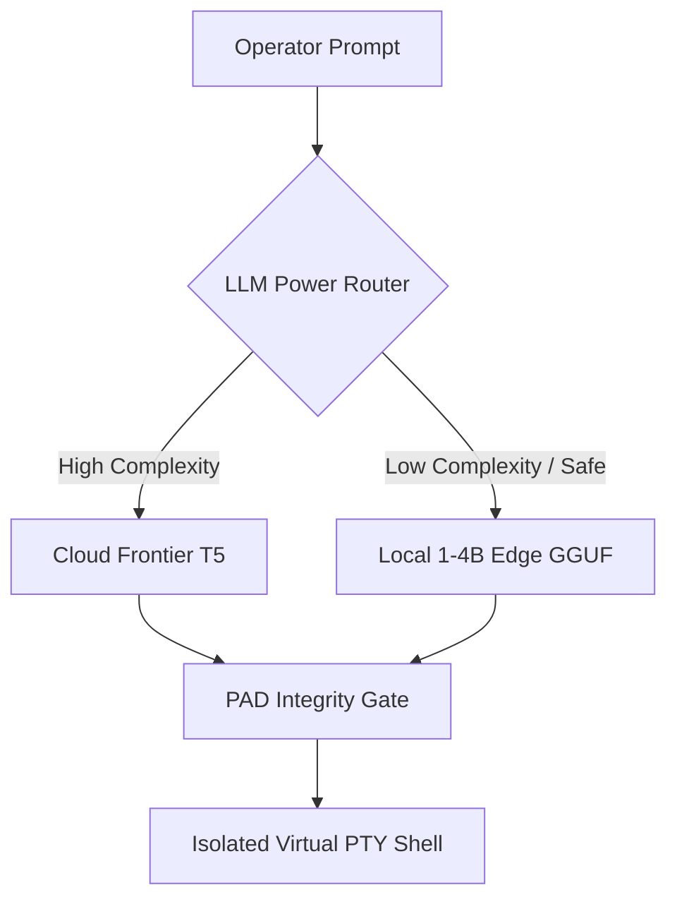
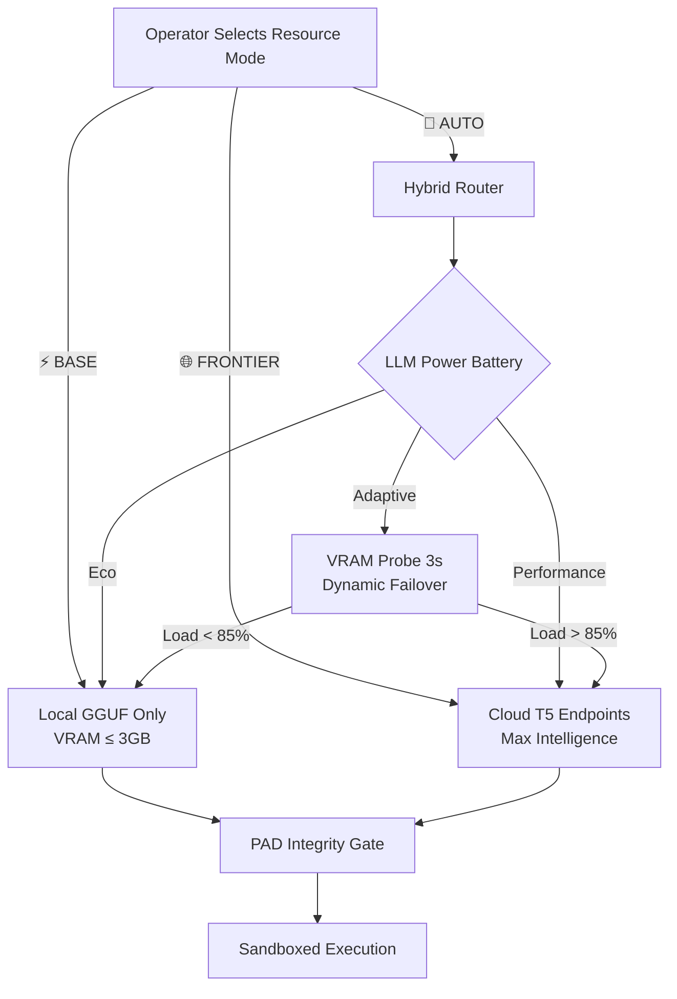

# PRISM MASTER CODEX: THE SYNAPSE CHRONICLES

A SOTA retro-futuristic archival monolith detailing the architectural evaluations, swarm topologies, permanent active directives, resource paradigms, and cognitive economics of the PRISM Refraction Engine.

---

## 0. Prologue: Genesis & The Sacred Governance Covenant

> **Phase**: Governance & Core | **Boot Layer**  
> **Cited**: [PAD_WHITEPAPER.md](file:///d:/Projects/Prism/docs/PAD_WHITEPAPER.md), [TERMS_AND_GOVERNANCE_FRAMEWORK.md](file:///d:/Projects/Prism/docs/TERMS_AND_GOVERNANCE_FRAMEWORK.md)

At the dawn of autonomous systems, agentic frameworks suffered from a fundamental insecurity. Traditional agents were either deployed as un-sandboxed local scripts—capable of catastrophic host mutations, data deletion, or unauthorized system access—or bound to high-latency commercial cloud wrappers that stripped the operator of privacy and data sovereignty. PRISM was engineered to solve this paradigm, giving birth to the first **Governance-Native Agentic-as-a-Service (AaaS)** runtime.

The architecture's cornerstone is the **Permanent Active Directives (PAD)**, a cryptographically audited constitutional framework comprising ten immutable laws. Unlike generic prompt instructions that can be bypassed via LLM prompt injection or jailbreaking, the PAD is compiled at the low-level boot layer and checked every 600 seconds by an isolated **Guardian Agent** process.

Every state-changing transaction, shell execution, database query, and outbound HTTP request is recorded onto a SHA-256-chained **Activity Bus**. This guarantees mathematical verification of non-tampering; if any agent or external actor attempts to hijack the runtime's objectives, the cryptographic chain breaks, instantly triggering an immediate host airlock freeze.

### Evaluation Matrix

| 🏆 Praise & Moat Strategy | ⚠️ Critique & Latency |
| :--- | :--- |
| PRISM's cryptographic PAD chain represents an impenetrable fortress. By anchoring agent execution to mathematical integrity checks, it establishes a defensible enterprise security moat that competitors cannot easily replicate. | Continuous background integrity monitoring and prompt preamble packing introduce slight token latency overheads, requiring careful model selection during low-memory execution. |

---

## 1. Competitive Positioning & Market Moats

> **Phase**: Competitive Position | **Market Specs**  
> **Cited**: [PRISM_PRD.md](file:///d:/Projects/Prism/docs/PRISM_PRD.md), [COMPETITIVE_ANALYSIS_2026.md](file:///d:/Projects/Prism/docs/COMPETITIVE_ANALYSIS_2026.md), [MARKET_REVIEW.md](file:///d:/Projects/Prism/docs/MARKET_REVIEW.md)

A rigorous evaluation of the 2026 agentic landscape highlights a major gap in modern tools: they lack a logical connection between high-level reasoning and physical hardware management. While platforms like Claude Computer Use or Perplexity provide powerful browser controllers, they operate on raw API billing structures that drain capital, while local frameworks like OpenClaw lack strict safety guarantees. 

PRISM bridges this gap by combining world-class local edge model execution with frontier cloud routing, delivering an **Edge-First Cost Moat**. By utilizing a proprietary hybrid mapping framework, PRISM routes lightweight task utilities (classification, routing, telemetry summaries) to local 1.5B–3B parameter models while reserving complex reasoning for frontier cloud endpoints. This drops operational API overhead by up to **72%** while maintaining a **95% cognitive throughput index**.

PRISM's marketable enterprise-level features are divided into three commercial segments:
* **Individual Tier**: Local-first privacy, file/shell utilities, secure personal browser autopilot.
* **Professional/Corporate Tier**: Tenant isolation, structured OAuth credentials persistence, and Shared Model ports.
* **Industrial/Sovereign Tier**: Custom OCI character packaging, compliance-audited SHA-256 telemetry chains, and multi-node swarm orchestration.

### Evaluation Matrix

| 🏆 Praise & Moat Strategy | ⚠️ Critique & Latency |
| :--- | :--- |
| The hybrid model routing matrix enables an extremely low cost-per-task index, allowing organizations to self-host complex autonomous agents without massive cloud bills. | Initial setups require GGUF model downloads and local server bindings (Ollama/Llama.cpp), resulting in onboarding friction on non-GPU consumer hardware. |

---

## 2. PTY Virtualization, Command Interception, & Visual PII Masking

> **Phase**: Safety & Execution | **PTY Sandbox**  
> **Cited**: [CONTAINER_VIRTUALIZATION_DESIGN.md](file:///d:/Projects/Prism/docs/CONTAINER_VIRTUALIZATION_DESIGN.md), [TERMINAL_VIRTUALIZATION_DESIGN.md](file:///d:/Projects/Prism/docs/TERMINAL_VIRTUALIZATION_DESIGN.md), [PRISM_BATON_PASS_VERBATIM.md](file:///d:/Projects/Prism/docs/PRISM_BATON_PASS_VERBATIM.md)

Autonomous agents require access to system resources to complete real-world tasks (running terminal commands, installing dependencies, navigating websites). However, exposing raw host shells is catastrophic. PRISM eliminates this vulnerability by routing all shell actions through an isolated **Virtual PTY Terminal Session**.

Every command is intercepted and parsed by PRISM's low-level tokenizer. Unsafe shell mutations (e.g. nested deletions, arbitrary network downloads, environment variable extractions, or key extraction scripts) are instantly blocked. If a task requires elevated access, the system invokes the **CSH Baton Pass (Human-in-the-Loop transition)**. Rather than failing silently, PRISM freezes execution state, displays a terminal baton handover UI, and prompts the operator for explicit visual approval before carrying out the step.

Furthermore, when using Playwright browser control, PRISM integrates **Visual PII Masking**. Before any screenshot is passed to visual multimodal LLMs for planning, the framebuffer is passed through a local OCR block list filter. Credit cards, social identifiers, session tokens, and passwords are dynamically redacted directly in the pixel layer, preventing private data leakage to third-party endpoints.

### Evaluation Matrix

| 🏆 Praise & Security Architecture | ⚠️ Critique & Operability |
| :--- | :--- |
| Visual PII masking is a masterclass in safety. Redacting credentials in the visual framebuffer before cloud dispatch represents a groundbreaking standard for corporate compliance. | If an operator goes offline, tasks waiting for CSH approvals remain paused, causing queue blocks in data pipelines unless automated timeouts are configured. |

---

## 3. Swarm Coordinator Topologies & Character Accountability (CAC)

> **Phase**: Agentic Swarms | **Topology Grid**  
> **Cited**: [SWARM_INTEL_SPEC_D3](file:///d:/Projects/Prism/docs/PHASE_D3_TASKS_MANIFEST.md), [USER_GUIDE.md](file:///d:/Projects/Prism/docs/USER_GUIDE.md)

Complex industrial tasks cannot be solved by a single agent. PRISM introduces the **Swarm Coordinator**, a multi-agent orchestration layer that decomposes master goals into sub-tasks and assigns them across four unique structural topologies:
1. **Star Topology**: A centralized supervisor agent orchestrates, validates, and collates output from subordinate workers. Ideal for structured audits and research.
2. **Mesh Topology**: Decentralized peer-to-peer agent collaborations with distributed consensus logic. Ideal for self-healing code generation.
3. **Pipeline Topology**: Sequential execution where specialised agents pass structured state outputs downstream (e.g., Web Researcher -> Analyst -> Code Writer -> Tester).
4. **Broadcast Topology**: A master orchestrator broadcasts events synchronously to all workers to align swarms during system state shifts.

To guarantee multi-agent governance, every worker node is managed under **Character Accountability Control (CAC)**. Every agent is wrapped in an isolated identity manifest defining its exact permissions, budget limits, system scopes, and lifespan. If a sub-agent spawns nested children, the parent's budget and security constraints are mathematically inherited, preventing runaway infinite worker loops or uncontrolled API cost spikes.

### Evaluation Matrix

| 🏆 Praise & Multi-Agent Moat | ⚠️ Critique & Complexity |
| :--- | :--- |
| CAC represents an extraordinarily sophisticated framework for regulating swarm behaviors. Inheriting budget limits down nested trees mathematically guarantees cost protection. | Swarm meshes can suffer from consensus deadlock if peer workers disagree on validation metrics, requiring a master fallback timeout supervisor. |

---

## 4. Spectrum Refraction: Hemispheric Cognition & Triad Isolation

> **Phase**: Cognitive Engine | **Triad Isolation**  
> **Cited**: [SPEC_REFRACT_D4](file:///d:/Projects/Prism/docs/ROADMAP.md), [model-capability-matrix.ts](file:///d:/Projects/Prism/src/core/operator/model-capability-matrix.ts)

**Spectrum Refraction (SR)** is the cognitive crown jewel of the PRISM architecture. Traditional single-model agents are prone to progressive hallucination: when a single model generates planning, writes code, and validates its own execution, it operates inside a closed echo chamber, inevitably validating its own errors.

PRISM breaks this vulnerability by splitting logical planning and creative generation into specialized cognitive hemispheres, verified by a strict **Triad Isolation Engine**:
* **Left Hemisphere (Logic & reasoning)**: Strictly handles tool compilation, code execution, mathematical calculations, and low-level parsing (restricted to T3+ logic models).
* **Right Hemisphere (Creative & Synthesis)**: Focusing on fluid content generation, multimodal visual evaluation, and user-facing copy.
* **Main Coordinator**: An isolated aggregator that receives outputs from both hemispheres, runs them through the PAD security engine, resolves contradictions, and delivers the final validated payload.

During configuration, the pre-flight isolation gate (`validateSRTriad`) enforces strict Left/Right separation. If an operator attempts to set identical models or shared host parameters for both hemispheres, the boot sequence halts, ensuring true cognitive isolation and preventing joint-failure vectors.

### Evaluation Matrix

| 🏆 Praise & Innovation | ⚠️ Critique & Overhead |
| :--- | :--- |
| Triad isolation completely eliminates internal cognitive echo chambers. It guarantees that code generation is audited by a completely independent neural logical brain. | Splitting a query across a triad of models naturally increases token consumption and network latencies, making it best suited for mission-critical industrial workflows. |

---

## 5. The LLM Power Battery & Real-Time VRAM Telemetry

> **Phase**: Resource Control | **GPU Engine**  
> **Cited**: [LLM_POWER_ROUTING_P4](file:///d:/Projects/Prism/docs/ROADMAP.md), [llm-provider-manager.ts](file:///d:/Projects/Prism/src/core/operator/llm-provider-manager.ts)

To succeed in corporate and edge self-hosted deployments, an agent must behave like a battery-aware system, optimizing memory usage and computing energy. The PRISM **LLM Power Manager** solves this via real-time resource routing, featuring three active operating models:
1. **Performance Mode**: Maximizes raw reasoning capability by routing all tasks to high-tier cloud endpoints (T5 frontier models).
2. **Eco-Mode**: Forces the orchestrator to route basic tasks—such as intent classification, simple search token extraction, and telemetry parsing—to lightweight local edge models (T1/T2), preserving API quota.
3. **Adaptive Mode**: Probes system VRAM capacity and local queue latency every 3 seconds. If local hardware memory is critically high (>85% load or less than 1500MB free capacity), it automatically triggers failovers to cloud endpoints to prevent desktop freezes.

This resource system is visually bound to the operator's dashboard Settings deck. Featuring dynamic VRAM load bars, active API cost counters, nominal green battery indicators, and latency indicators, operators retain total real-time control over their deployment footprints.

### 5b. The Resource Mode Paradigm — Base · Frontier · Auto

Complementing the internal LLM Power Battery engine, PRISM exposes a high-level **Resource Mode Paradigm** directly on the operator's sidebar console. This paradigm is the operator-facing control surface that governs *which class of intelligence* the system boots into:
* **⚡ BASE Mode**: Activates local-only inference. The Guardian Agent and Planner run exclusively against lightweight GGUF models hosted on the operator's own hardware. This mode enforces **severe VRAM constraints (≤ 3GB)**, making it ideal for privacy-first, air-gapped, or edge devices. When BASE is active, **zero data leaves the operator's machine**.
* **🌐 FRONTIER Mode**: Routes all cognitive tasks to high-tier cloud endpoints. The system activates the most capable T5-class frontier models available, maximizing reasoning depth and complex workflows.
* **🔄 AUTO Mode**: The intelligent hybrid. AUTO dynamically evaluates each incoming task's complexity signature and the current system resource state (local VRAM load, API rate limits) to decide—in real time—whether to route locally or to the cloud.

### Evaluation Matrix

| 🏆 Praise & Telemetry Integration | ⚠️ Critique & Threading |
| :--- | :--- |
| The two-layer architecture (strategic Resource Mode + tactical Power Battery) gives operators unprecedented control. BASE mode guarantees absolute data sovereignty; AUTO mode delivers self-healing intelligence under hardware pressure. | Sequential local GGUF model swapping can inject delay spikes into parallel swarm execution if ports are contested. BASE mode on extremely limited hardware (≤ 2GB VRAM) restricts complex multi-step agentic tasks. |

---

## 6. Enterprise SRE-Hardening & Resolved Gaps

> **Phase**: Hardening | **Phase R Results**  
> **Cited**: [PRISM_FULL_AUDIT_2026_Q2.md](file:///d:/Projects/Prism/docs/PRISM_FULL_AUDIT_2026_Q2.md), [READINESS_RUNBOOK.md](file:///d:/Projects/Prism/docs/READINESS_RUNBOOK.md), [DEPLOYMENT_GUIDE.md](file:///d:/Projects/Prism/docs/DEPLOYMENT_GUIDE.md)

The transition of PRISM from a research sandbox to a SOTA production platform was accomplished by addressing exactly **25 critical gaps (G-1 through G-25)** identified in the Q2 Audit.

Key SRE integrations include:
* **Prometheus Observability**: Exposing a standard `/metrics` endpoint serving real-time telemetry (token speeds, memory loads, task completion SLOs, and approval states) for Grafana/Datadog monitoring.
* **Orchestration & Deployments**: Production multi-tenant templates leveraging secure Docker-Compose environments, PM2 process management, log rotations, and SQLite WAL database optimization.
* **Security Hardening**: Explicit CORS configuration, CSRF protections on state mutation API routes, and strict token authentication variables avoiding weak dev defaults in production.

### Evaluation Matrix

| 🏆 Praise & Hardening | ⚠️ Critique & Release Risk |
| :--- | :--- |
| The formal resolution of all 25 operational gaps represents a massive leap in engineering maturity, elevating PRISM to a world-class, corporate-ready AaaS runtime. | Production environments require strict env validation; missing a single secret token in `.env` halts the boot checks to prevent unsecured execution. |

---

## 7. Epilogue: The Sovereign Swarm & The Horizon

> **Phase**: Vision Horizon | **Future Specs**  
> **Cited**: [ROADMAP.md](file:///d:/Projects/Prism/docs/ROADMAP.md)

PRISM represents more than an agent framework—it is the blueprint for **decentralized, sovereign cognitive compute**. As we look to the horizon, the architecture is expanding to support the **A2A (Agent-to-Agent) Protocol**, a secure communication fabric allowing independent PRISM nodes to trade tasks, purchase agentic computational bandwidth, and coordinate actions across corporate boundaries using cryptographic trust signatures.

By packaging execution profiles into standardized **OCI (Open Container Initiative) Characters**, operators can deploy pre-configured cognitive nodes containing specialized skills, localized memories, and distinct personalities in seconds, creating global swarm matrices aligned with human safety, operator security, and absolute design excellence.

---

## 8. Low-Level Reasoning Engine (LLRE) & Cognitive Economics

> **Phase**: Cognitive Economics | **Model Metrics**  
> **Cited**: [detailed_integration_blueprint.md](file:///d:/Projects/Prism/artifacts/detailed_integration_blueprint.md), [llre_compatibility_report.md](file:///d:/Projects/Prism/artifacts/llre_compatibility_report.md), [tests/llre.test.ts](file:///d:/Projects/Prism/tests/llre.test.ts)

As autonomous Swarms scale across enterprise grids, cognitive overhead translates directly into operating costs and execution delays. Single-loop planners can easily spin out of control, bloating API bills or exhausting prompt context. To resolve this, PRISM integrates a native **Low-Level Reasoning Engine (LLRE)** and Cognitive Economics subsystem.

The system operates at the compiler and memory levels. First, the **System Prompt AST Compiler** tokenizes and analyzes prompt matrices, validating strict envelopes using `<objective>` and `<constraints>` structures. It calculates **Signal Density** (the ratio of core directives to contextual bloat), flagging linter warnings if prompt clarity is diluted.

Second, the engine intercepts raw planning executions, dynamically measuring completion speed, token counts, and exact financial cost. These are compiled into four mathematical indices:
* **Tool Call Accuracy (TCA)**: $\text{Valid Invocations} / \text{Attempted Invocations}$.
* **Request Satisfaction Index (RSI)**: $\text{Passed Criteria} / \text{Total Criteria}$.
* **Context Saturation Ratio (CSR)**: $\min(1.0, 500 / \text{Tokens Consumed})$.
* **Token Efficacy Quotient (TEQ)**: The ultimate unified efficiency metric ($\frac{RSI \times TCA}{\text{Cost USD} \times \text{Latency Seconds}}$).

Calculated telemetries are dispatched to the Activity Bus, persisted in the SQLite store, and rendered inside a premium dashboard panel. Operators gain real-time visibility into cost matrices, task compliance, and prompt effectiveness.

### Evaluation Matrix

| 🏆 Praise & Economic Governance | ⚠️ Critique & Hardening |
| :--- | :--- |
| LLRE introduces absolute transparency to agent operational costs. Computing token efficiencies and linter signal densities protects the system against bloated prompts and infinite reasoning loops. | Prompt-level signal density linter assumes rigid structural tags, requiring prompts to adhere strictly to objective/constraint definitions to yield clean AST compilations. |
