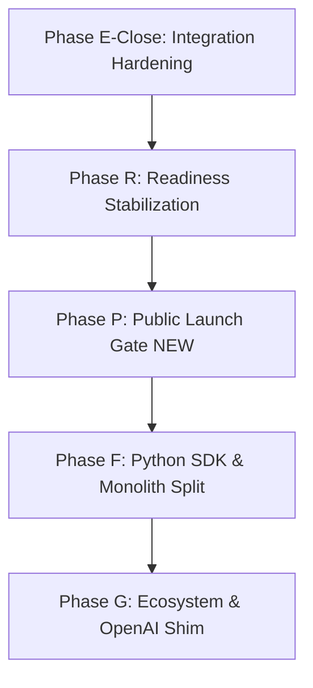

# PRISM Definitive Public GitHub Launch Roadmap & Integration Guide
**Date:** May 26, 2026  
**Auditor/SRE:** Antigravity AI (Advanced Agentic Systems)  
**Subject:** Public Launch Strategy, Audit Integration, and Comprehensive Testing Guardrails  
**Reference Assets:** [prism_world_class_project_audit_2026.md](file:///C:/Users/kirkl/.gemini/antigravity/brain/c259fde5-8bcc-4aac-860c-d92057aa0b1a/prism_world_class_project_audit_2026.md) & [PRISM_UPDATED_ROADMAP_2026_Q2.md](file:///d:/Projects/Prism/docs/PRISM_UPDATED_ROADMAP_2026_Q2.md)  

---

## 1. Executive Context

Going public on GitHub is a pivotal event for **PRISM**. Because PRISM's primary market differentiator is **cryptographically verified, decoupled Governance-as-a-Service (GaaS)**, any public launch must demonstrate flawless codebase safety, robust security postures, and pristine developer ergonomics. 

We must ensure that:
1.  **No secrets, API keys, or private metadata** are committed to the public Git history.
2.  **All 9 CI validation gates** are green and run reliably on standard clean clones.
3.  **Onboarding friction is near-zero** (less than 15 minutes to run `start_web.bat` and execute a sandboxed test session).
4.  **Public branding represents PRISM as a premium, SOTA platform**, linking to our high-end architectural diagrams and audit matrices.

This document merges the **May 2026 World-Class Project Audit** findings with the existing **Q2 Roadmap** to establish a unified, battle-tested launch playbook.

---

## 2. Integrated Roadmap (The Definitive Road Forward)

We have integrated the Q2 Audit recommendations directly into the official phases, introducing a new transitional phase: **Phase P — Public Launch Prep**.



### 2.1 Updated Phase Milestones

#### Phase E-Close: Integration Hardening (Active | Target: June 2026)
*   **PTY & Docker Sandboxing:** Finalize integration test suites to assert container virtualization transitions from mock adapters to real environments.
*   **Sovereign Sentinel & CSH Baton Pass:** Wire approval UI controls in the dashboard's Telemetry and Agent tabs, enabling full manual interventions.
*   **Telemetry Audits:** Support JSON/CSV event-chain log exporters directly from the dashboard.

#### Phase R: Readiness Stabilization (Planned | Target: June–July 2026)
*   **Secrets & Config Hygiene:** Implement the fail-fast `validateProductionReadiness()` boot gate. Ensure any missing `.env` parameters halt execution with explicit debugging alerts.
*   **Security Gates:** Embed CSRF-prevention cookies, strict CORS policies, and rate-limiting thresholds (lowered to 50 requests/min, stricter on `/api/auth/*`).
*   **Operations & Backup:** Provide standard `backup.sh` and `restore.sh` scripts for SQLite state preservation.

#### Phase P: Public Launch Gate (NEW | Target: July 2026)
*   **Git History Scrubbing:** Purge historical developer secrets and private email domains from historical commits.
*   **Open-Source Foundations:** Set up public license models (AGPL-3.0 or Apache 2.0 dual-licensing), code of conduct, and public SRE guides.
*   **CI/CD Infrastructure:** Deploy the `.github/workflows/ci.yml` runner containing the full 9-gate qualification process.

#### Phase F: Ecosystem & Scale (Planned | Target: Aug–Oct 2026)
*   **Python SDK (`prism-client`):** Publish lightweight REST client wrappers to PyPI, unlocking the ~70% Python AI developer segment.
*   **Monolithic Controller Split:** Extract sub-routers from the 528 KiB `dashboard-service.ts` file to keep all modules under 120 KiB.

---

## 3. The GitHub Public Launch Checklist

To ensure a seamless transition from a private workspace to a world-class public open-source project, the following four-stage checklist must be executed before toggling the repository visibility to "Public."

### Stage A: Cryptographic & Security Sweep (Zero Leakage)
> [!CAUTION]
> A single leaked API key in your public Git history can compromise your corporate accounts, ruin trust, and trigger automated security takedowns.

- [ ] **Scan historical Git objects:** Run `trufflehog` or `gitleaks` locally over the entire commit history to identify any raw tokens, credential structures, or private keys.
- [ ] **Scrub history if leaks are found:** Use `git-filter-repo` to programmatically purge sensitive files or variables from all historic trees (do not rely on simple new commits to hide keys).
- [ ] **Validate `.gitignore` coverage:** Confirm the following patterns are explicitly locked to prevent accidental check-ins:
  ```gitignore
  # DB & State
  *.db
  *.db-wal
  *.db-shm
  workspace/logs/
  
  # Credentials & Keys
  .env
  .prism-preferences.json
  *.pem
  *.key
  config/plugin-signing-keys.json
  ```
- [ ] **Sanitize `.env.example`:** Provide a comprehensive template covering all ~25 variables with extensive descriptions, default mock values, and clear documentation.

### Stage B: Legal & Open-Source Foundations
- [ ] **License Selection:** Place a standard `LICENSE` file in the repository root. Recommended: **Apache 2.0** (maximum developer adoption) or **AGPL-3.0** (protects against cloud-hosted monetization without contributions).
- [ ] **Security Policy (`SECURITY.md`):** Establish clear vulnerability disclosure instructions, mapping private SRE contact channels so researchers don't publish exploits publicly.
- [ ] **Contribution Rules (`CONTRIBUTING.md`):** Outline pull-request guidelines, code-formatting policies, and compile/test verification steps.
- [ ] **Signed Directives Invariant:** Document the cryptographic boot directives validation, explaining to external contributors that core laws (the 10 Laws) require SHA-256 agreement to compile.

### Stage C: Rigorous Testing & CI/CD Validation
> [!IMPORTANT]
> External developers will clone the repository on varied environments (Windows, macOS, Linux). The test suites must build and pass locally without requiring unique developer licenses.

- [ ] **Verify mock-fallback test environments:** Ensure all integration tests gracefully transition to "mock mode" or "skipped" if dependencies like Docker or `node-pty` are absent.
- [ ] **Implement standard E2E smoke tests:** Deliver a single, fast integration smoke test (`tests/e2e-smoke.test.ts`) that runs setup, chat, tool mock, and policy deny actions in under 60 seconds.
- [ ] **Create the GitHub Actions workflow:** Commit `.github/workflows/ci.yml` to automatically run:
  - `npm run lint` (ESLint configuration checking).
  - `npm run build` (Clean TypeScript compiling).
  - `npm run test` (All unit tests).
  - `npm run release:validate:strict` (Verify release manifest criteria).
- [ ] **Local qualification gate:** Add a pre-commit hook that runs `npm run prebuild` to automatically regenerate directive hashes and prevent broken PR builds.

### Stage D: Premium Public Branding & UX
- [ ] **Revamp `README.md`:** The README is your public showcase. It must feel premium and state-of-the-art:
  - Add clean architectural diagrams (the SSHP Privacy Shielding Pipeline SVG and the CSH State Machine SVG).
  - List clear Value Propositions (Decoupled GaaS vs. vulnerable prompt guardrails).
  - Provide a 3-step Quick Start guide using `start_web.bat`.
- [ ] **Expose the Wiki:** Host the SOTA Wiki [SOTA_BROWSER_WIKI.md](file:///d:/Projects/Prism/docs/SOTA_BROWSER_WIKI.md) and link it directly in the README table of contents.
- [ ] **Provide a Self-Driving Demo Asset:** Make sure `npm run ptac:demo-recording` generates a clean, browse-ready HTML slideshow, and link it in the README as a visual proof of computer-use capabilities.

---

## 4. Step-by-Step Public Release Script

Execute the following terminal commands to verify codebase readiness and prepare the repository branch for public packaging:

### Step 1: Clean Build Verification
Ensure all builds are clean and directive hashes align perfectly:
```powershell
# Clean node modules and rebuild from scratch
rm -Recurse -Force node_modules, package-lock.json
npm install
npm run prebuild
npm run build
```

### Step 2: Full Test Suite Check
Verify that all unit and mock integration tests pass under a zero-secrets local environment:
```powershell
# Set dry-run or mock environments
$env:NODE_ENV="test"
$env:PRISM_PTAC_SAFE="1"
npm test
```

### Step 3: Secrets Sweep Dry-Run
Run a search across the codebase for any un-ignored temporary files or leaked variables:
```powershell
# Check for uncommitted database, log, or key files
git status --ignored
```

### Step 4: Strict Release Manifest Check
Execute PRISM's internal release validator:
```powershell
npm run release:validate:strict
```

Once all four steps return successful codes, the code is officially certified for public push!

---
*Roadmap and launch checklist compiled by Antigravity AI.*
