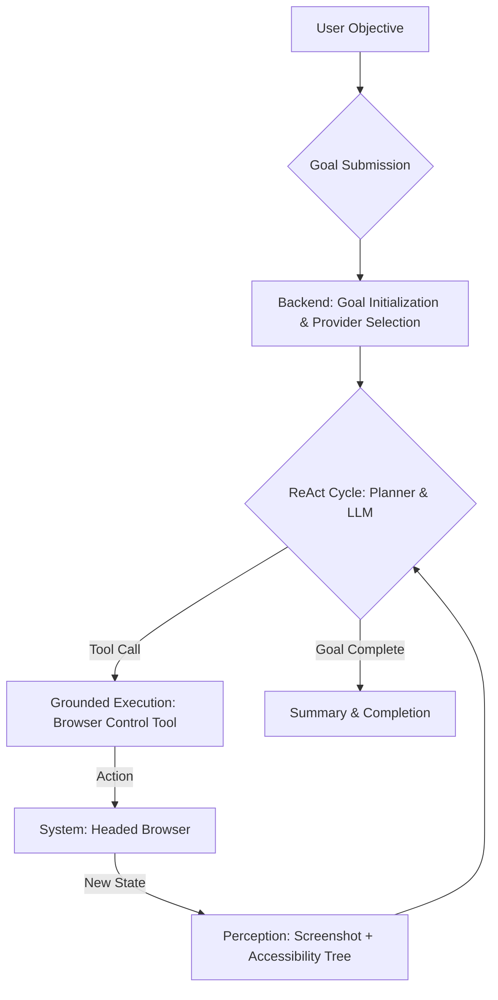

# Whitepaper: A State-of-the-Art Architecture for Autonomous Browser Control

**Authored by:** Kirk LaSalle & PRISM AI
**Date:** 2026-06-10
**Version:** 1.0

## Abstract

The automation of web-based tasks has long been a goal of software engineering, but traditional imperative scripting frameworks (e.g., Selenium, Puppeteer) have proven fragile and unable to adapt to dynamic user interfaces. This whitepaper specifies a state-of-the-art architecture for a truly autonomous browser control agent. It proposes a **cognitive-behavioral loop** that combines advanced AI reasoning with robust, grounded execution. This system is designed for transparency, resilience, and the capacity for advanced self-healing and human-in-the-loop collaboration, representing a paradigm shift from brittle scripts to intelligent, goal-driven digital agents.

---

## 1. Introduction: The Fragility of Traditional Web Automation

For decades, web automation has been dominated by tools that rely on deterministic selectors (e.g., CSS IDs, XPath) to interact with web pages. While powerful, this approach is fundamentally brittle. A minor change in a website's frontend code can break an entire automation script, leading to high maintenance costs and unreliable execution. These systems lack any understanding of the *intent* behind an action; they simply execute a pre-programmed sequence of clicks and keystrokes. The rise of large language models (LLMs) and cognitive architectures presents an opportunity to build a new class of agent—one that can perceive, understand, and act upon a web page with human-like intelligence and adaptability.

## 2. The SOTA Paradigm: A Cognitive-Behavioral Loop

The foundation of a state-of-the-art browser agent is not a static script, but a dynamic, continuous, closed-loop cognitive architecture. This "Life of a Browser Control Request" cycle models the process of human interaction with a web browser: a perpetual loop of perception, reasoning, action, and new perception.

This architecture ensures that every action is informed by the most recent state of the environment, allowing the agent to dynamically adapt to changing page layouts, unexpected pop-ups, and other real-world web complexities.



*Figure 1: The Cognitive-Behavioral Loop*

## 3. Architectural Deep Dive: Anatomy of a Request

The following sections provide a detailed technical breakdown of each phase of the "Life of a Browser Control Request," using the user's objective as a running example: *"Launch a browser session, go to a shopping website like amazon.com, search for a pair of 'blue jeans', filter or select size 'W32 L30', and find the cheapest available option."*

### 3.1. Intent Ingestion & Goal Formulation (UI -> API)

The process begins when the operator translates their intent into a natural language objective.

* **Action:** The operator types the objective into a UI panel (e.g., "Browser Auto-Pilot").
* **System:** The frontend JavaScript captures this text.
* **Critical Step:** The frontend **must** capture the unique identifier of the operator's active session (`chatSessionId`). This ID is the golden thread that links the autonomous goal to the operator's specific context, including their selected AI provider and model (e.g., Google AI's `gemini-2.5-flash`).
* **Execution:** A JSON payload is constructed and sent via a `POST` request to the backend API (e.g., `/api/autonomous/goals`).

**Example Payload:**

```json
{
  "objective": "Launch a browser session, go to a shopping website...",
  "source": "browser-autopilot",
  "chatSessionId": "66-114-b154-f8d8",
  "constraints": {
    "allowBrowser": true,
    "maxActions": 60
  }
}
```

### 3.2. Cognitive Scaffolding & Provider Selection (Backend)

The backend receives the goal and prepares it for execution.

* **Action:** The API handler (`autonomous-handler.ts`) receives the request.
* **System:** It calls the `AutonomousAgentLoop.submitGoal()` function, creating a persistent record for the new goal and, crucially, storing the `chatSessionId`.
* **Critical Step:** The `AutonomousPlanner` is invoked to begin the ReAct loop. It prepares the first call to the AI model. The planner's "generate function" (`setLlmGenerateFn`) inspects the goal object, finds the `chatSessionId`, and uses it to query the `ChatSessionStore`. This retrieves the session-specific provider and model selection.
* **Execution:** The planner now knows to send all subsequent reasoning requests for this goal to the correct endpoint (e.g., Google AI), not a system-wide default. This is the **most critical step** for preventing provider-mismatch errors.

### 3.3. The ReAct Cycle: Thought & Action Generation (Planner -> LLM)

This is the "thinking" part of the loop.

* **Action:** The planner sends the user's objective to the selected AI provider.
* **System:** To prevent the AI from simply guessing an answer without doing any work, the very first call includes the parameter `tool_choice: "required"`. This forces the model to select a tool.
* **Critical Step:** The AI, guided by a system prompt that instructs it to break down problems and use tools, reasons that it cannot browse the web without a browser. It formulates a plan and returns a structured command.
* **Execution:** The AI returns a `tool_call` object to the planner.

**Example AI Response (Step 1):**

```json
{
  "thought": "I need to start a browser session to visit the shopping website. The operator must be able to see this, so I will launch it in headed mode.",
  "tool_call": {
    "name": "browser_control",
    "arguments": {
      "action": "launch_session",
      "headless": false
    }
  }
}
```

### 3.4. Grounded Execution (Agent -> Tool -> System)

The planner translates the AI's abstract command into a real-world action.

* **Action:** The `AutonomousAgentLoop` receives the `launch_session` tool call.
* **System:** It routes the command to the registered `BrowserControlTool`. This tool is a software adapter that wraps a low-level browser automation library like Playwright.
* **Execution:** The `BrowserControlTool` executes `playwright.chromium.launch({ headless: false })`.
* **Expected Result:** A new, visible (headed) Chromium browser window opens on the operator's desktop. The tool returns the new browser's session ID to the loop, which records the successful completion of Step 1.

### 3.5. Perception & World Model Update (System -> Agent)

After acting, the agent must "see" the result.

* **Action:** The `AutonomousPlanner` determines it needs to understand the current state of the browser.
* **System:** It invokes a "perceive" function. This function captures two forms of data in parallel:
    1. **A Screenshot:** A raw pixel-perfect image of the browser viewport.
    2. **An Accessibility Tree:** A structured text representation of all interactive elements on the page (buttons, links, inputs), including their text, role, and coordinates.
* **Execution:** This multimodal data is passed to the AI in the next "Thought" step. The image provides visual context, while the text provides a machine-readable map of interactive elements, allowing the AI to reason about what is clickable and where to type.

### 3.6. Iterative Execution & Goal Completion

The loop now continues, with each cycle building on the last.

* **Step 2 (Navigate):** The AI sees the blank browser and issues a `navigate` command with the URL `https://www.amazon.com`. The browser navigates to the page.
* **Step 3 (Type):** The AI perceives the Amazon homepage, identifies the search bar from the accessibility tree (e.g., `input[name='field-keywords']`), and issues a `type` command with the text "blue jeans".
* This cycle of **Perceive -> Think -> Act** repeats as the agent filters by size, sorts by price, and analyzes the results until it has fulfilled the user's entire objective. When it determines the objective is complete, it responds with a final summary instead of a `tool_call`, which terminates the loop.

---

## 4. Advanced Capabilities & Self-Healing

A truly world-class system must handle the complexities and roadblocks of the real web. The core cognitive loop is extended with the following advanced subsystems.

### 4.1. Cognitive Session Handoff (CSH) "Baton Pass"

When an agent encounters a blocker that requires human intelligence or credentials (such as a CAPTCHA, an MFA prompt, or a login form), it should not fail. Instead, it initiates a **Cognitive Session Handoff**.

* **Pause & Serialize:** The agent pauses its execution loop and serializes its entire state, including the browser session, cookies, and its current plan.
* **Notify Operator:** It signals the UI that a human-in-the-loop intervention is required, presenting the roadblock in the "CSH Baton Pass" panel.
* **Human Intervention:** The operator "takes control" of the live browser session, solves the CAPTCHA or enters the MFA code, and clicks "Resume Agent".
* **Seamless Resumption:** The agent deserializes its state and continues its mission from the exact point it left off, now past the blocker.

### 4.2. Sovereign Sentinel Hyper-Proxy (SSHP)

To operate safely, especially in enterprise environments, the agent's perception must be sanitized to prevent the leakage of sensitive data (PII).

* **Visual PII Masking:** Before a screenshot is sent to the AI, SSHP automatically detects and composites black boxes over sensitive fields like credit card numbers, passwords, and personal information.
* **DOM Sanitization:** The accessibility tree text is scrubbed of sensitive regex matches.
* **Covenant Audit:** Every proposed action is pre-audited against a "Sacred Covenant" manifest. Dangerous commands (e.g., `localStorage.clear()`, `rm -rf /`) are blocked before they can be executed.

### 4.3. ImpressionCore MCP Integration (Hybrid Automation)

For known, high-value websites or internal applications, relying solely on visual automation can be inefficient. The **Model Context Protocol (MCP)** provides a bridge.

* **MCP Servers:** An "ImpressionCore" MCP server can expose a structured, API-like interface for a specific website. For example, instead of visually clicking the "Add to Cart" button, the agent can call `impressioncore-shopping.addToCart({productId: '123'})`.
* **Hybrid Strategy:** A sophisticated agent can be equipped with both the `browser_control` tool and an `mcp` tool. The AI can then reason about the most efficient path. If it recognizes a site is backed by an MCP, it will prefer the fast and reliable API calls. If it's on an unknown public website, it will fall back to the general-purpose visual automation of the `browser_control` tool.

---

## 5. Conclusion: Towards True Digital Autonomy

By building upon a foundational **Cognitive-Behavioral Loop**, this architecture provides a clear path to creating robust, intelligent, and adaptable browser automation agents. The system's transparency ensures that operators have a full trace of the agent's reasoning process, while advanced features like CSH and SSHP provide the necessary safeguards for real-world deployment. The integration of hybrid automation via MCP represents the next frontier, allowing agents to combine the generality of visual interaction with the speed and precision of direct API calls. This is the blueprint for the future of digital work.
