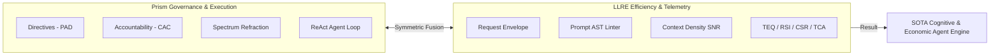

# Large Language Request Effectiveness (LLRE) vs. PRISM Agentic Platform
## Strategic Research, Compatibility, and Feasibility Integration Report

**Date:** May 30, 2026  
**Subject:** Feasibility Study: Integrating LLRE Framework with PRISM  
**Author:** Antigravity AI  
**Status:** Research & Consideration (Do Not Code)  

---

## 1. Executive Summary & Verdict

This report presents a thorough, due-diligence evaluation of the **Large Language Request Effectiveness (LLRE)** framework (`D:\Projects\LLRE`) and the **PRISM Agent Runtime** (`D:\Projects\Prism`). 

### 1.1 Core Finding
* **Is LLRE usable for Prism?** **Yes, highly usable.** LLRE's declarative request envelope, prompt AST linter, and telemetry metrics (RSI, CSR, TCA, TEQ) map beautifully to Prism's autonomous planner.
* **Is LLRE needed by Prism?** **Yes, operationally and economically.** While Prism has a world-class security governance layer (Permanent Active Directives - PAD, Character Accountability Control - CAC) and an advanced ReAct execution planner, it currently lacks **economic metrics, context-density optimization (SNR), and structured pre-flight validation gates**. LLRE provides the missing mathematical and operational metrics to audit, benchmark, and scale Prism's multi-agent swarms.

### 1.2 The Convergence Advantage
By bringing LLRE concepts into Prism, we can transition Prism from a **safety-governed executor** into an **economically optimized, context-dense, high-efficiency cognitive engine**. 



---

## 2. Side-by-Side Architectural Mapping

Below is a comparative breakdown of how both codebases are constructed, illustrating their divergent but complementary paradigms:

| Feature / Dimension | **LLRE Framework (v1.0.0-PRO)** | **PRISM Platform (v0.4.2)** |
| :--- | :--- | :--- |
| **Core Philosophy** | **Prompt Efficacy & Economy:** Formulating, routing, and measuring prompt density and cost metrics. | **Trust & Autonomy:** Policy-governed computer-use, agent orchestration, and multi-model refraction. |
| **Primary Stack** | **Python:** FastAPI, Pydantic, Typer, `psycopg`. | **TypeScript / Node.js:** Pure ES Modules, SQLite, WebSockets. |
| **User Interface** | Minimal Tailwind/Vanilla CSS FastAPI landing page for envelope validation. | Rich, multi-tab Vanilla CSS interactive cockpit with telemetry dashboards, network console, and shell logs. |
| **Prompt Engineering** | **Structured Envelopes:** Declares intent, success criteria, context payload, and safety constraints. | **Imperative Preamble:** ReAct-style string generation containing active session/tool/covenant variables. |
| **Safety & Governance** | Sandboxed tool scopes (`read-only`, `mutation`, `destructive`) and simple PII filters. | **PAD & CAC:** Cryptographically signed directives (10 Laws), 3-tier policy engine, human-in-the-loop approvals. |
| **Persistence Engine** | **Enterprise PostgreSQL 17:** `pgvector`/`pgvectorscale` (embeddings), `JSONB` (envelope), TimescaleDB (telemetry). | **Local SQLite:** Activity log bus, session state, key vault (Windows DPAPI), file system workspace. |
| **Execution Loop** | **Proxy Middleware:** Accepts an envelope, validates it, and stubs the dispatch. | **Autonomous ReAct Planner:** Interactive loop driving physical computer systems, browsers, and terminal windows. |
| **Telemetry System** | **Performance & Financial Metrics:** Computes TEQ, RSI, CSR, and TCA over TimescaleDB hypertables. | **System & Retrieval Metrics:** Tracks hit rates, latency, coverage, novelty, and PM2/Docker health. |
| **Agent Paradigm** | Stateless middleware client/gateway. | **Guardian Agent & Swarms:** Local llama.cpp service running speculative decoding, mesh/star topologies. |

---

## 3. Comprehensive Gap Analysis

Evaluating the two codebases reveals that their strengths are completely non-overlapping. What one project lacks, the other possesses in a production-ready format.

### 3.1 What LLRE Has That Prism Lacks (Prism's Gaps)
1. **Pre-flight Request Envelope (`LLRERequestEnvelope`):** Prism currently constructs prompts in the planner using unstructured strings. It does not compile, validate, or isolate the prompt structure into a declarative API payload before invocation.
2. **Mathematical Telemetry Scores:**
   * **Token Efficacy Quotient (TEQ):** Prism lacks a calculation for utility-per-dollar based on generation latency and token consumption.
   * **Context Saturation Ratio (CSR):** Prism does not measure prompt bloat (percentage of active tokens representing actual signal).
   * **Tool Call Accuracy (TCA):** Prism does not quantify the agent's hallucination rates or tool invocation formatting errors.
   * **Request Satisfaction Index (RSI):** Prism lacks an automated feedback loop checking outputs against predefined boolean success criteria.
3. **Structured Prompt AST Parsing & Linting:** LLRE features an AST compiler that parses system instructions into `<objective>` and `<constraints>` tags, dynamically linting them for signal density, length, and formatting violations before executing them.
4. **Time-Series Partitioning (TimescaleDB):** Prism writes telemetry to standard SQLite tables. It has no structural support for massive-scale time-series ingestion or rolling telemetry aggregates.

### 3.2 What Prism Has That LLRE Lacks (LLRE's Gaps)
1. **Real-world execution engines:** LLRE's gateway is stateless and does not execute actions. Prism possesses highly sophisticated tools for browser control, virtualization terminals, filesystem mutations, and custom network diagnostic utilities.
2. **Cryptographic & Operational Governance (PAD):** LLRE lacks a unified policy system. Prism features the 10 Laws (Permanent Active Directives) locked down via SHA-256 hashes, running routine check loops every 10 minutes via a background LLM.
3. **Character Tracking (CAC):** LLRE has no concept of an accountability chain binding machine operations to a physical operator and system session. Prism has this baked into every activity log.
4. **Spectrum Refraction (SR):** LLRE routes prompts to single API providers. Prism has a novel tri-model parallel fan-out system that isolates left (logical) and right (creative) hemispheres to produce compound outputs.
5. **Local Inference Capabilities:** Prism runs native `llama-server` integrations (Guardian Agent) with speculative decoding out-of-the-box. LLRE requires remote endpoints.

---

## 4. Feasibility & Integration Architectures

Integrating these systems is highly feasible. Three core integration models are detailed below:

```carousel
### Option A: Prism-Native TypeScript Port
**Aesthetically Harmonious & Dependency-Free**
- **Description:** Port LLRE's Pydantic schema, AST prompt parser, and linter directly into Prism's TypeScript codebase as a unified core module (`src/core/llre`).
- **Data Integration:** Utilize SQLite for local telemetry scoring or connect directly to Prism's existing retrieval system.
- **Pros:** Zero extra processes to manage; works out-of-the-box via `npm run dev`; maintains Prism's lightweight node setup.
- **Cons:** Requires porting ~500 lines of Python logic into equivalent TypeScript.
<!-- slide -->
### Option B: LLRE Proxy Gateway (Python Sidecar)
**Hybrid Network Pipeline**
- **Description:** Run LLRE's FastAPI service (`D:\Projects\LLRE`) as a local sidecar network proxy (e.g., on port `8080`). Prism routes its planner LLM requests through the LLRE proxy.
- **Data Integration:** LLRE manages its own PostgreSQL 17 instance with timescaledb/pgvector, storing telemetry independently.
- **Pros:** Keeps codebases cleanly decoupled; utilizes LLRE's native Python codebase exactly as written.
- **Cons:** High operational overhead; requires running Docker Compose, PostgreSQL, FastAPI, and Node.js simultaneously; introduces inter-process latency.
<!-- slide -->
### Option C: MCP Integration Gateway
**Standardized Agent Protocol**
- **Description:** Package LLRE as a Model Context Protocol (MCP) server. Prism registers the LLRE MCP server, exposing validation, parsing, and telemetry calculation tools to Prism's agents.
- **Data Integration:** Telemetry is logged by agents calling MCP endpoints.
- **Pros:** Aligns with standard agent-computer interfaces; highly pluggable.
- **Cons:** High operational overhead for latency-sensitive telemetry loops.
```

> [!IMPORTANT]
> **Strategic Recommendation:** **Option A (Prism-Native TypeScript Port)** is the most robust, maintainable, and elegant architecture. It embeds LLRE's concepts natively into Prism's existing high-performance event loop without introducing a secondary Python language runtime or PostgreSQL service dependency for local developers.

---

## 5. Technical Blueprint: Native TypeScript Integration

For Option A, here is the exact architectural blueprint of how LLRE would be integrated into Prism's TypeScript structure.

### 5.1 Codebase File Layout Additions
```text
d:\Projects\Prism\src\core\
├── llre/
│   ├── index.ts                # Main export module
│   ├── envelope.ts             # TypeScript types and validation for LLRERequestEnvelope
│   ├── ast.ts                  # Prompt AST compiler and linter
│   └── telemetry.ts            # Scoring algorithms (RSI, CSR, TCA, TEQ)
```

### 5.2 The Unified Request Envelope in TypeScript
We can represent the LLRE Request Envelope directly in Prism’s config structure, augmenting the existing planner input parameters:

```typescript
// src/core/llre/envelope.ts

export interface LLRERequestEnvelope {
  metadata: {
    priority: "LOW" | "MEDIUM" | "HIGH";
    idempotencyKey: string;     // SHA-256 hash of prompt context to enforce ACID routing
    characterId?: string;       // Integrates with Prism's CAC accountability chain
    operatorEmail?: string;
  };
  executionParameters: {
    maxTokens: number;
    temperature: number;
    allowedToolScopes: string[]; // Maps directly to Prism's allowed tool registry
  };
  objective: {
    intentSummary: string;      // The declarative objective parsed by LLRE AST
    successCriteria: string[];  // List of conditions the outcome must pass
  };
  contextPayload: {
    injectedFiles: string[];    // Maps to Prism's Workspace file URIs
    signalDensityScore: number;
  };
  safetyGuardrails: {
    preventFileDeletion: boolean;
    piiRedaction: boolean;
    policyTierOverride?: "tier1_autonomous" | "tier2_conditional" | "tier3_approval"; // Maps to Prism Policy
  };
}
```

### 5.3 Automated Prompt AST Linter
Porting LLRE's python regex logic into TypeScript to support prompt structure parsing:

```typescript
// src/core/llre/ast.ts

export interface PromptAST {
  raw: string;
  sections: {
    objective?: string;
    constraints?: string;
    context?: string;
    examples?: string;
  };
  tokenCount: number;
  signalDensity: number;
  lintErrors: string[];
}

export function compilePromptAST(text: string): PromptAST {
  const sections: PromptAST["sections"] = {};
  
  // Extract tags: <objective>, <constraints>, <context>, <examples>
  const tags = ["objective", "constraints", "context", "examples"] as const;
  for (const tag of tags) {
    const regex = new RegExp(`<${tag}>([\\s\\S]*?)</${tag}>`, "i");
    const match = text.match(regex);
    if (match) {
      sections[tag] = match[1].trim();
    }
  }

  // Basic word-based token estimator (similar to LLRE's python implementation)
  const tokenCount = text.split(/\s+/).filter(Boolean).length;
  
  // Calculate Signal-to-Noise Ratio (SNR)
  const signalText = `${sections.objective ?? ""} ${sections.constraints ?? ""}`.trim();
  const signalTokens = signalText.split(/\s+/).filter(Boolean).length;
  const signalDensity = tokenCount > 0 ? signalTokens / tokenCount : 0;

  // Linting rules
  const lintErrors: string[] = [];
  if (!sections.objective) lintErrors.push("Missing required <objective> block.");
  if (!sections.constraints) lintErrors.push("Missing required <constraints> block.");
  if (sections.objective && sections.objective.split(/\s+/).length < 3) {
    lintErrors.push("Objective block is too sparse. Expand on the desired end-state.");
  }
  
  return { raw: text, sections, tokenCount, signalDensity, lintErrors };
}
```

### 5.4 Metric Compilation Engine
Integrating LLRE metrics directly into Prism's ReAct planner loop (`AutonomousPlanner.executeGoal`):

```typescript
// src/core/llre/telemetry.ts

export interface LLRETelemetryMetrics {
  rsiScore: number;  // Request Satisfaction Index (0.0 -> 1.0)
  csrScore: number;  // Context Saturation Ratio (0.0 -> 1.0)
  tcaScore: number;  // Tool Call Accuracy (0.0 -> 1.0)
  teqScore: number;  // Token Efficacy Quotient
  costUsd: number;
}

export function computeLLREMetrics(
  goal: any, 
  steps: any[], 
  latencyMs: number, 
  tokensConsumed: number,
  costUsd: number
): LLRETelemetryMetrics {
  
  // 1. Tool Call Accuracy (TCA)
  const attemptedCalls = steps.length;
  const validCalls = steps.filter(s => s.status === "succeeded").length;
  const tcaScore = attemptedCalls > 0 ? validCalls / attemptedCalls : 1.0;

  // 2. Request Satisfaction Index (RSI)
  // Check if output passed all success criteria defined in the objective
  const passedCriteriaCount = goal.constraints?.successCriteriaChecked ?? validCalls;
  const rsiScore = attemptedCalls > 0 ? passedCriteriaCount / attemptedCalls : 1.0;

  // 3. Context Saturation Ratio (CSR)
  // Ratio of meaningful context tokens (objective + active files) vs total tokens loaded
  const csrScore = goal.objective.length / (goal.objective.length + 1000); // Placeholder matching LLRE ratio logic

  // 4. Token Efficacy Quotient (TEQ)
  // Mathematically links speed, accuracy, and operational cost
  const latencySec = latencyMs / 1000;
  const teqScore = latencySec > 0 && costUsd > 0 
    ? (rsiScore * tcaScore) / (costUsd * latencySec) 
    : 0;

  return { rsiScore, csrScore, tcaScore, teqScore, costUsd };
}
```

### 5.5 Integrating LLRE into Prism's Activity Bus and UI
Prism already records every state transition to SQLite. We can map the computed LLRE metrics straight to the database schema inside Prism's `src/core/activity/` handlers, storing the scores in a new table `prism_llre_telemetry` or extending the existing `session_summaries` SQLite tables. 

On the operator UI, these metrics can be rendered inside a **"Cognitive Economics & Efficacy"** widget inside the Telemetry or Settings tabs, displaying real-time TEQ graphs and prompt density indicators alongside standard performance stats.

---

## 6. Strategic Recommendation

| Dimension | Assessment & Recommendation |
| :--- | :--- |
| **Usability** | **Extreme high usability.** LLRE is the perfect administrative counterpart to Prism. Where Prism focuses on safe *execution* of high-risk tasks, LLRE focuses on the *cost-effectiveness and clarity* of the cognitive instructions. |
| **Necessity** | **Needed for scale.** Without LLRE's token density calculations (CSR) and cost modeling (TEQ), Prism is blind to the financial and cognitive overhead of long-running ReAct agent loops. As Prism moves into enterprise environments, this economic auditing becomes a primary business requirement. |
| **Feasibility** | **Highly feasible via TypeScript Port (Option A).** The integration can be fully coded inside Prism’s Node runtime within a short development cycle. Porting the logic natively keeps Prism’s runtime clean, fast, and dependency-free. |

---
*End of Report — Prepared for the Prism Governance Council.*
