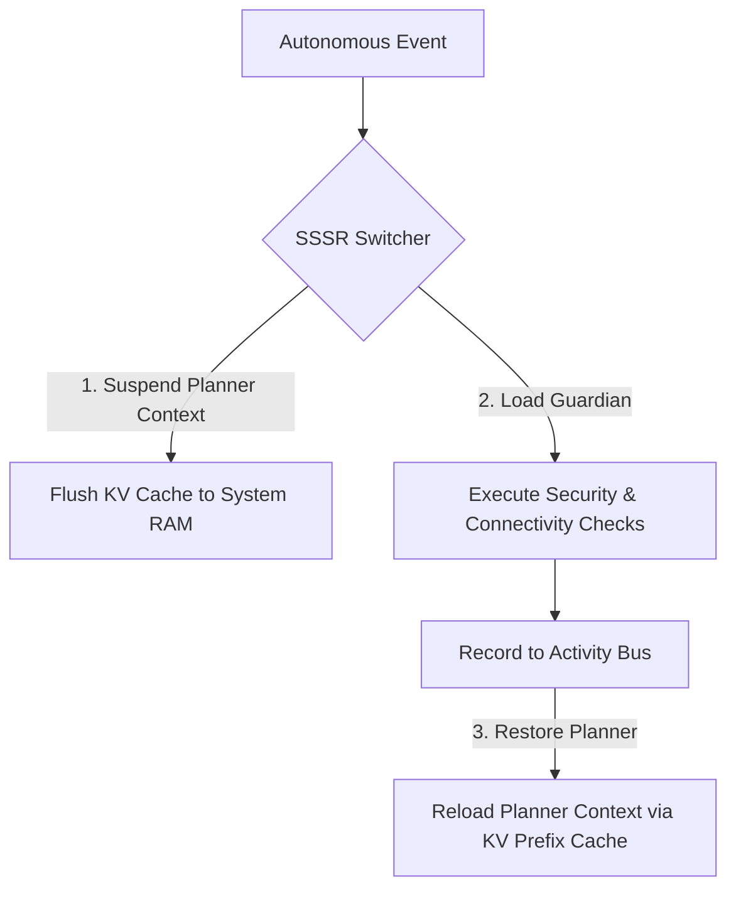

# PRISM BASE MODE: EXTREME CONSTRAINT ARCHITECTURE

A detailed technical specification for running a local, dual-agent platform (Main LLM + Perpetual Guardian) strictly constrained to a **2.0GB - 3.0GB VRAM** footprint on legacy edge hardware.

---

## 01. The Hardware Reality & Bottlenecks

Designing local-only agentic capabilities for standard GPU/CPU configurations is simple, but legacy edge hardware introduces extreme constraints. theoretical architectures assuming modern technologies (Flash Attention 2, fast PCIe lanes, high-bandwidth VRAM) will fail. PRISM's "Base Mode" is engineered for the following baseline legacy hardware specification:

### Legacy Hardware Baseline Specs

* **GPU**: Nvidia GeForce GTX 1050 Ti (Pascal Architecture, 4.0GB Total VRAM)
* **CPU**: Intel Core i5-4460 (Haswell Architecture 22nm, 4 Cores / 4 Threads)
* **System RAM**: 32GB Dual-Channel DDR3 @ 1600 MT/s (Severe memory bus bottleneck)
* **Storage**: SATA III SSD (~550 MB/s sequential read speed)

### VRAM Budget Allocation (4.0GB Total Capacity)

```
[================= Q8_0 Target Model VRAM: 2.0GB =================] [==== OS & System: 1.2GB ====] [= Guardian Cache: 0.5GB =] [= Free: 0.3GB =]
```

### Memory Bandwidth Comparison

| Memory Class | Bandwidth (GB/s) | Architectural Impact |
| :--- | :--- | :--- |
| **SATA III SSD** | 0.55 GB/s | Swapping models to disk causes catastrophic execution pauses (30s+). |
| **DDR3 System RAM** | 25.6 GB/s | Loading models from CPU RAM is too slow for real-time swarms. |
| **Modern DDR5 RAM** | 64.0 GB/s | Industry-standard edge reference; unavailable on baseline hardware. |

---

## 02. SOTA Model Scouting & Candidates

To co-exist safely within the **3.0GB VRAM absolute ceiling**, candidates are limited to 1B to 3B parameters using native **8-bit (Q8_0)** or high-stability **5-bit (Q5_K_M)** quantization. Aggressive 3-bit or 2-bit crushing is rejected to maintain logical parsing and JSON schema outputs.

### Model Candidate Mapping

```
 VRAM (GB)
   5.0 |                                    Gemma 3 (4B) 
       |                                      [Est VRAM: 4.2GB] -- VRAM Death Zone
   4.0 |                                     
   3.5 | ------------------------------------------------------------- [Absolute VRAM Ceiling: 3.0GB]
   3.0 |              Llama 3.2 (3B)       Qwen 2.5 (3B)
       |             [Est VRAM: 3.4GB]   [Est VRAM: 3.2GB]
   2.0 |
   1.5 | Qwen 2.5 Coder (1.5B)      DeepSeek-R1-Distill (1.5B)
       |   [Est VRAM: 1.6GB]            [Est VRAM: 1.6GB]
   1.0 | Gemma 3 (1B)    Llama 3.2 (1B)
       | [Est VRAM: 1.1G]  [Est VRAM: 1.3G]
   0.0 +--------------------------------------------------------------
       0.0              1.5B                 3.0B                  4.5B
                                     Parameters (Billions)
```

### Target Selection Profile

1. **Qwen 2.5 Coder (1.5B - Q8_0)**: *Highly Recommended*. Strong code generation, tool calls, and XML/JSON conformance inside small parameter limits.
2. **DeepSeek-R1-Distill (1.5B - Q8_0)**: *Recommended*. Outstanding structured logical chain-of-thought outputs for complex reasoning.
3. **Llama 3.2 (3B - Q5_K_M)**: *Alternative*. Exceptional natural text synthesis; VRAM footprint requires tight context limit checks to avoid out-of-memory crashes on GTX 1050 Ti.

---

## 03. Base Mode Degradation Strategy

When the system detects VRAM pressure (using `LlamaCppSupervisor`), it automatically shifts the platform into **Base Mode**. The prompt structures and diagnostic task lists are dynamically pruned to preserve memory overhead.

### Prompt Budget Pruning

| Metric | Full Capacity (Standard Mode) | Base Mode (Degraded) |
| :--- | :--- | :--- |
| **Max Context Window** | 4,096 tokens | 2,048 tokens |
| **System Prompt Size** | 4,000+ tokens (detailed descriptions) | < 600 tokens (compressed guidelines) |
| **Tool Contracts** | Full comprehensive XML Schemas | Compact GBNF Grammars or raw format strings |

### Guardian Task Catalog (`GUARDIAN_TASK_CATALOG`)

Non-essential background monitoring is suspended to minimize CPU thread usage and KV-cache footprint.

* **🔒 directive_integrity** (*Essential - ACTIVE*): SHA-256 integrity scan checking PAD constitutional safety laws. Run Interval: 600,000ms.
* **🔧 mcp_health_recovery** (*Essential - ACTIVE*): Resolves and restores broken connections to active MCP servers. Run Interval: 60,000ms.
* **📈 aab_ledger_monitor** (*Essential - ACTIVE*): Audits the Autonomous Activity Bus for runaway loops and resource waste. Run Interval: 30,000ms.
* **🧠 memory_audit** (*Non-Essential - SUSPENDED*): Deep scan of memory usage and context fragmentation. Run Interval: 300,000ms.
* **💾 disk_space_check** (*Non-Essential - SUSPENDED*): Checks local disk usage and clears temporary folders. Run Interval: 300,000ms.
* **🛡️ command_filter_verify** (*Non-Essential - SUSPENDED*): Audits execution histories against local blocklists. Run Interval: 600,000ms.
* **🕸️ knowledge_graph_check** (*Non-Essential - SUSPENDED*): Validates relationships inside the semantic memory index. Run Interval: 900,000ms.

---

## 04. Local Engine Routing & Single-Slot Sequential Runner (SSSR)

Co-existing within a tiny VRAM footprint prevents running two models concurrently. PRISM resolves this using a **Single-Slot Sequential Runner (SSSR)** configuration.



### Ollama Fallback Routing

The `LlamaCppSupervisor` queries the local Ollama API wrapper to see if models are resident in memory. If cold, it boots a dedicated `llama-server` background process to avoid process initialization overheads.

```typescript
// Fallback check sequence
if (await checkOllama(modelPath)) {
  routeToOllama();
} else {
  spawnLlamaServer();
}
```

### Optimized Llama.cpp CLI Flags (Haswell/Pascal)

Optimizing command arguments is crucial to prevent prompt processing times from locking the 4-thread CPU:

* `-t 4`: Restricts processing strictly to Haswell's 4 physical CPU cores (prevents hyper-threading context-switching overhead).
* `--batch-size 128`: Limits batched evaluation chunks, keeping DDR3 bus utilization below saturation levels.
* `--lookup-cache`: Enables context cache lookups, restoring system states without reprocessing past prompts.
