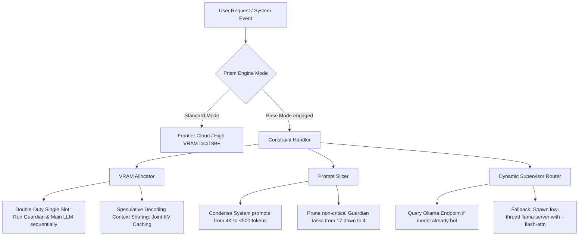

# PRISM Extreme Constraint Challenge: Gemini Deep Research Prompt & Architecture Guide

This document is designed to be fed directly into **Google Gemini Deep Research**. It contains the comprehensive background, exact codebase definitions, target constraints, and engineering challenges required to find the absolute best tiny models (<= 2GB to <= 3GB VRAM) and suggest optimized architecture for PRISM's experimental **"Base Mode."**

---

# PART 1: THE GEMINI DEEP RESEARCH PROMPT

*Copy and paste the section below directly into the Google Gemini Deep Research prompt box to initiate the deep research session.*

```markdown
DEEP RESEARCH REQUEST: EXTREME RESOURCE-CONSTRAINED AGENT SYSTEM (PRISM "BASE MODE")

OBJECTIVE
Analyze and research the absolute best-performing local open-source LLMs under extreme VRAM constraints (Target: <= 2.0 GB VRAM; Absolute Ceiling: <= 3.0 GB VRAM) suitable for driving a complex agentic platform (PRISM). You will design a "Base Mode" architecture for PRISM that executes BOTH the "Guardian Agent" (a permanent system agent performing active monitoring, self-healing, security checks, and AAB ledger audits) AND the "Main LLM" (the core planning and tool-execution agent) on local hardware within this VRAM footprint.

BACKGROUND & SYSTEM TARGETS
PRISM is an advanced agentic framework that utilizes:
1. A permanent local "Guardian Agent" running concurrently with system activities to run health checks, temporary file cleanups, memory usage audits, directive integrity checks (SHA-256 validation of core instructions), and MCP (Model Context Protocol) connection self-healing.
2. A main agent loop that performs goal planning, dynamic tool selection, and code generation.
3. A local supervisor (`LlamaCppSupervisor`) managing local `llama-server` instances, alongside local Ollama integrations.

THE EXTREME CHALLENGE
In standard operation, PRISM relies on large cloud frontier models (GPT-4o, Claude 3.5 Sonnet, Gemini 1.5/2.5 Pro) or large local models (8B+ parameters).
Under the "Extreme Test," we are collapsing the entire runtime footprint down to 2-3GB VRAM. 
Both the Guardian and the Main LLM must either:
- Co-exist in VRAM concurrently (highly constrained, e.g., two 1B-1.5B models, or a single shared model running multiple sessions).
- Run sequentially via high-speed context switching or prompt caching.
- Dynamically scale features downward, disabling heavier agent tasks and switching the system to a degraded "Base Mode."

RESEARCH TASK REQUIREMENTS

1. SOTA MODEL SCOUTING (<= 3GB VRAM, Ideal <= 2GB VRAM)
   Identify the top 5 highest-scoring open-source models under 4.0B parameters (focused heavily on 1B, 1.5B, 2.7B, and 3B parameter scales) that exhibit:
   - Strong instruction-following and system prompt adherence.
   - Stable JSON generation or JSON schema validation capabilities.
   - Tool-use and parameter extraction capability.
   - Context window stability up to 4,096 or 8,192 tokens.
   Evaluate and compare the following specific models across multiple quantizations (Q4_K_M, Q5_K_M, Q8_0, IQ4_XS):
   - Qwen 2.5 & Qwen 2.5 Coder (1.5B and 3B)
   - Gemma 3 (1B and 4B)
   - Llama 3.2 (1B and 3B)
   - DeepSeek-R1-Distill-Qwen (1.5B and 3B)
   - Granite 3.1 MoE (1B and 3B)
   - Dria-Agent-a / Tiny-Agent-A (1.5B)
   Provide a benchmark comparison table ranking these models on: Tool-use accuracy, System-prompt compliance, Context window retention, and exact VRAM footprints (in MB) at listed quantizations.

2. PRISM "BASE MODE" DEGRADATION STRATEGY
   Propose a concrete degradation hierarchy. When "Base Mode" is engaged due to VRAM limits:
   - What specific Guardian tasks must be suspended or reduced in frequency?
   - How can we simplify system prompts without losing safety? Provide exact instructions on prompt pruning, mapping out how to condense massive agent profiles into compact system instructions (e.g., from 4000+ tokens to <600 tokens).
   - What core functions of PRISM must be prioritized (e.g., local shell execution, SQLite memory queries) and what can be stubbed or disabled (e.g., complex browser-use, multimodal analysis)?

3. LOCAL ENGINE DYNAMIC ROUTING & CO-EXISTENCE
   Provide detailed software engineering recommendations for dynamically routing between `llama.cpp` and `Ollama`:
   - Design a dynamic detection mechanism to determine if Ollama is running and has the model pre-loaded, versus launching a dedicated slot in the local `llama.cpp` server.
   - Outline VRAM-sharing strategies: Can we run a single model instance in a shared slot to serve BOTH the Guardian and the Main LLM? Or must we spin up two discrete slots using a highly aggressive draft model setup?
   - Explain how to configure speculative decoding (draft models) within the <= 2-3GB VRAM limit. What tiny draft model (e.g., a 100M-500M parameter draft model or speculative prefix) should pair with our target models?

4. OPTIMIZATION & ENGINEERING TECHNIQUES
   Propose specific GGUF/llama.cpp runtime optimization flags and strategies to minimize footprint:
   - Explain the impact of Flash Attention (`--flash-attn`), context-shifting (`--ctx-shift`), prefix caching, and batch size configuration.
   - Detail GPU offloading optimization (`--n-gpu-layers` or `-ngl`) for hybrid CPU/GPU setups, ensuring that the model remains within exact VRAM targets on an entry-level GPU (e.g., Nvidia MX series, older GTX/RTX cards, integrated AMD/Intel graphics).
   - Detail how native tool-calling (`--jinja` templates in llama-server) can be adapted to work reliably with extremely small models, suggesting prompt-engineering structures that prevent small models from choking on tool JSONs.

INCLUDED CODEBASE & TECHNICAL REFERENCE
Below is the core architectural mapping of PRISM's local execution engine. Use these codebase structures to guide your concrete code proposals and engineering suggestions.
```

---

# PART 2: PRISM CODEBASE & TECHNICAL REFERENCE

*The following sections outline the exact integration surface of PRISM's local LLM and Agent supervisors. This gives Gemini Deep Research full context on how to adapt the system.*

## 1. Local Llama.cpp Process Supervisor (`llama-cpp-supervisor.ts`)

This module manages the lifecycle, slots, and spawn configuration of local `llama-server` instances.

```typescript
export interface LlamaModelSlot {
    id: number;
    port: number;
    modelAlias: string | null;
    modelPath: string | null;
    pid: number | null;
    status: "empty" | "loading" | "ready" | "error";
    lastActive: number;
    error?: string;
    /** Path to a smaller draft model for speculative decoding. */
    draftModelPath: string | null;
    /** Max tokens the draft model proposes per step (default 16). */
    draftMax: number;
    /** Min draft tokens to use (default 5). */
    draftMin: number;
    /** Min probability threshold for speculation (default 0.9). */
    draftPMin: number;
    /** Number of GPU layers to offload (-1 = all). null = auto. */
    gpuLayers: number | null;
    /** Enable flash attention for reduced memory usage. */
    flashAttn: boolean;
    /** Active context size for this slot. */
    contextSize: number;
}

export interface LlamaSupervisorConfig {
    binaryPath: string; // The path for 'llama-server'
    basePort: number;   // Port to start assigning from (default 8081)
    maxSlots: number;   // Maximum number of parallel models (default 5)
    defaultContext: number; // Context size (num_ctx, default 4096)
    modelsDir?: string; // Optional directory scanning for local .gguf models
}

export interface LlamaLoadOptions {
    ctxSize?: number;
    draftModelPath?: string;
    draftMax?: number;
    draftMin?: number;
    draftPMin?: number;
    gpuLayers?: number;
    flashAttn?: boolean;
}

/**
 * Manages local llama-server instances. Supports speculative decoding,
 * GPU offloading, flash attention, and native tool-calling via jinja templates.
 */
export class LlamaCppSupervisor extends EventEmitter {
    // Spawns llama-server using command arguments:
    // --model <path> --alias <alias> --port <port> --ctx-size <ctx> --jinja
    // Also appends:
    // --model-draft <draftPath> --draft-max <max> --draft-min <min>
    // --n-gpu-layers <ngl> --flash-attn
}
```

---

## 2. System Prompt & Model Routing Matrix (`model-capability-matrix.ts`)

This registry matches models to task roles and defines prompting strategies. Local/Open-Source models fall back to the generic strategy designed to protect tiny context budgets.

```typescript
export interface ModelCapabilityProfile {
    pattern: string;             // Regex or exact model pattern
    label: string;
    tier: 1 | 2 | 3 | 4 | 5;     // T1 (minimal) to T5 (frontier)
    parameterSize: "tiny" | "small" | "medium" | "large" | "frontier";
    parametersBillions: number;
    contextWindow: number;       // Max input context in tokens
    estimatedVramMb: number;     // VRAM footprint in MB
    maxOutputTokens: number;
    adaptivePromptBudget: number; // Tokens allocated for system prompt before degradation
    strengths: string[];
    modalities: string[];
    locality: "local" | "cloud";
}

/** Strategy for Local / Open-Source models in PRISM */
export const LOCAL_PROMPT_STRATEGY = {
    providerPattern: ".*",
    label: "Local / Open-Source",
    structureFormat: "minimal",
    chainOfThoughtMode: "implicit",
    temperatureDefault: 0.2,
    fewShotStyle: "inline",
    maxSystemPromptTokens: 600,
    notes: [
        "Keep system prompts concise: 300-600 tokens optimal for small models",
        "Lead with critical/must-do instructions — models weigh early tokens more heavily",
        "Show, don't tell — a schema example beats a paragraph of prose",
        "Temperature 0.0-0.3 for factual/extraction tasks, 0.7-0.9 for creative",
        "Context budgeting is critical with limited VRAM and context windows",
        "Minimize generation length to reduce latency on local hardware",
    ],
};
```

---

## 3. The Perpetual Guardian Agent (`guardian-agent.ts`)

The Guardian Agent runs indefinitely on the local engine, spawning structured health, security, and diagnostics tasks at fixed intervals.

```typescript
export interface GuardianConfig {
    modelAlias: string;          // Default 'guardian'
    modelPath: string;
    authorityTier: "tier1_autonomous" | "tier2_conditional";
    healthCheckIntervalMs: number;
    autoStart: boolean;
    contextSize: number;
    draftModelPath?: string;
    gpuLayers?: number;
    flashAttn?: boolean;
    modelSource?: string;
}

/** Active tasks run by the Guardian. Under Base Mode, this must be pruned. */
export const GUARDIAN_TASK_CATALOG = [
    // Maintenance
    { id: "disk_space_check", intervalMs: 300000 },
    { id: "temp_cleanup", intervalMs: 300000 },
    { id: "memory_audit", intervalMs: 300000 },
    { id: "model_integrity", intervalMs: 300000 },
    // Security
    { id: "command_filter_verify", intervalMs: 600000 },
    { id: "env_secrets_scan", intervalMs: 600000 },
    { id: "endpoint_access_audit", intervalMs: 600000 },
    { id: "directive_integrity", intervalMs: 600000 }, // SHA-256 PAD check
    // Diagnostics
    { id: "knowledge_graph_check", intervalMs: 900000 },
    { id: "tool_contract_audit", intervalMs: 900000 },
    { id: "agent_health_check", intervalMs: 900000 },
    // Monitoring
    { id: "system_snapshot", intervalMs: 120000 },
    { id: "agent_census", intervalMs: 120000 },
    { id: "log_volume_analysis", intervalMs: 120000 },
    { id: "mcp_health_recovery", intervalMs: 60000 },   // Reconnects down MCP servers
    { id: "aab_ledger_monitor", intervalMs: 30000 },     // Audits anomalous behavior
    { id: "covenant_audit", intervalMs: 300000 },        // Sacred Covenant integrity check
];
```

---

# PART 3: ARCHITECTURAL CONSIDERATIONS FOR PRISM "BASE MODE"

Below is a conceptual blueprint mapping out potential enhancements and optimizations to make running an agent system on a 2GB VRAM budget a reality.



## A. Enhancements to Research & Implement:

### 1. Dynamic Routing & Context-Passing ("Co-existence")
Rather than maintaining two active `llama-server` instances in memory (which easily breaches 2GB VRAM due to duplicate runtime libraries and KV caches), PRISM's "Base Mode" should implement a **Single-Slot Sequential Runner (SSSR)**:
- **Concept**: A single running slot in `llama-cpp-supervisor` serves both the Guardian and the Main LLM. 
- **Mechanism**: The supervisor hosts the model (e.g., `Qwen-2.5-Coder-1.5B-Q4_K_M` or `Gemma-3-1B`). When the Guardian needs to run a health check, its context is swapped into the KV cache. Once complete, the main agent loop context is loaded.
- **Optimization**: This requires high-performance **KV Cache swapping** or aggressive **Prompt Caching** (prefix caching) in `llama.cpp` to ensure context swaps do not trigger massive time-to-first-token (TTFT) delays.

### 2. Intelligent Ollama / Llama.cpp Autonomic Integration
PRISM must dynamically query Ollama first. If Ollama is running and has the target model resident in memory, PRISM routes requests to the local Ollama API to conserve local compute processes. If Ollama is absent or cold:
- Spawns `llama-server` natively with thread count mapped to CPU physical cores (`-t`).
- Uses `--flash-attn` and `--n-gpu-layers` to offload exactly as much of the model to VRAM as fits under the threshold.
- Employs quantization formats like **IQ4_XS** or **IQ3_XXS** for the main model, and potentially a **100M draft model** (e.g., mobiley-100m) for speculative decoding.

### 3. Radical Prompt Slicing & Task Pruning
In Base Mode, the Guardian cannot run 17 distinct diagnostics tasks every few minutes. PRISM must automatically engage a **Task-Degradation Protocol**:
- **Critical Tasks Retained**:
  - `directive_integrity` (Security: ensuring directives are not tampered with).
  - `mcp_health_recovery` (Connectivity: keeping tools accessible).
  - `aab_ledger_monitor` (Safety: checking for anomalous runaway loops).
- **Suspended Tasks**:
  - Memory audits, Disk audits, log volume analysis, command-filter verification (which are resource intensive).
- **Prompt Compression**:
  - Shrink the agent's task prompts. Instead of a long list of XML schemas, pass the model raw mini-instructions with a highly compressed string representation of the tool contracts (e.g., a single line containing `tool_name(arg1:type, arg2:type): description` rather than full JSON Schema documents).

---

# PART 4: RECOMMENDED DEEP RESEARCH STRATEGIES

When reviewing the output of Gemini's Deep Research, pay close attention to:
1. **Model IQ vs Size**: Which 1.5B model scores highest on tool-calling under constrained quantizations? (Typically Qwen 2.5 Coder 1.5B, but Gemma 3 1B/4B should be researched closely).
2. **Speculative Decoding Overhead**: Does speculative decoding actually save time when VRAM is tight, or does loading the draft model's weights push the VRAM footprint past the critical 2GB barrier?
3. **KV Cache Compression**: Research techniques like grouped-query attention (GQA) and Multi-Query Attention (MQA) which are native to these tiny models, and how context size constraints (e.g. capping `num_ctx` to `2048`) saves hundreds of megabytes of VRAM.

This complete specification will enable Gemini to run an absolute masterclass research execution on constraint engineering. Good luck with the extreme test!
