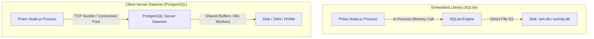
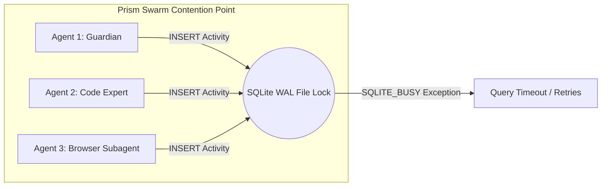
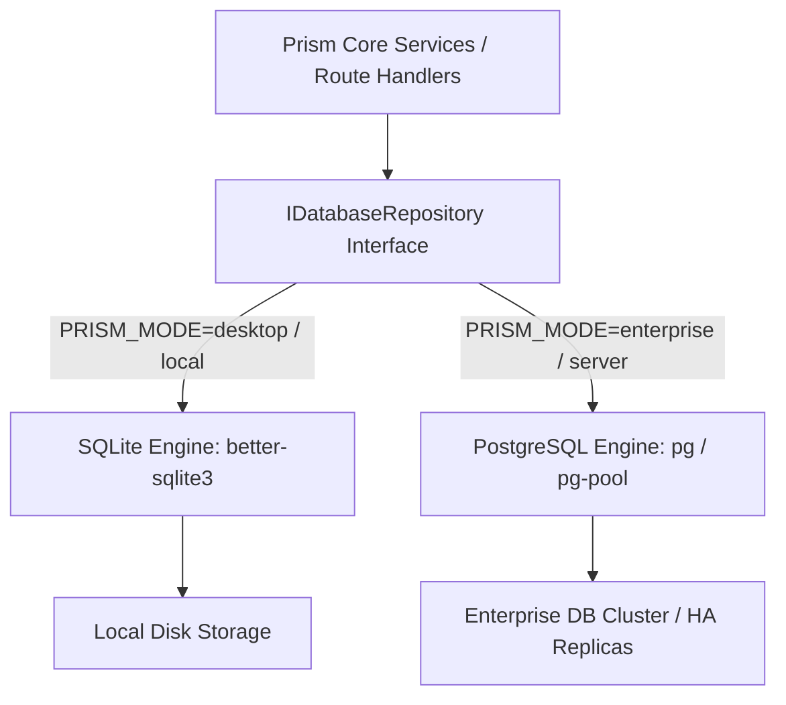

# Architectural Research & Feasibility Analysis: SQLite vs. PostgreSQL in Prism Refraction

**Document Reference**: `ARCH-RESEARCH-SQLITE-VS-PG-2026`  
**Focus**: Architectural evaluation, comparative critique, feasibility analysis, and enhancement roadmap for Prism's database storage layer.  

---

## Executive Summary

Prism Refraction currently operates on an **embedded SQLite** storage architecture across its core subsystems: the Identity & Access Management store (`iam.db`), the chat session history ledger (`chat-session-store.ts`), the causal activity bus ledger (`SqliteActivityStore`), and the character accountability repository (`CharacterAccountabilityStore`). 

This document provides a rigorous architectural comparison between embedded SQLite and client-server PostgreSQL, critiquing Prism’s current deployment model under the stress of high-concurrency autonomous swarms (`SwarmCoordinator`, `AgentPool`), multi-operator enterprise scaling, and vector embedding RAG retrieval. Finally, it outlines strategic recommendations and a hybrid architectural roadmap to maximize performance without sacrificing local-first portability.

---

## 1. Fundamental Architectural Paradigms



### Embedded Library (SQLite)
SQLite is not an independent database server daemon; it is a **compact C library linked directly into the host application process** (accessed in Prism via native bindings like `better-sqlite3` or `sqlite3`). 
- **The Zero-Hop Advantage**: All SQL statement parsing, B-Tree traversal, and data retrieval execute within the host process's memory space, completely bypassing network stacks, socket serialization, and inter-process communication (IPC) overhead.
- **File-Backed Persistence**: Database files are standard, cross-platform disk files, granting unmatchable ease of backup, zero-configuration local deployment, and immediate portability.

### Client-Server Daemon (PostgreSQL)
PostgreSQL is a **robust, multi-process database server daemon** designed for enterprise-grade concurrency, high availability, and horizontal scaling across network boundaries.
- **Network Protocol & Connection Overhead**: Every query requires assembling a wire protocol packet, transmitting it over a UNIX domain socket or TCP connection, authenticating against backend worker processes, and parsing the response back across the socket.
- **Dedicated Resource Management**: PostgreSQL maintains its own shared buffer cache, background write-ahead logging workers (`walwriter`), vacuum cleaners (`autovacuum`), and complex query optimization engines independently of the client application.

---

## 2. Deep-Dive Comparative Critique

| Architectural Dimension | Embedded SQLite | Client-Server PostgreSQL | Architectural Implication for Prism |
| :--- | :--- | :--- | :--- |
| **Concurrency Model** | **WAL Mode (Single Writer, Multiple Readers)**. Writes are serialized at the database file level. | **Multi-Version Concurrency Control (MVCC)**. Concurrent readers and writers never block each other. | Under heavy parallel swarm execution (`SwarmCoordinator`), concurrent tool logging to `activity.db` can experience `SQLITE_BUSY` lock contention. Postgres eliminates write bottlenecks. |
| **I/O Latency** | **Sub-Microsecond Latency**. Direct memory access and local OS filesystem page cache. | **Millisecond Latency**. Imposes TCP/Socket round-trips and connection pooling overhead. | For rapid local single-agent execution and instant UI state loads, SQLite is orders of magnitude faster due to zero network overhead. |
| **Data Typing & Schema** | **Dynamic / Flexible Typing** (`STRICT` tables optional). Excellent JSON support via SQLite functions. | **Strictly Enforced Relational Schema**. Native JSONB indexing (`GIN`), Enums, Custom Domains. | Postgres provides superior data integrity for enterprise multi-operator RBAC and granular auditing schemas. |
| **Vector / Embeddings** | **`sqlite-vec` (In-Process C Extension)**. Highly optimized linear scans / basic indexing. | **`pgvector` (Dedicated Server Extension)**. Advanced HNSW & IVFFlat approximate nearest neighbor indexing. | For small-to-medium agentic memory buffers (<100k vectors), `sqlite-vec` is exceptionally fast. For enterprise corpus indexing (millions of tokens), `pgvector` HNSW is mandatory. |
| **Operational Complexity** | **Zero Setup**. Single binary/file; no daemons, no Docker dependencies, no DB administrator required. | **High Infrastructure Footprint**. Requires Docker/Daemon orchestration, volume management, and connection pooling (`PgBouncer`). | SQLite preserves Prism's ability to run as a lightweight CLI, TUI, or desktop application instantly on Windows/macOS/Linux. |

---

## 3. Critique of Prism's Current SQLite Implementation

### Strengths & Triumphs of the Current Architecture
1. **Local-First & Air-Gapped Superiority**: Prism’s mandate as an autonomous desktop agent (`ComputerUseTool`, `BrowserControlTool`) requires immediate zero-configuration startup. A user downloading Prism can run `start_web.bat` or `npm start` instantly without installing or configuring a database server.
2. **Deterministic File Portability**: Because workspaces and IAM profiles reside in clean SQLite databases (`.prism/iam.db`), users can zip up a workspace directory, transfer it between devices, or commit state snapshots directly to git repositories seamlessly.
3. **Microsecond Read Throughput**: Fetching character configurations, active covenants, and prompt templates takes microseconds, preventing UI stutter in the React frontend or TUI interface.

### Identified Bottlenecks & Scaling Friction Points


1. **Write Contention Under Autonomous Swarm Stress**: When Prism initiates a multi-agent swarm (`SwarmCoordinator` dispatching 10 parallel sub-agents), all agents continuously emit telemetry, tool execution steps, and causal audit logs to the `SqliteActivityStore`. Because SQLite's Write-Ahead Log (WAL) mode permits only **one concurrent writer**, high-frequency parallel logging can trigger `SQLITE_BUSY` exceptions unless retry loops and exponential backoffs are strictly configured.
2. **Enterprise Multi-Operator Isolation**: In enterprise deployments (`PRISM_ENTERPRISE_IAM=on`), multiple operators access the dashboard simultaneously. SQLite lacks row-level security (RLS) and fine-grained user connection isolation. All queries execute under the single system process identity.
3. **Unbounded Ledger Growth**: The causal activity ledger (`activity.db`) and accountability event stores accumulate gigabytes of JSON blobs over extended autonomous testing runs. While SQLite handles multi-gigabyte files effortlessly, executing complex historical analytical queries (e.g., aggregating token consumption across 10,000 sessions grouped by model and tool) locks the database file, degrading real-time chat responsiveness.

---

## 4. Feasibility Analysis: Migrating to PostgreSQL

Migrating Prism entirely to PostgreSQL involves significant architectural trade-offs. We analyze two primary migration scenarios:

### Scenario A: Full PostgreSQL Replacement (Monolithic Server Mode)
In this scenario, SQLite is completely excised, and Prism requires a running PostgreSQL instance (either local Docker container or remote RDS/Cloud DB).

- **Feasibility**: High technical feasibility if using an abstraction layer (e.g., Drizzle ORM, Prisma, or Knex.js). The SQL dialect differences between SQLite and Postgres (e.g., `AUTOINCREMENT` vs `SERIAL`/`BIGSERIAL`, `DATETIME` vs `TIMESTAMPTZ`, `JSON` functions vs `JSONB` operators) must be normalized.
- **The Core Trade-off**: **Loss of Zero-Config Portability**. Installing Prism would now require `docker compose up -d postgres` or manual database provisioning. For enterprise server deployments, this is perfectly acceptable; for individual developers running Prism as a local pair-programming CLI/TUI, this introduces massive friction.

### Scenario B: The Dual-Engine Dynamic Repository (Recommended)
Rather than forcing a hard switch, Prism can adopt a **Repository Interface Pattern** that dynamically binds to either SQLite or PostgreSQL based on the runtime configuration profile (`PRISM_MODE`).



- **Feasibility**: Extremely high. Prism already exhibits excellent modularity (e.g., `IamStore` encapsulates all SQL execution behind clean TypeScript methods). By refactoring `IamStore`, `ChatSessionStore`, and `SqliteActivityStore` to implement abstract interfaces (`IIamStore`, `IActivityStore`), the underlying engine can be swapped during application bootstrap in `DashboardService`.

---

## 5. Strategic Recommendations & Architectural Enhancements

To maximize system performance and future-proof Prism without sacrificing its local-first ethos, we propose a three-tiered architectural enhancement roadmap:

### Near-Term: SQLite Performance & Concurrency Hardening
Before attempting any migration to Postgres, Prism’s existing SQLite implementation should be tuned to its absolute limit:

1. **Enforce Pragmatic PRAGMA Execution**: During SQLite connection initialization, enforce the following high-concurrency PRAGMA directives:
   ```sql
   PRAGMA journal_mode = WAL;         -- Enable Write-Ahead Logging
   PRAGMA synchronous = NORMAL;       -- Safe WAL sync speed without fsync bottlenecks
   PRAGMA busy_timeout = 5000;        -- Automatic 5-second retry loop on write locks
   PRAGMA cache_size = -65536;        -- Allocate 64MB of in-memory page cache
   PRAGMA temp_store = MEMORY;        -- Store temporary tables and indexes in RAM
   PRAGMA mmap_size = 3000000000;     -- Memory-map up to 3GB of the DB file for lightning reads
   ```
2. **Dedicated Background Writer Queue**: To prevent `SQLITE_BUSY` errors during massive swarm telemetry bursts, wrap the `SqliteActivityStore` in an in-memory asynchronous ring buffer (e.g., batching `INSERT` statements in memory and executing them inside a single SQLite transaction every 100ms or 1,000 events). This reduces disk I/O operations by 90% and completely eliminates write lock contention.
3. **Adopt Strict Typing & WAL2**: Transition all SQLite table definitions to `STRICT` mode (SQLite 3.37+) to enforce data integrity matching PostgreSQL standard schemas.

### Mid-Term: Abstracting Storage via ORM / Query Builder
To prepare for dual-engine compatibility, migrate raw SQL query strings (`this.db.prepare(...)`) to a lightweight, highly performant TypeScript query builder such as **Drizzle ORM** or **Kysely**.
- Both engines provide 100% type-safe SQL query generation.
- Both engines support seamless swapping between `better-sqlite3` drivers and PostgreSQL `pg` connection pools without altering core business logic.

### Long-Term: Distributed Edge SQLite (libSQL / Turso) vs. Enterprise Postgres Hub
If Prism expands into a distributed team collaboration tool:
- **For Edge & Multi-Device Sync**: Evaluate **libSQL** (an open-source fork of SQLite by Turso) or **LiteFS**. This allows Prism to run local SQLite databases on the operator's machine while automatically streaming WAL replication logs over HTTP to a centralized cloud hub, achieving local microsecond reads with global data synchronization.
- **For Centralized Enterprise Hubs**: For dedicated enterprise servers managing hundreds of simultaneous autonomous agents and terabytes of accountability ledgers, activate the PostgreSQL driver profile. Leverage `pgvector` HNSW indexes for enterprise-wide codebase semantic searching and partitioned tables for causal audit logs.

---

## Summary Conclusion

**SQLite is not a "toy" database; it is an industrial-strength embedded data engine.** In 2026, the performance delta between SQLite and PostgreSQL is driven entirely by deployment topology. 

For Prism’s primary mission as an autonomous, local-first coding assistant and desktop automation harness, **SQLite remains the superior architectural choice** due to zero network latency, effortless file portability, and zero operational overhead. By implementing aggressive PRAGMA tuning, asynchronous write batching, and an abstract Repository Pattern interface, Prism can maintain flawless local execution while unlocking seamless PostgreSQL scalability for enterprise server environments.

---
**References & Citations**:
1. *SQLite Documentation: Write-Ahead Logging (WAL) & Memory-Mapped I/O* (https://www.sqlite.org/wal.html)
2. *PostgreSQL Concurrency & MVCC Architecture* (https://www.postgresql.org/docs/current/mvcc.html)
3. *sqlite-vec vs. pgvector: Architectural Trade-offs in Vector Embeddings* (https://github.com/asg017/sqlite-vec)
4. *Scaling SQLite for High-Concurrency Web Applications* (https://fractaledmind.github.io/2023/12/11/sqlite-on-rails-improving-concurrency/)
