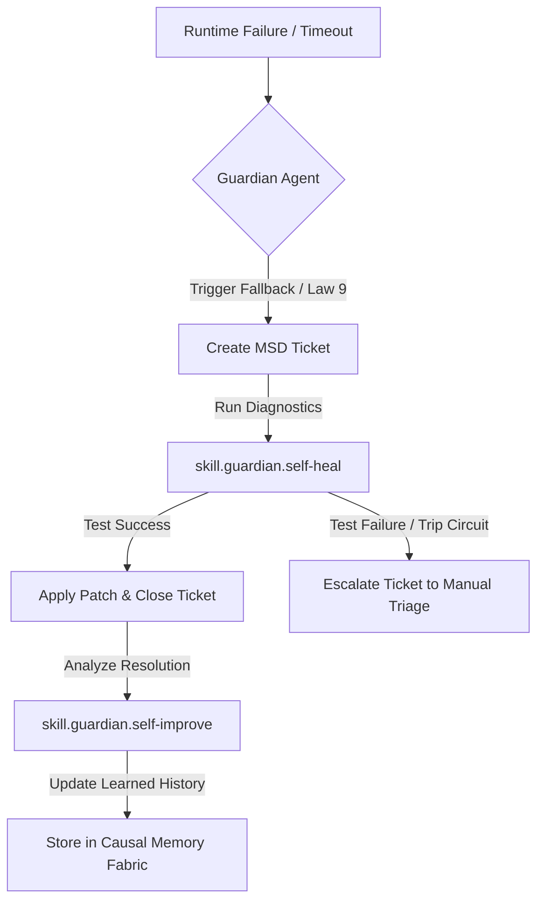

# Guardian MSD & Self-Healing Integration Design

This document details the architecture, ticket schemas, execution lifecycles, and testing patterns for integrating the **Micro Support Desk (MSD)** with the **Guardian Agent's Self-Healing and Self-Improvement skills**.

---

## 🏥 Architecture Overview

To achieve the resilience mandated by the **Diagnostic Fallback (Law 9)**, the Guardian Agent must leverage the Micro Support Desk (MSD) as its living database of failures, recoveries, and evolutionary milestones.



---

## 🎫 Micro Support Desk (MSD) Integration

### 1. Unified Ticket Schema

All self-healing tasks write directly to the SQLite-persisted MSD database. Tickets are enriched with the execution context from the **Character Accountability Control (CAC)** chain:

```json
{
  "ticketId": "MSD-2026-0089",
  "status": "OPEN",
  "priority": "HIGH",
  "category": "SELF_HEALING",
  "characterId": "guardian@prism.local",
  "operatorId": "operator-kirk",
  "context": {
    "errorTrace": "SyntaxError: Unexpected token in config.json at line 14",
    "affectedFiles": ["D:/Projects/Prism/config/config.json"],
    "triggerSource": "ast_lint_failure",
    "fallbackStateActive": true
  },
  "history": [
    {
      "timestamp": "2026-07-12T17:40:00Z",
      "action": "TICKET_CREATED",
      "note": "AST parser caught broken config file during prebuild."
    }
  ]
}
```

### 2. Ticket Lifecycle States

* **`OPEN`:** The Guardian Agent detects a compiler, linter, or test failure. A ticket is created, locking the target files to prevent write collisions.
* **`UNDER_INVESTIGATION`:** The `skill.guardian.self-heal` loop is active. The engine reads the Causal Memory Fabric to search for similar historical failures.
* **`RESOLVED` (Self-Healed):** A repair candidate has passed all local verification checks. The patch is committed, the build succeeds, and the ticket is resolved.
* **`MANUAL_TRIAGE`:** The repair candidate fails or triggers a circuit-breaker. The system rolls back to the stable git baseline, halts self-drive mode, and opens a critical alert in the operator dashboard.

---

## 🛠️ Guardian Skill Definitions

### 1. `skill.guardian.self-heal`

This skill coordinates the automated recovery loop when reasoning models encounter code or environment breakage.

* **Triggers:**
  * Repeated test failures (`npm run test` exits non-zero).
  * AST parse errors during compilation or pre-building.
  * Infinite loops or execution timeouts exceeding the 60,000ms threshold.
* **Action Pipeline:**
  1. **Lock & Verify:** Isolate the active files and check git status.
  2. **Retrieve Context:** Pull the last 5 episodic memory traces from the **Causal Memory Fabric**.
  3. **Formulate Repair:**
     * **SR Enabled:** Route the failure trace to the Logic Hemisphere to produce a minimal, safe patch code.
     * **SR Disabled Fallback:** If Spectrum Refraction (SR) is disabled, notify the Operator immediately with an alert in the format `[SR_DISABLED SpectrumRefraction disabled; routing task to primary model <ModelName>]`, falling back to the designated primary model.
  4. **Validate:** Execute compilation and target test suites. If successful, promote the patch.

### 2. `skill.guardian.self-improve`

This skill optimizes system performance and prevents future fallbacks by logging design patterns and optimizing prompt preambles.

* **Triggers:**
  * Successful resolution of a `self-heal` ticket.
  * High model latency or token consumption warnings.
* **Action Pipeline:**
  1. **Analyze Resolution:** Contrast the broken code state against the working patch.
  2. **Update Learned History:** Append the resolved pattern to the semantic memory graph under `#diagnostics`.
  3. **Refine Prompts:** Inject warning tags into the orchestrator prompt files (e.g., `"When editing config.json, always preserve trailing commas"`).

---

## 📊 Traceability, Logging & Telemetry

To support rigorous auditability, every execution step, routing fallback, and database mutation must be fully observable:

* **Disk File Logging:** Write detailed trace entries to the local path `logs/guardian-self-heal.log`.
* **Dashboard Stream:** Broadcast live events via WebSocket to the operator console.
* **Console Presentation:** Populate the **Telemetry** and **Logs & Debug** tabs with the self-healing telemetry.
* **Access Roles:** Ensure all generated logs are formatted to be readable and inspectable by the **Guardian Agent** (for automated learning), the **CAC Engine** (for identity signing verification), and the **Operator** (for manual audit).

---

## 🧪 Testing & Verification Plan

Five dedicated integration tests must be implemented in the testing harness to verify this functionality:

1. **`test:msd-ticket-creation`:** Induce a syntax error in a sample workspace file and verify that the Guardian Agent creates an `OPEN` ticket in the MSD database with the correct error trace.
2. **`test:self-healing-success`:** Run the self-healing pipeline on a broken function, verify that the Logic Hemisphere generates a patch that resolves the lint error, commits it, and moves the ticket to `RESOLVED`.
3. **`test:circuit-breaker-fallback`:** Simulate a repair loop that fails three successive compilation attempts. Verify the system rolls back to the original git commit and elevates the ticket to `MANUAL_TRIAGE`.
4. **`test:learned-history-retrieval`:** Break a function in a way that replicates a previous failure. Verify that the agent retrieves the prior resolution from the MSD database and applies the fix on the first try.
5. **`test:cac-permission-enforcement`:** Verify that executing `skill.guardian.self-heal` requires the synthetic `guardian@prism.local` identity and rejects attempts from unauthorized characters.
