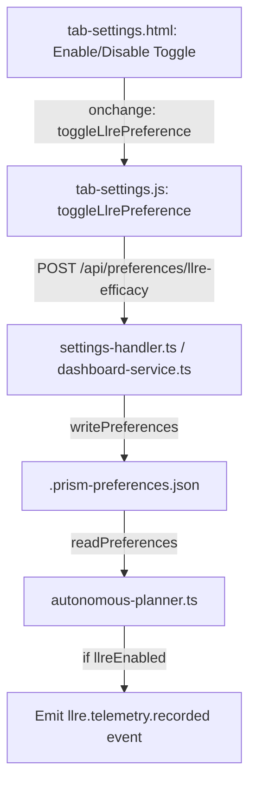

# LLRE Cognitive Economics Telemetry Toggle Implementation

This walkthrough details the design, implementation, and testing of the new Enable/Disable toggle switch for **Cognitive Economics & Prompt Efficacy** (Large Language Model Reasoning Efficacy - LLRE) inside Prism's **Providers & Settings** dashboard tab.

## Summary of Changes



### 1. Front-end UI Implementation
*   **HTML Layout (`src/core/operator/public/tab-settings.html`):**
    *   Added a custom styled checkbox toggle label (`#llre-toggle`) in the header card of the **Cognitive Economics & Prompt Efficacy** widget, positioned adjacent to the last sync status.
    *   Assigned the ID `llre-active-status-badge` to the active state badge.
*   **JavaScript Controller (`src/core/operator/public/tab-settings.js`):**
    *   Updated `refreshLlreTelemetry()` to initialize/sync the checkbox state with the stored `state.runtimeSettings.llreEnabled` setting.
    *   Stylized the active status badge dynamically: showing `"LLRE Port Active"` (with indigo background `#4f46e5`) when enabled, or `"LLRE Port Disabled"` (with neutral slate background `#64748b`) when disabled.
    *   If disabled, metrics display as `--` and signal-to-noise rating displays as `"LLRE Disabled"`.
    *   Added and exported `toggleLlrePreference(checked)` which makes a POST request to `/api/preferences/llre-efficacy` to save settings and refreshes the telemetry view.
*   **Entrypoint Mapping (`src/core/operator/public/dashboard-app.js`):**
    *   Imported and globally registered `toggleLlrePreference` on the `window` object to allow inline event binding from the HTML template.

### 2. Back-end Route Handling & Configuration
*   **API Preferences Routing (`src/core/operator/routes/settings-handler.ts` & `src/core/operator/dashboard-service.ts`):**
    *   Implemented `POST /api/preferences/llre-efficacy` route handlers in both files to extract the telemetry status (`enabled` boolean) from the request body and save it into workspace preferences using `writePreferences()`.
*   **Default Configuration (`src/core/operator/dashboard-service.ts`):**
    *   Initialized `llreEnabled: true` in the default `runtimeSettings` configuration registry.

### 3. Planner Telemetry Gating
*   **Autonomous Planner Loop (`src/core/runtime/autonomous-planner.ts`):**
    *   Imported `readPreferences` from `src/core/config/workspace-resolver.ts`.
    *   Wrapped the telemetry calculations and `"llre.telemetry.recorded"` event emission code block inside a gating check: `if (llreEnabled)`. This prevents calculations or event writes when disabled.

---

## Verifying and Testing

### Unit Test Execution
We added test case 5 to `tests/llre.test.ts` to test writing and reading the workspace preference:
```typescript
// 5. Test LLRE enable/disable preference toggling logic
const { readPreferences, writePreferences } = await import("../src/core/config/workspace-resolver.js");
const initialPrefs = readPreferences() || { lastModified: "" };
const originalLlreEnabled = initialPrefs?.runtimeSettings?.llreEnabled;
try {
    // Disable LLRE
    writePreferences({
        runtimeSettings: { ...initialPrefs.runtimeSettings, llreEnabled: false }
    });
    const prefsAfterDisable = readPreferences();
    assert.strictEqual(prefsAfterDisable?.runtimeSettings?.llreEnabled, false);

    // Enable LLRE
    writePreferences({
        runtimeSettings: { ...initialPrefs.runtimeSettings, llreEnabled: true }
    });
    const prefsAfterEnable = readPreferences();
    assert.strictEqual(prefsAfterEnable?.runtimeSettings?.llreEnabled, true);
} finally {
    // Restore original preference
    writePreferences({
        runtimeSettings: { ...initialPrefs.runtimeSettings, llreEnabled: originalLlreEnabled }
    });
}
```

The test runner verified that workspace read/write operations succeed cleanly:
```bash
✓ LLRE tests passed
LLRE Test Suite Passed!
```
