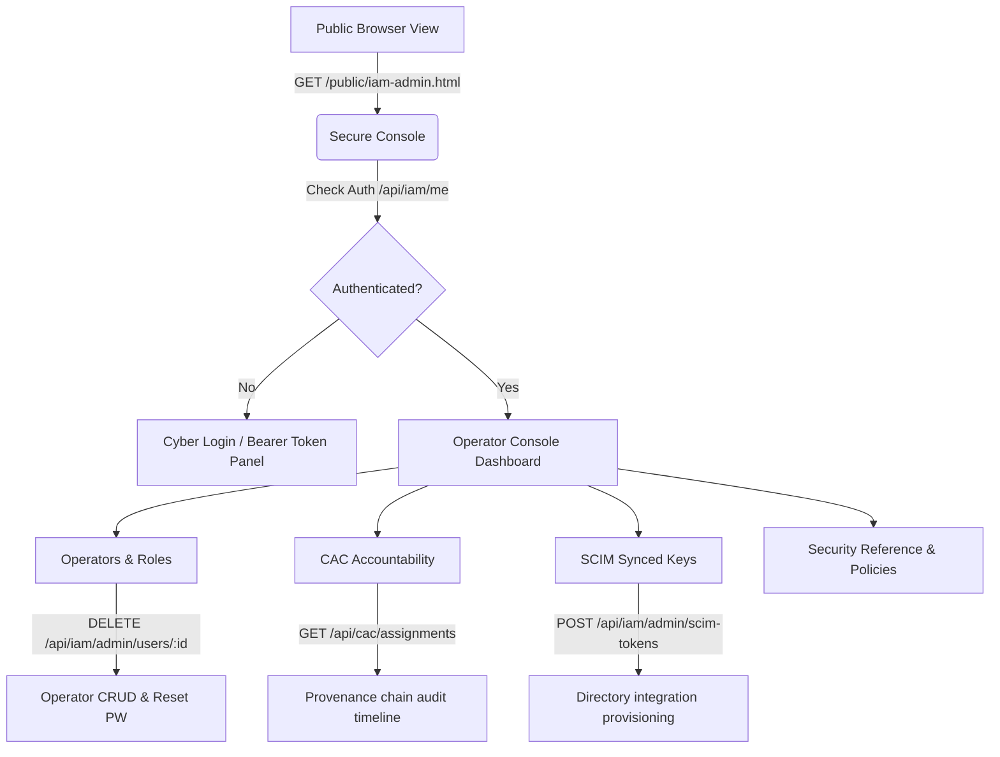
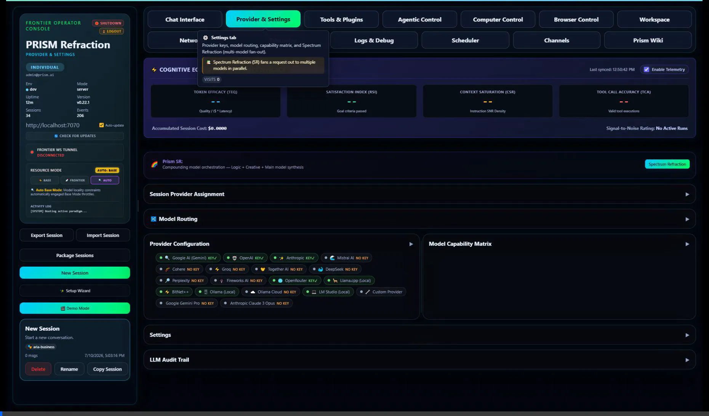

# PRISM Secure Operator Console & IAM Management

We have successfully designed, built, and verified a world-class secure Operator Management Dashboard at `/public/iam-admin.html` that matches the high-end cyberpunk and glassmorphism styling of the PRISM platform.

## 🛠️ Implemented Architecture

The console is fully standalone and handles its own session state by interacting with PRISM's IAM and CAC endpoints.

---

## 🎨 Design Highlights & Features

1. **Cyber-Secure Login Screen**:
    - Seamlessly integrated fallback for developer tokens (expanding inline with custom inputs).
    - Emergency system shutdown control mapped to `POST /api/system/shutdown`.

2. **Operators & RBAC Directory**:
    - Full list of registered operators.
    - Inline Role Management: allows dynamically adding/revoking individual roles via dropdowns/pills.
    - Inline Password resetting modal.
    - Account suspension/activation toggles.
    - Secure operator account deletion (preventing self-deletion).

3. **CAC Main Agents**:
    - One durable, Initialization Certificate-bound Main Agent for each operator.
    - The CAC is the operator's assistant and primary interaction identity, not a per-session certificate.
    - Guardian is the permanent secondary agent supporting each CAC Main Agent and the complete platform.
    - Interactive modal displaying the full provenance audit timeline (fetching `/api/cac/assignments/:id/chain`).
    - Manual verification controls for linking Gmail / Outlook emails.
    - Direct download links for audit log exports (CSV/JSON).

4. **SCIM Token Sync**:
    - Secure provisioning dialog that surfaces generated plaintext integration tokens (e.g., for Okta/Azure AD sync) only once, with quick-copy controls.
    - Revocation tables for decommissioning sync keys.

---

## 🎥 Visual Walkthrough

Here is the screen capture showing the dashboard navigation, role checks, and responsive design:

---

## 🔍 Validation Log

We verified the build and ran a browser subagent:

- **Build Status**: Success (`Exit code: 0`).
- **Endpoint Response**: `/api/iam/me` resolves correctly; token authorization works successfully.
- **Redirection check**: Clicking **Launch Refraction Dashboard** redirects cleanly to `/dashboard`.
