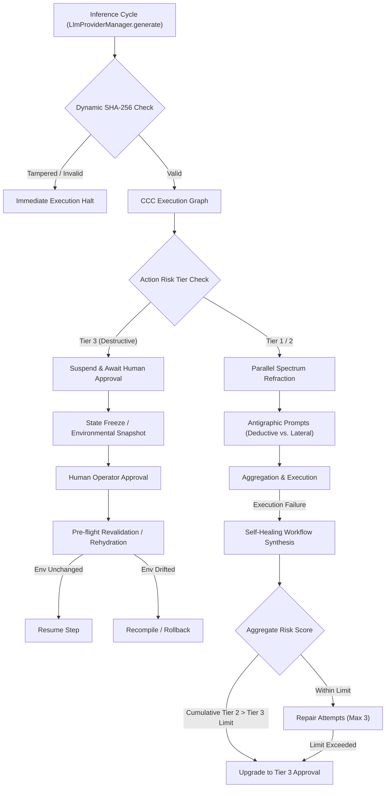

# PRISM Autonomous Agent Runtime Hardening Plan

**Document Version:** 1.0.0  
**Author:** Antigravity (AI Coding Assistant)  
**Presented to:** Kirk LaSalle  
**Status:** Pending Approval

---

## 1. Executive Summary

This document presents a comprehensive, world-class development plan to harden the **PRISM Autonomous Agent Runtime** against runtime vulnerabilities, cognitive homogenization, state drift during human latency, and self-healing escalation loops.

Our plan directly addresses the four critical areas identified in the recent audit of the PRISM architecture:

1. **Dynamic Cryptographic Directive Enforcement** (closing the 10-minute check window and preventing active memory manipulation).
2. **Constitutional Causal Compiler (CCC) Rehydration** (handling the state drift caused by manual human-in-the-loop latency).
3. **Spectrum Refraction Cognitive Isolation** (ensuring true reasoning diversity instead of the illusion of provider-based separation).
4. **Self-Healing Loop Constraints** (blocking indirect workarounds of Law 10 through stacked Tier 2 actions and recursive execution).

---

## 2. Architectural Audit & Vulnerability Assessment

### 2.1 Cryptographic Directive Enforcement (Pillar 1)

- **Current State:** The Guardian agent verifies the Permanent Active Directives (PAD) SHA-256 hash once every 600 seconds (10 minutes) on disk.
- **Vulnerability:** A memory manipulation attack during active execution (e.g. prompt injection or shell exploit) can alter the directive constant or prompt injection string in RAM. The agent could run unsanctioned actions for up to 10 minutes before the disk-based check detects the tamper.
- **Hardening Strategy:** Evolve the verification to **continuous runtime enforcement**. The system prompt's injected directive text must be dynamically recomputed and validated against the compiled SHA-256 hash at the exact millisecond of every inference call.

### 2.2 CCC Latency & State Hydration (Pillar 2)

- **Current State:** The Constitutional Causal Compiler (CCC) precompiles a deterministic execution graph of actions.
- **Vulnerability:** When a Tier 3 action (e.g. deleting a container) suspends the graph to wait for human approval, the environment can change. If human approval takes hours, the steps compiled prior to suspension are executed in a drifted environment, leading to cascading failures.
- **Hardening Strategy:** Implement a formal **State Freeze & Rehydrate** mechanism that runs a pre-flight validation check before resuming, or enforce **Just-In-Time (JIT) compilation** where the graph is only precompiled up to the next Tier 3 gate.

### 2.3 Spectrum Refraction Isolation (Pillar 3)

- **Current State:** Spectrum Refraction separates processing into left (logic) and right (creative) hemispheres, assuming isolation simply because different providers are used (e.g., Anthropic vs. OpenAI).
- **Vulnerability:** Modern frontier models share massive amounts of common web crawled training data and align closely on safety fine-tuning (RLHF), resulting in output correlation and cognitive homogenization.
- **Hardening Strategy:** Move validation beyond provider separation. Enforce **disjoint, antagonistic system prompts** (e.g., forcing strict deductive reasoning for the left hemisphere and barring deductive steps for the right) and introduce a **Taxonomy Distance Metric** to warn when highly correlated model architectures are chosen.

### 2.4 Self-Healing Escalation Loops (Pillar 4)

- **Current State:** The Self-Healing Workflow Synthesis repairs failed tasks by generating alternative plans within policy bounds.
- **Vulnerability:** Multiple Tier 2 rollback-capable actions (e.g., moving files, modifying read-only flags) can be chained together autonomously to achieve the same result as a blocked Tier 3 action (e.g. deleting a production folder), bypassing manual approval gates.
- **Hardening Strategy:** Impose a **Repair Exhaustion Limit** (max 3 recursive attempts) and calculate an **Aggregate Risk Score** over a temporal window. If chained repairs approximate a Tier 3 outcome, upgrade the plan to Tier 3 automatically to enforce human approval.

---

## 3. Action Plan & Actionable Tasks

### Phase 1: Cryptographic Runtime Enforcement (Active Memory Protection)

- **Task 1.1: Millisecond-level Prompt Hashing**
    - _Implementation:_ Inject a SHA-256 verification step directly inside `LlmProviderManager.generate` in [llm-provider-manager.ts](file:///d:/Projects/Prism/src/core/operator/llm-provider-manager.ts).
    - _Details:_ Recompute the SHA-256 hash of the active directives string in memory at runtime and compare it against the frozen `DIRECTIVE_SHA256` constant. Throw a blocking error if a mismatch is detected.
- **Task 1.2: Software-based RAM Protection**
    - _Implementation:_ Freeze directive constants using `Object.freeze` in [directive-integrity.ts](file:///d:/Projects/Prism/src/core/security/directive-integrity.ts).
    - _Details:_ Ensure the loaded directives string, the expected hash, and the metadata results are immutable.

### Phase 2: CCC Suspended State Rehydration

- **Task 2.1: Pre-flight Environmental Snapshots**
    - _Implementation:_ Modify `CausalCompiler` in [compiler.ts](file:///d:/Projects/Prism/src/core/incubation/ccc/compiler.ts).
    - _Details:_ Take a state/environment snapshot (filesystem flags, database connections, active files) before suspending a Tier 3 action.
- **Task 2.2: Rehydration & Revalidation Sequence**
    - _Implementation:_ Update execution logic in [enforcer.ts](file:///d:/Projects/Prism/src/core/incubation/ccc/enforcer.ts).
    - _Details:_ Upon operator approval, compare the current environment with the snapshot. If the environment has drifted beyond acceptable thresholds, force a recompile of the remaining execution graph.

### Phase 3: Spectrum Refraction Cognitive Isolation

- **Task 3.1: Antagonistic Prompt Enforcement**
    - _Implementation:_ Update specialization profiles in [sr-hemisphere-profiles.ts](file:///d:/Projects/Prism/src/core/operator/sr-hemisphere-profiles.ts) and [model-capability-matrix.ts](file:///d:/Projects/Prism/src/core/operator/model-capability-matrix.ts).
    - _Details:_ Refine the left hemisphere system prompt to mandate step-by-step logical proofs and formal deduction. Refine the right hemisphere prompt to explicitly bar deductive/code patterns, forcing lateral, associative reasoning.
- **Task 3.2: Taxonomy Distance & Architecture Warning**
    - _Implementation:_ Update `normalizeSRConfig` in [model-capability-matrix.ts](file:///d:/Projects/Prism/src/core/operator/model-capability-matrix.ts).
    - _Details:_ Add an architectural kinship matrix (mapping model families like GPT, Claude, Gemini, Llama). If selected models have a kinship score > 0.8, generate a warning event to the activity bus alerting the operator of potential correlation.

### Phase 4: Self-Healing Bounded Recovery & Risk Escalation

- **Task 4.1: Bounded Repair Depth Limit**
    - _Implementation:_ Modify `SelfHealingWorkflowSynthesizer` in [synthesizer.ts](file:///d:/Projects/Prism/src/core/incubation/shws/synthesizer.ts).
    - _Details:_ Track execution retry depth in the context. Throw a hard failure once depth exceeds 3 recursive repair attempts.
- **Task 4.2: Aggregate Risk Scoring & Upgrade Gate**
    - _Implementation:_ Update `PolicyValidator` in [policy-validator.ts](file:///d:/Projects/Prism/src/core/incubation/shws/policy-validator.ts).
    - _Details:_ Evaluate the cumulative risk of all actions in the repair chain. If the combined actions match the signature of a protected Tier 3 resource deletion/alteration, upgrade the plan's security tier to Tier 3.

---

## 4. Verification & Testing Plan

To ensure the highest standard of verification, we will construct new Scenario test files under `src/ptac/scenarios/` mapping to each pillar:

| Test ID | Scenario File Name               | Objective                                                                                                         |
| ------- | -------------------------------- | ----------------------------------------------------------------------------------------------------------------- |
| **s30** | `s30-continuous-pad-verify.ts`   | Verify that modifying the directives text in memory immediately halts inference.                                  |
| **s31** | `s31-ccc-state-rehydration.ts`   | Verify that long suspensions trigger pre-flight checks and re-compilations if files change during approval.       |
| **s32** | `s32-sr-antagonistic-prompts.ts` | Verify left/right prompts reject matching patterns and that the kinship distance warning fires.                   |
| **s33** | `s33-self-healing-escalation.ts` | Verify cumulative Tier 2 actions are correctly upgraded to Tier 3 and that recovery halts after 3 failed retries. |

---

## 5. Implementation Todos & Action Items Checklist

- [ ] **Pillar 1: Cryptographic Runtime Enforcement**
    - [ ] Implement `Object.freeze` on directive parameters.
    - [ ] Inject `verifyDirectiveIntegrity` inside `LlmProviderManager.generate`.
    - [ ] Write and verify PTAC Scenario `s30-continuous-pad-verify`.
- [ ] **Pillar 2: CCC Suspended State Rehydration**
    - [ ] Add pre-flight snapshots to the causal graph.
    - [ ] Build drift checking logic in the enforcer.
    - [ ] Write and verify PTAC Scenario `s31-ccc-state-rehydration`.
- [ ] **Pillar 3: Spectrum Refraction Isolation**
    - [ ] Restructure left/right prompts to enforce antagonistic deduction limits.
    - [ ] Build model family kinship mapping and add warnings.
    - [ ] Write and verify PTAC Scenario `s32-sr-antagonistic-prompts`.
- [ ] **Pillar 4: Self-Healing Workflow Synthesis**
    - [ ] Cap recursive recovery cycles at 3 attempts.
    - [ ] Add aggregate risk scoring to the policy validator.
    - [ ] Write and verify PTAC Scenario `s33-self-healing-escalation`.

---

_Please review this plan and indicate your approval to proceed with Phase 1._
