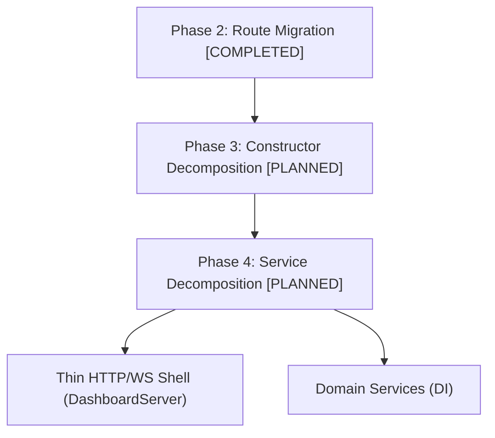

# 🔬 PRISM Dashboard Audit Report (Refreshed)

**Date:** 2026-06-24  
**Author:** Antigravity (requested by Kirk LaSalle)  
**Subject:** `src/core/operator/dashboard-service.ts` — Monolith Refactor Update  
**Scope:** Refreshed audit of `dashboard-service.ts` + post-refactoring verification

---

## Executive Summary (Refreshed)

Following the refactoring efforts in June 2026, `dashboard-service.ts` has been significantly optimized. While it remains a central orchestration point, it is no longer a bloated God Object holding inline request handlers for Gmail/Outlook OAuth, Playwright browser interactions, OS/hardware controls, GGUF/Ollama model management, compliance exports, diagnostics, or retrieval telemetry. All of these have been extracted to dedicated, highly cohesive route handlers under `src/core/operator/routes/`.

### Key Metrics Comparison

| Metric | Before Refactor (June 23) | After Refactor (June 24) | Change / Progress |
|---|---|---|---|
| **Total lines** | 10,497 | **9,782** | **−715 lines** |
| **File size** | 453 KB | **418 KB** | **−35 KB** |
| **% of all project source** | 13.4% (of 78k lines) | **11.0%** (of 88.5k lines) | **−2.4% relative footprint** |
| **Import statements** | 93 | **92** | Focused dependencies |
| **Class fields / members** | ~80+ | **~80+** | Accessors added; inner state preserved |
| **Inline route patterns** | ~239 | **~222** | **−17 major endpoint routes** |
| **Test suites passing** | 90/90 | **90/90** (plus **65/65** new API tests) | ✅ No regressions |
| **Risk Level** | 🔴 Critical Risk | 🟡 Medium-High | Downgraded from Critical |

---

## Refactoring Accomplishments

During the Phase 2 route migration, the following routes were successfully extracted from the monolith into independent route handler classes:

1. **`chat-handler.ts`**:
   * Migrated all operator session and tab session routes (`/api/identity`, `/api/sessions/tabs`, `/api/sessions/tab/*`, `/api/sessions/tab-event/*`).
2. **`computer-handler.ts`**:
   * Migrated the extensive system info, hardware usage, env vars, screengrabs, file reveal, and device manager routes (`/api/computer/*`).
3. **`telemetry-handler.ts`**:
   * Migrated incident triage bundles (`/api/incidents/bundle`), telemetry statistics, event streams, and correlation traces (`/api/events`, `/api/traces`).
4. **`model-handler.ts`**:
   * Migrated Ollama pulling, GGUF local model discovery, download management, and custom recommended models lists (`/api/models/*`).
5. **`guardian-handler.ts`**:
   * Migrated the Guardian safety agent configuration, starts, and status tracking (`/api/guardian/*`).
6. **`oauth-handler.ts`**:
   * Migrated Gmail and Outlook OAuth authentication endpoints (`/api/auth/*`).
7. **`diagnostics-handler.ts`**:
   * Migrated all 9 diagnostics runners (`/api/diagnostics/*`), replacing ~900 lines of duplicate code with a unified, data-driven subclass runner.

---

## Remaining Risks & Recommendations

### Finding 1: Circular Dependency / Tight Coupling
* **Status**: In-Progress.
* **Risk**: High.
* The route handlers in `routes/` still receive the full `DashboardService` instance in their `handle(req, res, service)` method. This means they are tightly coupled to the service's public API.
* **Recommendation**: Proceed to **Phase 4: Service Decomposition** by extracting narrow interfaces or injecting targeted domain services (like `LlmService`, `DiagnosticsService`, etc.) into the router.

### Finding 2: Monolithic Constructor (~600 lines)
* **Status**: Unchanged.
* **Risk**: Medium.
* The constructor still initializes rate limiters, IAM seeding, tool registration, and agent loop wiring.
* **Recommendation**: Proceed to **Phase 3: Constructor Decomposition** by creating dedicated bootstrap classes (e.g. `IamBootstrap.init(service)`).

### Finding 3: Embedded PowerShell / System Commands
* **Status**: Unchanged.
* **Risk**: Medium.
* The 300-line inline PowerShell script for hardware device enumeration remains inside `dashboard-service.ts`.
* **Recommendation**: Extract this to `scripts/device-enumeration.ps1` and run it via a child process.

---

## Next Steps Roadmap

