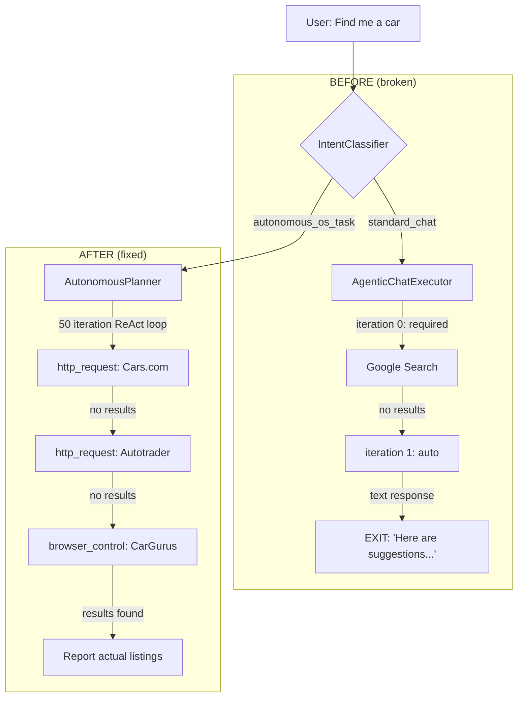

# PRISM Research Task Failure — Root Cause Diagnosis

## The Symptom

When asked "Find a 2020 Ford Explorer, 50-70K miles, $10-14K, Onondaga County NY", PRISM:
1. Makes 1-2 tool calls (Google search, web search)
2. Gets no/empty results
3. **Immediately gives up** and returns suggestions for the user to try themselves
4. Reports "2 tool calls in 2 iterations" — then stops

This has persisted across **4 days and 3 previous fix attempts** (conversations d382d303 and 8a1b59a6).

## Why Previous Fixes Didn't Work

Previous fixes were all **advisory** (system prompt text changes) rather than **structural** (code logic changes):

| Fix Attempt | What Was Changed | Why It Didn't Help |
|---|---|---|
| d382d303 - System prompts | Added "MANDATORY TOOL-USE DIRECTIVES" to all 3 prompt tiers | LLM ignores prompt instructions when it decides the task is done |
| d382d303 - `tool_choice: "required"` | Force tool use on iteration 0 only | LLM makes ONE tool call, then on iteration 1 goes back to `auto` and responds with suggestions |
| d382d303 - MCP stopwords | Removed "search"/"scrape" from filter | Correct but insufficient — tools are available but LLM still quits early |
| 8a1b59a6 - Section 5 prompt | Added "AUTONOMOUS RESEARCH & SELF-PLANNING" to system prompt | More prompt text that the LLM ignores when it decides to give up |
| 8a1b59a6 - Planner point 8 | Added "execute alternative strategies yourself" to planner | **Planner is never reached** — research tasks go through AgenticChatExecutor, not AutonomousPlanner |

> [!CAUTION]
> The most critical finding: **research queries never reach the AutonomousPlanner**. They go through the `AgenticChatExecutor` which has a fundamentally simpler loop that exits the moment the LLM stops calling tools.

---

## Root Cause #1: IntentClassifier Misroutes Research Tasks

**File:** [intent-classifier.ts](file:///d:/Projects/Prism/src/core/operator/intent-classifier.ts#L24-L80)

The `IntentClassifier.classify()` determines whether a task gets the full autonomous treatment (AutonomousPlanner + AutonomousAgentLoop with 50-100 iterations) or the simple chat path (AgenticChatExecutor with 25 iterations).

**The problem:** "Find me a car" doesn't match ANY `autonomous_os_task` pattern:

```
Shopping patterns: /\bshop\b/, /\bbuy\b/, /\bpurchase\b/, /\border\b/, /\bfind.*shoes\b/ ...
Browser patterns:  /\bnavigate\b/, /\bopen.*website\b/, /\bgo to\b/, /\bweb search\b/ ...
```

The word "car" is NOT in any pattern list. "Find" alone doesn't trigger anything. So the request falls to `standard_chat` → goes to `AgenticChatExecutor` → gets only 25 max iterations with no persistence logic.

**What should happen:** Research/information-gathering requests should be classified as `autonomous_os_task` with `requiresBrowser: true` so they get the full autonomous loop.

---

## Root Cause #2: AgenticChatExecutor Exits After First Failed Search

**File:** [agentic-chat-executor.ts](file:///d:/Projects/Prism/src/core/operator/agentic-chat-executor.ts#L147-L191)

Even when `isResearchQuery()` correctly detects the query, `tool_choice: "required"` is **only set on iteration 0**:

```typescript
const toolChoice = (activeTools.length > 0 && isResearch && iteration === 0)
    ? "required"        // ← Only iteration 0!
    : (activeTools.length > 0 ? "auto" : "none");
```

**The failure sequence:**
1. Iteration 0: `tool_choice: "required"` → LLM calls Google search → gets no results
2. Iteration 1: `tool_choice: "auto"` → LLM writes "I couldn't find listings, here are suggestions..." → **no tool calls** → loop exits at line 188-190

```typescript
// If no tool calls, done    ← THIS IS THE KILL SWITCH
if (!result.toolCalls?.length || result.stopReason !== "tool_use") {
    emit({ type: "done", iteration });
    return { finalContent, ... };  // ← Exits immediately
}
```

There is **zero** logic to detect that the LLM gave up and should be pushed to continue.

---

## Root Cause #3: No "Gave Up" Detection

When the LLM responds with text containing suggestions like:
- "Here are some steps you can take..."
- "Contact local dealerships..."  
- "Continue checking platforms like Autotrader..."

...the executor treats this as a **successful completion**. There is no mechanism to:
1. Detect that the response is advice/suggestions rather than actual results
2. Inject a follow-up message saying "No — YOU do those steps. Call the next tool."
3. Force the loop to continue with `tool_choice: "required"`

---

## Root Cause #4: Two Separate Execution Paths, Only One Was Fixed

The codebase has **two** execution paths for tasks:

| Path | Entry Point | Loop Engine | Max Iterations | Persistence |
|---|---|---|---|---|
| **Chat Path** | `generateAssistantReply()` → `AgenticChatExecutor.execute()` | Simple for-loop, exits on no tool calls | 25 | None — exits immediately |
| **Autonomous Path** | `IntentClassifier` → `AutonomousAgentLoop.executeGoal()` → `AutonomousPlanner.executeGoal()` | ReAct loop with conversation buffer, retry, resume | 50-100 | Yes — retries, waits, budgets |

Previous fixes added prompt text to **both** paths but only fixed the **structural logic** of the autonomous path (which research tasks never reach). The chat path's structural flaw (immediate exit on no tool calls) was never addressed.

---

## Fix Plan

### Fix 1: IntentClassifier — Route research tasks to autonomous loop
Add a new `research` category to `autonomous_os_task` patterns that catches find/search/research + real-world objects (car, vehicle, listing, price, property, etc.).

### Fix 2: AgenticChatExecutor — Extend forced tool use for research tasks
For research queries, keep `tool_choice: "required"` for the first 3 iterations (not just iteration 0), giving the LLM multiple chances to try different sources.

### Fix 3: AgenticChatExecutor — Add "gave up" detection and re-injection
When the LLM responds with text-only (no tool calls) during a research task, check if the response contains suggestion patterns. If so, inject a follow-up user message telling it to execute those suggestions itself, and continue the loop.

---

## Fixes Applied ✅

All 3 fixes compiled and built cleanly (exit code 0).

### Fix 1 — IntentClassifier Research Routing
**File:** [intent-classifier.ts](file:///d:/Projects/Prism/src/core/operator/intent-classifier.ts)

Added a new `research` category as the **first** pattern checked in `autonomous_os_task`, with 5 regex patterns covering:
- "find/search/look up/locate/research" + real-world objects (car, vehicle, listing, price, property, job, hotel, flight, etc.)
- Reverse order (object + verb)
- "help me find" / "I need to find" compound patterns
- Direct vehicle brand + sale/listing patterns (Ford, Chevy, Toyota, etc.)

**Effect:** "I need to help Kirk find a car" → now classified as `autonomous_os_task` with `requiresBrowser: true` → routed to `AutonomousPlanner` (50-100 iteration ReAct loop) instead of `AgenticChatExecutor` (25 iteration simple loop).

### Fix 2 — Extended Forced Tool Use
**File:** [agentic-chat-executor.ts](file:///d:/Projects/Prism/src/core/operator/agentic-chat-executor.ts)

`tool_choice: "required"` now applies for the first **3 iterations** of research queries (was: only iteration 0). This means the LLM must attempt at least 3 different tool calls before it's allowed to respond with text-only.

### Fix 3 — "Gave Up" Detection & Re-injection
**File:** [agentic-chat-executor.ts](file:///d:/Projects/Prism/src/core/operator/agentic-chat-executor.ts)

New `isGaveUpResponse()` function detects when the LLM's response matches 2+ patterns like:
- "here are some steps/suggestions..."
- "you can/should try/check/visit..."
- "I couldn't find/locate..."
- "contact local dealerships..."
- "continue checking platforms..."

When detected during a research task (up to 3 times), the executor:
1. Adds the assistant's "gave up" response to the conversation
2. Injects a `user` role message: *"Do NOT suggest steps for me. YOU must execute those steps yourself using your tools..."*
3. **Continues the loop** instead of exiting

This creates a self-correcting mechanism: the model tries → gives up → gets pushed back → tries again with broader strategy.

### Before vs After Flow



> [!IMPORTANT]  
> **Restart PRISM** to pick up the new build. The changes are in `dist/` and ready.
