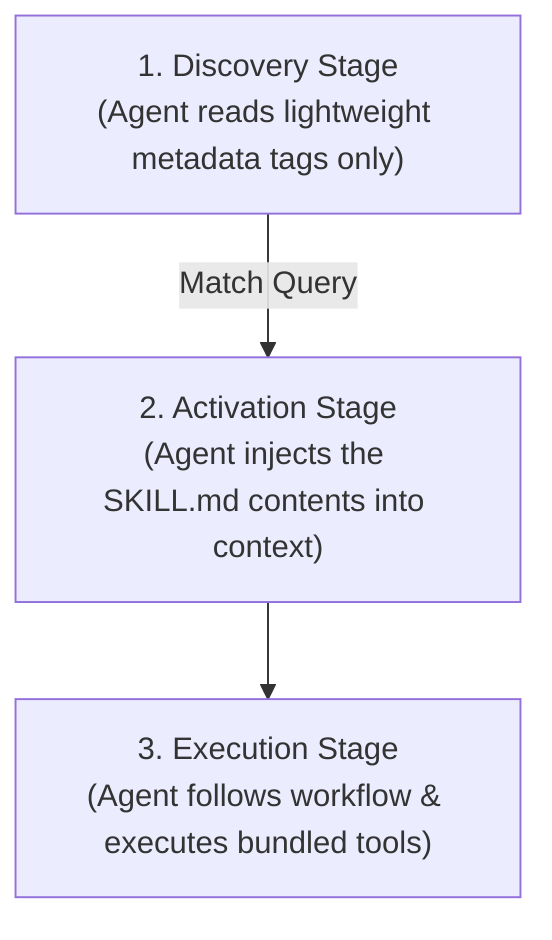

# PRISM Research: LLM Provider Failures & Agent Skills

## Executive Summary

When asking PRISM to perform broad tasks (e.g., *"create a website inside Prism_public"*), a `Provider returned an empty response` failure is triggered. 

This document analyzes the root cause of this failure—**monolithic prompt/tool bloat on local models**—and researches the **Agent Skills** paradigm (an emerging 2026 open-source standard) as the strategic architectural solution.

---

## 1. Root Cause Analysis: "Provider returned an empty response"

In your startup logs, PRISM successfully loaded and registered a massive suite of **71 MCP tools**:
```text
[MCP] Registered 71 tool(s): mcp_ai_semantic_search, mcp_knowledge_graph_query, ...
```

### The "Bloated Prompt" Bottleneck
*   **The Model**: By default, `start_individual.bat` runs the lightweight **`gemma3:1b`** (1-billion parameters) local model via Ollama.
*   **The Bloat**: When you ask a complex question like *"create a Prism website using all tools and agents"*, the orchestrator attempts to inject the full JSON schemas and descriptions of all **71 tools** into the active LLM context.
*   **The Failure**: A 1B local model cannot process thousands of tokens of dense JSON schemas. Its internal reasoning capabilities are completely overwhelmed, causing it to generate **blank/empty content** during inference.
*   **The Result**: Ollama returns an empty HTTP response. The PRISM provider manager catches this empty block and throws:
    ```typescript
    throw new Error("Provider returned an empty response.");
    ```

### Immediate Resolution
With the backend `404`/`401` API issues now fully fixed:
1.  **Switch Provider/Model**: Use the LLM control panel in the **Right Rail** of the PRISM dashboard.
2.  Select a larger local model that handles complex function schemas better (e.g., `driaforall/tiny-agent-a:1.5b` or a larger model).
3.  Alternatively, configure a remote provider (e.g., Google Gemini or OpenAI) in the settings.

---

## 2. Deep Dive: The 2026 "Agent Skills" Standard

To solve prompt bloat systematically, modern AI agent frameworks are adopting the **Agent Skills** specification. 

### What is a "Skill"?
Rather than hardcoding all instructions and tool schemas directly in the core system prompt, a **Skill** is a self-contained, modular unit of "procedural knowledge" stored in a directory with a `SKILL.md` file.

```text
skills/
└── create-website/
    ├── SKILL.md         <-- Metadata + markdown workflow instructions
    ├── templates/       <-- Asset templates (e.g. index.html boilerplate)
    └── verify.js        <-- Companion test script
```

### Core Architecture: Progressive Disclosure

The Agent Skills standard uses a three-stage lifecycle to keep the active LLM context window compact and efficient:



1.  **Discovery**: The agent only reads the lightweight YAML frontmatter metadata (name, tags, description) of available skills to see if any are relevant to the user request. The LLM is **never** exposed to the tool schemas or deep instructions of unused skills.
2.  **Activation**: Once a skill is selected (e.g., `create-website`), the agent loads the detailed markdown instructions and specific tools associated *only* with that skill.
3.  **Execution**: The agent runs the workflow with a clean, focused prompt, keeping context usage minimal and enabling small models (like 1B–3B local models) to operate successfully.

---

## 3. Does PRISM Need a Skills System?

**Yes. Strategically and Architecturally.**

While PRISM currently has a state-of-the-art **Character/Persona System** (Aria, Phoenix, Sentinel) which governs alignment and compliance, adding a **Modular Skills System** will deliver critical advantages:

### 1. Context Window Optimization
- Allows lightweight local models (`gemma3:1b`, `tiny-agent-a:1.5b`) to run complex multi-tool workflows by hiding the other 70 unused MCP tools dynamically.

### 2. Ecosystem Portability & Interoperability
- A standardized `skills/` structure makes PRISM compatible with direct competitors like **Docker Agent** (which uses a native Go/YAML skills system) and **OpenClaw** (which has a huge community skills marketplace).
- Allows operators to import public skills from third-party registries.

### 3. Separation of Concerns
- Decouples **cognitive reasoning** (handled by PRISM's characters and Spectrum Refraction) from **procedural execution** (the modular step-by-step instructions packaged in `SKILL.md`).

---

## 4. Proposed PRISM Skills Implementation Plan

If we want to build a native Skills engine for PRISM, we can introduce a lightweight, file-based registry:

### Step 1: Define `SKILL.md` Schema
```yaml
---
id: web_creation
name: Web Page Creator
description: Creates static HTML/CSS/JS websites in the workspace
tags: [development, file_operations]
tools: [mcp_vrgc_self_heal_code, mcp_ids_update]
---
# Instructions
When asked to create a website:
1. Make a directory named `Prism_public`.
2. Generate an elegant `index.html` structure with premium aesthetics.
3. Verify files are properly created and structured.
```

### Step 2: Implement Progressive Disclosure in `LlmProviderManager`
At query time, the agent performs a quick semantic match over the registered skills' lightweight metadata. Only the matched skills are injected, keeping the context pristine.
