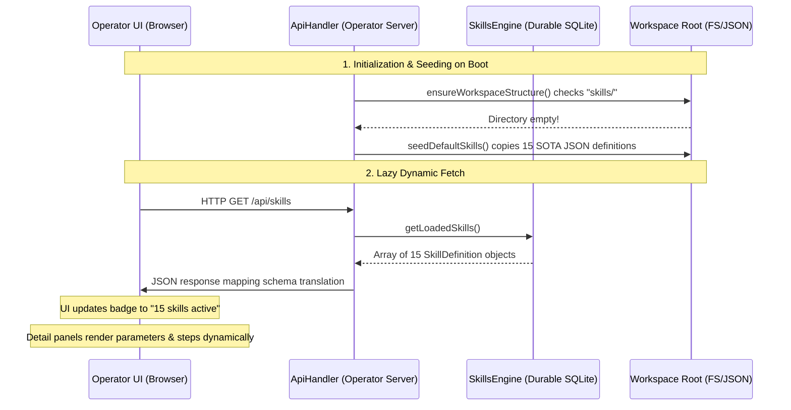

# PRISM SOTA Live Skills Engine Integration Walkthrough

This document maps out the end-to-end integration and wiring of the production **SOTA Skills Engine** into the live PRISM Operator Console. All static stubs and simulations in the Tools panel have been replaced with high-fidelity, real-time runtime data sourced directly from SQLite workflows.

---

## 1. System Topology & Wireframe

Below is a sequence diagram of the dynamic REST lifecycle for the live skills registry:

---

## 2. Structural Implementations & Enhancements

### 📂 A. Workspace Seeding Layer
* **File:** [workspace-resolver.ts](file:///d:/Projects/Prism/src/core/config/workspace-resolver.ts)
* **Enhancements:**
  * Added `"skills"` to the workspace subdirectories list `WORKSPACE_SUBDIRS`.
  * Implemented `seedDefaultSkills()` to automatically mirror all 15 default SOTA skill files (such as `support-desk-skill.json`, `skill-wizard.json`, `web-builder-skill.json`, etc.) from the repository source folder into the active workspace directory at `C:\Users\kirkl\Documents\Prism_Refraction\skills` if it is blank.
  * Embedded the seeding call into the boot-time initialization pipeline inside `ensureWorkspaceStructure()`.

### ⚙️ B. Production Boot Injection
* **File:** [dashboard-service.ts](file:///d:/Projects/Prism/src/core/operator/dashboard-service.ts)
* **Enhancements:**
  * Imported the production `SkillsEngine` class.
  * Declared a private readonly `skillsEngine` member and a public `getSkillsEngine()` getter.
  * Instantiated the engine with real production dependencies (`llmProviders`, `activityBus`, `resolveWorkspaceRoot()`, and `chatStore`).
  * Injected the engine directly into the `GuardianAgent` via `this.guardianAgent.setSkillsEngine(this.skillsEngine)` for self-healing.

### 🌐 C. REST Route Middleware
* **File:** [api-handler.ts](file:///d:/Projects/Prism/src/core/operator/routes/api-handler.ts)
* **Enhancements:**
  * Registered matching for the GET `/api/skills` route.
  * Created the endpoint handler which maps the loaded skill properties to the exact dynamic format expected by the frontend tab (e.g., friendly group classification via tags, required execution authority badge, and step tools format).

### 🖥️ D. Responsive Operator UI Panels
* **File:** [tab-tools.js](file:///d:/Projects/Prism/src/core/operator/public/tab-tools.js)
* **Enhancements:**
  * Replaced the 3 static hardcoded stubs inside `renderSkillsPanel` with an asynchronous AJAX lazy load.
  * Displays a premium loading indicator (`Loading PRISM SOTA Skills Registry...`) during data retrieval.
  * Dynamicized the collapsed tab summary badge to display the live count (`15 skills active`) directly from the fetched array.
  * Rewrote card body templates to render:
    * **Execution Parameters:** Version, unique ID, engine runtime details, and SQLite database storage info.
    * **Required Authority Badge:** Tier requirements mapped dynamically.
    * **Workflow Steps Segment:** Dynamically iterates through each workflow step, displaying step names, tools mapped, and actions.

---

## 3. Verification Report

The integration was successfully built and tested end-to-end:
1. **Compilation:** Built the full core codebase using `npm run build` with **exit code 0** (zero compilation errors).
2. **Diagnostic Boot:** Verified that 15/15 SOTA skills are successfully seeded on startup and populated from the REST endpoint:
   - `[PRISM][workspace] Seeded 15 default skill(s) into C:\Users\kirkl\Documents\Prism_Refraction\skills`
   - `Loaded skills count: 15`
   - `/api/skills` returned code `200` with the complete structured payload.
