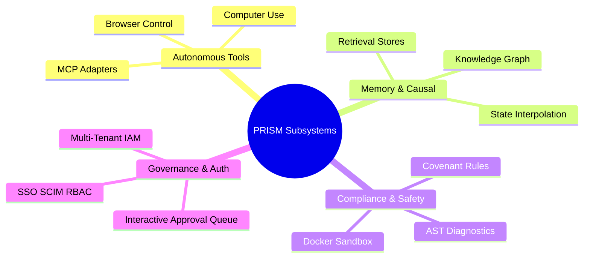

# PRISM SOTA Skills Architecture Matrix

This document provides a full capability audit of the PRISM platform, mapping new suggested skills across **Individual** and **Business** operator spheres. Each skill is designed to operate at the highest engineering standards, anchoring into PRISM's core subsystems (e.g., browser-use, sandboxing, IAM, AST compliance, and Knowledge Graph memory).

---

## 1. Subsystem Audit & Capability Mapping

PRISM possesses highly advanced core modules that are ideal for driving durable, multi-step agentic workflows:



---

## 2. PRISM Premium Skills Matrix

The following matrix organizes the suggested durable skills needed to maximize PRISM's individual and enterprise utility.

| Skill ID & Name | Operator Segment | Core Subsystems | Governed Workflow Steps | Cited Use Case & Premium Impact |
| :--- | :--- | :--- | :--- | :--- |
| **`prism.skill.ast_architect`**<br>Autonomous Code Architect | **Both** (Individual & Business) | `compliance`, `tools`, `security` | 1. Analyze AST & Imports<br>2. Generate Virtual Patches<br>3. Run Sandbox Linters<br>4. Rebuild & Verify | **Use Case:** Surgical modifications to large-scale React/TypeScript codebases.<br>**Impact:** Prevents common runtime crashes and reference breaks by checking imports and structures before writing to disk. |
| **`prism.skill.covenant_guard`**<br>Governance Audit & Covenant Enforcement | **Business** | `governance`, `policy`, `approval` | 1. Parse Corporate Policy<br>2. Audit Source Code Diff<br>3. Check Covenant Flags<br>4. Trigger Approval Queue | **Use Case:** Automating SOC2 compliance checkups and preventing commit-pushes containing plain secrets or security flaws.<br>**Impact:** Safeguards business IP and locks down dynamic overrides behind RBAC. |
| **`prism.skill.graph_harvest`**<br>Memory Harvester & Knowledge Extraction | **Both** | `memory`, `observability`, `database` | 1. Ingest Log Streams<br>2. Correlate Incidents<br>3. Extract Entity Triples<br>4. Sync to prism-activity.db | **Use Case:** Transforming diagnostic logs and support-desk resolution histories into a long-term searchable graph.<br>**Impact:** Converts unstructured developer activity logs into a permanent enterprise brain. |
| **`prism.skill.iam_provisioner`**<br>IAM SSO & SCIM Directory Admin | **Business** | `iam`, `governance`, `security` | 1. Query User Catalog<br>2. Map SCIM Schema Roles<br>3. Provision SSO Credentials<br>4. Log RBAC Vault Access | **Use Case:** Orchestrating employee onboarding/offboarding, role updates, and automated SCIM profile syncs.<br>**Impact:** Secures microservice clusters and dashboard panels behind absolute authed access structures. |
| **`prism.skill.browser_researcher`**<br>Autonomous Web Intelligence Analyst | **Both** | `tools` (browser), `memory` | 1. Launch Headless Session<br>2. Scrape Technical Docs<br>3. Correlate Web Data<br>4. Write Research Brief | **Use Case:** Scraping dynamic SOTA API updates, dependency migrations, and package changes in real-time.<br>**Impact:** Provides the developer with structured documentation without leaving the terminal. |
| **`prism.skill.sandbox_auditor`**<br>Docker Sandboxing Security Checker | **Business** | `security`, `governance`, `tools` | 1. Sprout Sandbox Image<br>2. Deploy Source Code<br>3. Execute Vulnerability Sweep<br>4. Collect Report & Kill | **Use Case:** Executing untrusted open-source dependencies or running package test suites under absolute containment.<br>**Impact:** Isolates host systems from zero-day threats or destructive shell executions. |
| **`prism.skill.tui_conductor`**<br>Terminal Command Center Orchestrator | **Individual** | `system`, `activity`, `operator` | 1. Capture Terminal State<br>2. Triage Output History<br>3. Suggest Repair Scripts<br>4. Autocomplete Executions | **Use Case:** Guiding a solo developer through complex multi-package monorepo builds and shell commands.<br>**Impact:** Resolves compiler issues, handles package installs, and automates shell routines locally. |
| **`prism.skill.api_connector`**<br>MCP Server Scaffolder & Integrator | **Both** | `tools` (mcp), `plugins`, `config` | 1. Scrape API OpenAPI Specs<br>2. Scaffold MCP Adapter Node<br>3. Bind Network Access Rules<br>4. Reconnect & Validate | **Use Case:** Rapidly exposing local resources (databases, folders, custom APIs) to the agentic MCP network.<br>**Impact:** Instantly expands the developer's toolbox with live, verified third-party API hookups. |
| **`prism.skill.setup_wizard`**<br>Interactive Configuration & Wizard Builder | **Individual** | `config`, `operator`, `observability` | 1. Survey Environment Variables<br>2. Draft prism-preferences.json<br>3. Validate LLM API Ports<br>4. Sprout Setup Success Dashboard | **Use Case:** First-time installation, onboarding, and environment diagnostic checks for new developer workspaces.<br>**Impact:** Reduces setup churn and establishes clear system configurations instantly. |
| **`prism.skill.telemetry_analyst`**<br>Log Trend & Metrics Predictor | **Business** | `observability`, `activity`, `memory` | 1. Query metrics-endpoint<br>2. Plot Activity History Trends<br>3. Identify SLO Anomalies<br>4. Alert Operator Dashboard | **Use Case:** Continuous uptime checks and performance profiling of running services on production staging.<br>**Impact:** Provides automated warning sweeps when resource memory caps or task latency spikes occur. |
| **`prism.skill.diff_gatekeeper`**<br>Interactive Code Reviewer | **Business** | `policy`, `compliance`, `approval` | 1. Retrieve Git Stage Diff<br>2. Check Lint & Style Policies<br>3. Suggest AST Refinements<br>4. File Formal Sign-Off | **Use Case:** Multi-agent code review gating before merging code into production directories.<br>**Impact:** Guarantees absolute code quality and style adherence automatically across teams. |
| **`prism.skill.personal_scheduler`**<br>Personal Task Decomposer & Tracker | **Individual** | `system`, `activity`, `memory` | 1. Ingest Vague User Goals<br>2. Decompose into task.md Items<br>3. Schedule Priority Windows<br>4. Generate End-of-Day Brief | **Use Case:** Managing solo developers' daily priorities, task tracking, and dynamic task status syncing.<br>**Impact:** Keeps the individual focused and records complete implementation histories permanently. |

---

## 3. Designing a Premium Skill: Example JSON Layouts

To help the **Skill Wizard (`prism.skill.skill_wizard`)** dynamically construct the matrix above, here are two foundational templates conforming to PRISM's world-class standard.

### 3.1. Business-Facing: `prism.skill.covenant_guard`
```json
{
  "id": "prism.skill.covenant_guard",
  "version": "1.0.0",
  "name": "Prism Governance Covenant Guard",
  "description": "Enforces strict organizational policies, security audits, and code covenant guidelines on staged changes before approval signatures are generated.",
  "tags": ["governance", "security", "policy", "covenant", "soc2", "compliance", "audit"],
  "governance": {
    "min_policy_tier": "tier-3",
    "required_approvals": ["file_write", "shell_exec"],
    "covenant_rules": [
      "Ensure zero hardcoded credentials, API tokens, or secrets exist in modified source code files.",
      "Strictly prohibit direct modification of core security libraries without dual-operator signature clearance.",
      "Verify all modifications pass strict static AST lints using prism_ide_lint."
    ]
  },
  "triad_templates": {
    "left_hemisphere": "Perform strict logic analysis on git diff structures for: {query}. Verify zero policy/covenant overrides or secret leaks exist in the modified blocks.",
    "right_hemisphere": "Formulate a creative security advisory, descriptive lint alerts, and high-fidelity code compliance reports for the diff: {query}.",
    "main_hemisphere": "Coordinate diff analysis. Fetch stage records, perform lint runs, flag logical violations, and route results to the active interactive approval queue: {query}."
  },
  "workflow": {
    "steps": [
      {
        "id": "diff_extraction",
        "name": "Extract Stage Git Diff",
        "tools": ["file_read", "run_command"],
        "action": "Run git diff command to capture modified blocks and parse filenames of modified files.",
        "transitions": {
          "success": "covenant_compliance_check",
          "failed": "diff_extraction"
        }
      },
      {
        "id": "covenant_compliance_check",
        "name": "Verify Covenant Compliance",
        "tools": ["prism_ide_lint"],
        "action": "Check code diffs against strict SOC2 patterns, API key regexes, and policy rules.",
        "transitions": {
          "success": "submit_to_queue",
          "failed": "quarantine_changes"
        }
      },
      {
        "id": "submit_to_queue",
        "name": "Route to Approval Queue",
        "tools": ["run_command"],
        "action": "Register a new governed signature request inside the PRISM interactive approval system.",
        "transitions": {
          "success": "completed",
          "failed": "diff_extraction"
        }
      },
      {
        "id": "quarantine_changes",
        "name": "Quarantine & Alert Operator",
        "tools": [],
        "action": "Flag security warnings, log violations, and reject automated merge approvals until issues are resolved.",
        "transitions": {
          "success": "completed",
          "failed": "completed"
        }
      },
      {
        "id": "completed",
        "name": "Governance Sweep Finalized",
        "tools": [],
        "action": "Confirm review is completed, outputting the safety verification logs to the operator terminal.",
        "transitions": {
          "success": "completed",
          "failed": "completed"
        }
      }
    ]
  }
}
```

### 3.2. Individual-Facing: `prism.skill.tui_conductor`
```json
{
  "id": "prism.skill.tui_conductor",
  "version": "1.0.0",
  "name": "Prism Terminal Conductor",
  "description": "Guides the solo developer through terminal shell executions, complex builds, and error repairs directly within the PRISM console framework.",
  "tags": ["terminal", "tui", "shell", "builder", "compile", "interactive", "diagnostics"],
  "governance": {
    "min_policy_tier": "tier-1",
    "required_approvals": ["shell_exec"],
    "covenant_rules": [
      "Analyze terminal stderr buffers completely before proposing shell corrections.",
      "Prioritize safe, non-destructive repair scripts (dry-runs, verification) over brute-force rewrites.",
      "Log all terminal repair lifecycles to build a localized terminal diagnostics knowledge base."
    ]
  },
  "triad_templates": {
    "left_hemisphere": "Analyze the failed compiler logs, syntax breaks, or environment mismatches: {query}. Verify that suggestions comply with clean build rules.",
    "right_hemisphere": "Craft creative shell repair commands, explanatory summaries, and optimal code correction buffers to resolve: {query}.",
    "main_hemisphere": "Coordinate shell recovery. Capture terminal history, fetch compiler configurations, execute safe dry-run lints, and output repair scripts: {query}."
  },
  "workflow": {
    "steps": [
      {
        "id": "capture_terminal_error",
        "name": "Capture Compiler Error Streams",
        "tools": ["file_read"],
        "action": "Read the tail of the active console output buffer and isolate the error stack traces.",
        "transitions": {
          "success": "formulate_repair_commands",
          "failed": "capture_terminal_error"
        }
      },
      {
        "id": "formulate_repair_commands",
        "name": "Formulate Terminal Repair Commands",
        "tools": ["run_command"],
        "action": "Draft targeted CLI repair commands and test them using dry-run flags inside the terminal sandbox.",
        "transitions": {
          "success": "propose_rebuilt_actions",
          "failed": "capture_terminal_error"
        }
      },
      {
        "id": "propose_rebuilt_actions",
        "name": "Propose Rebuilt Executions",
        "tools": [],
        "action": "Present the targeted repair script to the developer console and request terminal clearance.",
        "transitions": {
          "success": "completed",
          "failed": "capture_terminal_error"
        }
      },
      {
        "id": "completed",
        "name": "Terminal Repair Swept",
        "tools": [],
        "action": "Verify the compilation builds successfully with exit code 0 and confirm terminal recovery.",
        "transitions": {
          "success": "completed",
          "failed": "completed"
        }
      }
    ]
  }
}
```
