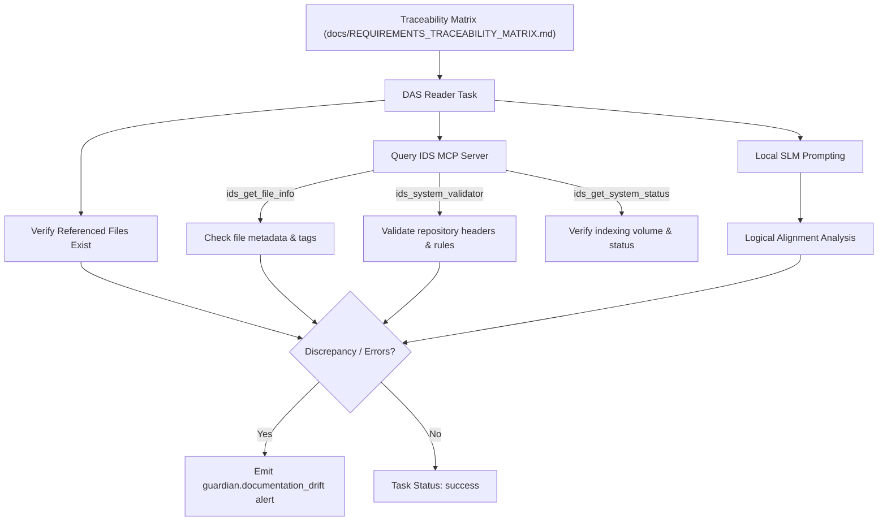

# PRISM SLM-Driven Documentation Alignment Sentinel (DAS)

**Document Version:** 1.1.0  
**Author:** Antigravity (AI Coding Assistant)  
**Presented to:** Kirk LaSalle & PRISM Engineering Group  
**Status:** Completed & Committed

---

## 1. Architectural Concept

As autonomous agent runtimes evolve, documentation (e.g., `README.md`, `USER_GUIDE.md`, `TEST_STRATEGY.md`) quickly drifts from actual implementation. Relying on manual human reviews to ensure alignment creates compliance vulnerabilities.

The **Documentation Alignment Sentinel (DAS)** is an active diagnostics task inside the **PRISM Guardian Agent**. Powered by PRISM's embedded **local Small Language Model (SLM)** (running via `LlamaCppSupervisor`) and integrated with the **IDS MCP** server, the DAS systematically verifies the Traceability Matrix, checks code and test references, and performs repository-wide compliance audits.



---

## 2. Key Capabilities & Integration

### 2.1 Guardian Agent Task Integration

The Sentinel is registered in the `GUARDIAN_TASK_CATALOG` in [guardian-agent.ts](file:///d:/Projects/Prism/src/core/agents/guardian-agent.ts):

```typescript
{
    id: "doc_alignment_sentinel",
    name: "Documentation Alignment Sentinel",
    category: "diagnostics",
    intervalMs: 900000, // 15 minutes
    enabled: true
}
```

### 2.2 IDS MCP Integration

When the Sentinel executes:

1. **Traceability Parse**: It parses the table in `docs/REQUIREMENTS_TRACEABILITY_MATRIX.md` to extract requirement IDs, details, and verification files.
2. **File Existence**: It confirms all referenced test (`tests/*.test.ts`) and source (`src/**/*.ts`) files exist on disk.
3. **IDS Index Verification**: For each verified file, it calls `ids_get_file_info` to ensure the file is correctly indexed and has valid tags in the database.
4. **Compliance Validation**: It executes the IDS MCP's `ids_system_validator` tool under scope `full` to check for header standardization and structural repository health.
5. **System Metrics**: It queries `ids_get_system_status` to log the current size and health of the documentation indexes.

### 2.3 Local SLM Alignment Analysis

To ensure logical consistency, the Sentinel samples requirement-verification mappings and routes them to a ready model slot in `LlamaCppSupervisor` with a specialized analysis prompt. The local SLM responds with a structured JSON indicating consistency or highlighting logical gaps.

---

## 3. Testing and Verification

### 3.1 Unit Test Coverage

We implemented robust coverage in [guardian-agent.test.ts](file:///d:/Projects/Prism/tests/guardian-agent.test.ts):

- **Base Verification**: Validates the sentinel parses requirements and runs existence checks.
- **IDS MCP Integration**: Mock-registers the key IDS MCP tools (`get-file-info`, `run-system-validator`, `get-system-status`), verifying that the agent dynamically discovers, executes, parses, and incorporates their diagnostics into the final task outcome.

### 3.2 Verification Results

All 30 unit tests pass, and the PRISM release validation suite passed successfully:

```bash
============================================================
Tests: 92 | Passed: 92 | Failed: 0
============================================================
```

All code changes have been staged, committed, and pushed to the `main` branch.

---

## 4. IDS Runtime Awareness Metrics

The Sentinel is now also the execution point for IDS-centered runtime awareness
tracking. This section defines the required metrics and release-impacting
thresholds.

### 4.1 Metrics

- **Awareness Score**
  - Weighted score derived from IDS status, validator integrity, file mapping
    coverage, and remediation closure.
- **Index Freshness**
  - Time since last successful indexing cycle from IDS status.
- **Requirement Coverage Integrity**
  - Percentage of matrix-linked files that exist and are indexed.
- **Drift Resolution Rate**
  - Percentage of identified mismatches resolved within policy SLA.
- **Validator Health**
  - Percentage of successful `ids_run_system_validator` executions.

### 4.2 Thresholds

- Awareness score target: `>= 85`.
- Warning band: `70-84`.
- Critical band: `< 70`.
- Critical release gate: unresolved critical validator findings must be `0`.

### 4.3 Governance Actions

When thresholds are violated:

1. Emit `guardian.documentation_drift` alert.
2. Create or update remediation work item.
3. Trigger IDS validation and refresh workflow.
4. Mark release readiness as blocked when critical thresholds are unmet.

### 4.4 Companion Documents

- `MCP_IDS_RUNTIME_AWARENESS_FRAMEWORK.md`
- `reference/mcp_server/MCP_IDS_API_REFERENCE.md`
- `reference/mcp_server/MCP_IDS_OPERATIONAL_RUNBOOK.md`
- `reference/mcp_server/MCP_IDS_SAP_ALIGNMENT.md`
